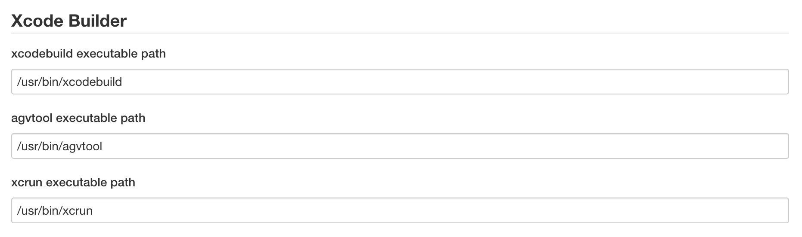
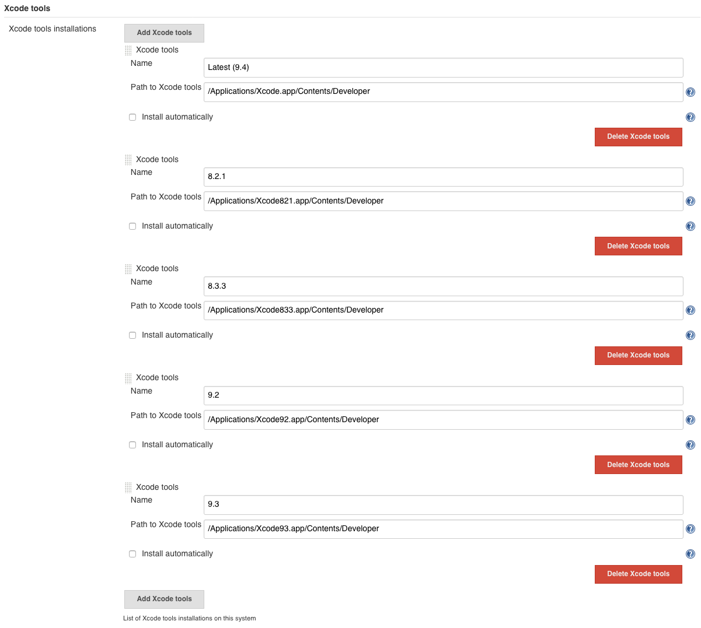
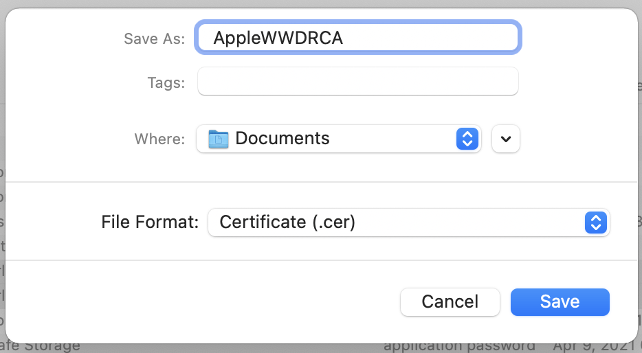
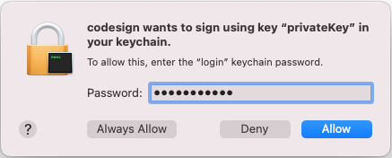

Xcode plugin
------------

This plugin adds the ability to call Xcode command line tools to automate build and packaging iOS applications (iPhone, iPad, ...).
*  Report all issues or features requests in Jira : https://issues.jenkins-ci.org/issues/?jql=component%20%3D%20xcode-plugin

Contact the Jenkins Community by [mail](http://jenkins-ci.org/content/mailing-lists) or [irc](http://jenkins-ci.org/content/chat) to have support.

*The maintainer is looking for a co-maintainer.
I need your help!!*

To help us maintain the plugin, you can take contact to jerome.lacoste
*at* gmail.com in particular if you are able to test upcoming releases

Thank you!

A problem, An idea ?

*Please use our tasks and issues tracker to report bugs, improvements or
new feature.*

-   [Report a bug](https://issues.jenkins-ci.org/secure/CreateIssueDetails!init.jspa?Create=Create&components=16124&pid=10172&issuetype=1)
-   [Ask for a new feature](https://issues.jenkins-ci.org/secure/CreateIssueDetails!init.jspa?Create=Create&components=16124&pid=10172&issuetype=2)
-   [Ask for an improvement of an existing feature](https://issues.jenkins-ci.org/secure/CreateIssueDetails!init.jspa?Create=Create&components=16124&pid=10172&issuetype=4)

Also if you want to propose some code change using a Github pull
request, please open also a Jira issue. It is easier for developers to
track them.

*Important!*

Newesth version is compatibility with the previous version priour 2.0.12 is maintained.
However, major changes have been made to the handling of macOS
keychains.

Information to access the keychain is moved from configuration to
credentials.  
After that, the information for accessing the keychain must be
registered in the credentials.

#### Features

This plugin adds the ability to call Xcode command line tools to
automate build and packaging iOS applications (iPhone, iPad, ...).

##### Versioning

This builder can invoke agvtool to dynamically update the
`CFBundleVersion` (a.k.a. Technical Version) and
`CFBundleShortVersionString` (a.k.a. Marketing Version).
It supports all macros beginning from the '$'.
For example the value `${BUILD_NUMBER}` will be replaced with the current build number.
We advice you to generate a
unique value for each build for the `CFBundleVersion` if you want for
example deploy it into a private store.
In that case you can use for example : `${JOB_NAME}-${BUILD_NUMBER}`

##### Building

The target (optional), configuration (e.g. `Debug`, `Release`) and SDK
(optional) can be specified in the per-project config along with whether
to perform a clean before the build phase.

##### Packaging

The builder can be used to package the .app into a .ipa. Since a .app is
actually a directory, it can be awkward to work with and, especially,
distribute. We can simplify this by packaging the .app into a single
.ipa file, which is just a zip file with a well-known internal structure

##### Signing

This plugin has two features that help you simplify the code signing
process.

###### Allowing Jenkins to stage developer profile

This plugin builds on top of to allow you to store your Apple Developer
Profile (*.developerprofile) file. [This file contains a code signing
private key, corresponding developer/distribution certificates, and
mobile provisioning
profiles](http://stackoverflow.com/questions/15154211/what-data-are-stored-in-developer-profile-file-exported-from-xcode).
You can [create this file from your
XCode](http://stackoverflow.com/questions/10404931/copying-keys-and-certificates-to-another-one-mac-for-iphone-development).

To upload the developer profile into Jenkins, go to "Manage Credentials"
in the system configuration page, and select "Apple Developer Profile"
from the "Add" button. See HELP for further details.

To use this profile for signing, add "Import developer profile" as a
build step before you run xcode, and select the developer profile to
import into the build machine. This build step will install the
developer profile into the slave's keychain.

###### Work with existing populated keychains

If you create a dedicated keychain that stores the code signing private
key and certificate on every build slave, you can configure the plugin
to just unlock this keychain (so that xcode can use it for signing)

Unlocking

If you store your keys in the user keychain (most probably) and if you
run jenkins as daemon, make sure you installed a recent version of
jenkins for Mac, or configured the daemon to create a session (through
the CreationSession=true parameter in your org.jenkins-ci.plist daemon
config file). [See
also](http://stackoverflow.com/questions/9626447/unable-to-sign-ios-builds-with-jenkins)

Timeouts

The keychain has a default timeout of 300 seconds. One can override it
using the security set-keychain-settings command, which isn't supported
in the plugin today. Support in the plugin could be improved by adding
options to modify the timeout as part of the build process. See
[JENKINS-17184](https://issues.jenkins-ci.org/browse/JENKINS-17184).

##### Unit Testing

This plugin will listen to the xcodebuild output when running OCUnit or
XC tests and write out JUnit-format test reports that Jenkins can
understand. Jenkins will then use these to publish test failure reports
and graphs.

##### Sample of the configuration panel


#### Documentation

##### Installation guide

Obviously, the build machine has to be an macOS X machine with Xcode
developer tools installed.  
Certificates, Identities and Provisions must be installed on the build
machine separately.

(This has been improved in the latest version of the plugin.
You can distribute the "Developer Profile" from the master node to the slave nodes by performing "Import Developer Profile" on the master node prior to the build step.)

Just install the latest version of the plugin from the update center and
configure a freestyle job (see #Usage Guide) that will use your OSX node (If your central instance isn't running under macOS X).
If Xcode related binaries aren't stored in the default location, update
the global configuration of the plugin (Manage Jenkins -> Configure
System)  


If you want to use multiple versions of Xcode to build your application,
use ’Global Tool Configuration’ to register the distinguished name and
location of the installed Xcode.


##### Usage guide

###### Import developer profile step

By adding the Import developer profile step to Build, you can import
developer profiles exported to Xcode into temporary keychains or
existing keychains.  
The developer profile contains a set of certificates, secret keys and
provisioning profiles necessary for compiling and signing applications,
which is useful for distributing with multiple Jenkins nodes.

###### Import developer profile configuration parameters

| Parameter                     | Pipeline Parameter         | Since version | Description                                                                                                                                                                                                                                                                                                                                |
|-------------------------------|----------------------------|---------------|--------------------------------------------------------------------------------------------------------------------------------------------------------------------------------------------------------------------------------------------------------------------------------------------------------------------------------------------|
| Developer Profile             | profileId                  | 2.0.1         | Select the developer profile you exported from Xcode Preference to import into the keychain. Developer profile must be registered with Jenkins in advance by "Credentials".                                                                                                                                                                |
| Import into existing Keychain | importIntoExistingKeychain | 2.0.6         | If it is checked, the developer profile will be imported into the existing keychain. If not checked, create a new key chain with the file name "jenkins-" + "job name" newly, and import the developer profile into this. (In this case, a random character string is automatically generated and used for the password)                   |
| Target keychain               | keychainId                 | 2.0.13        | The ID of the configured keychain to use to import certificates from developer profile to sign the package.                                                                                                                                                                                                                                |
| Target keychain               | ~~keychainName~~<br>This has been deprecated and has now been replaced by "keychainId".| 2.0.6         | The name of the configured keychain to use to import certificates from developer profile to sign the package.                                                                                                                                                                      |
| Keychain path                 | keychainPath               | 2.0.6         | Keychain path to import developer profile.                                                                                                                                                                                                                                                                                                 |
| Keychain password             | keychainPwd                | 2.0.6         | Password to unlock keychain importing developer profile.                                                                                                                                                                                                                                                                                   |
| AppleWWDRCA                   | appleWWDRCAcertId          | 2.0.15        | Select the AppleWWDRCA (Intermediate Certificate) you exported from macOS keychain to import into the Jenkins node(s) keychain. AppleWWDRCA must be registered with Jenkins in advance by "Credentials".                                                                                                                                   |

###### How to export AppleWWDRCA (Intermediate Certificate) from your macOS keychain

If you have an environment where you use Xcode on a daily basis and you can code sign your app using Xcode,
you will have the necessary Apple WWDRCA intermediate certificate in your macOS keychain.
You can export this using KeychainAccess utility.

When exporting Apple WWDRCA (intermediate certificate) from macOS keychain,
include all "Apple Worldwide Developer Relations Certification Authority" (expired in 2023 and expired in 2030) and "Apple Developer ID Certification Authority" as follows. Select and export.


Choose "Export 3 items" from context menu.


Select "Certificate (.cer)" for "File format:" when exporting.



If the Jenkins node is in a remote location like a cloud service,
In an environment where the WWDRCA intermediate certificate is not installed on your macOS,
you can download the certificate from the "Certificate Authority page"(https://www.apple.com/certificateauthority/) of the Apple Developer Portal and use it.


The file downloaded from the Apple Developer Portal (extension .cer) has a binary format DER format,
so use the openssl command to convert it to BASE64 encoded text and combine the three downloaded files into one file.

```shell
% (openssl x509 -in ~/Downloads/DeveloperIDCA.cer -inform der -out - && \
openssl x509 -in ~/Downloads/AppleWWDRCA.cer -inform der -out - && \
openssl x509 -in ~/Downloads/AppleWWDRCAG3.cer -inform der -out -) > AppleWWDRCA.cer
```

Whether you export the certificate using Keychain Access or convert and combine the files downloaded from the Apple Developer Portal,
the resulting AppleWWDRCA.cer file will have the same content.

###### How to import AppleWWDRCA (Intermediate Certificate) to your Jenkins certificates.

Select "Manage Jenkins" on the dashboard.


Select "Manage Credentials".


You can add new credentials to your "global" domain by clicking "(grobal)" from "Stores scoped to Jenkins"
and selecting "Add Credentials" from the top left of the displayed page.


And then click "Add Credentials".


For "Kind", select "Apple Worldwide Developer Relations Certification Authority".
Then click "Choose file".


Select and upload the certificate file (.cer) that you previously exported from Keychain
or downloaded from the Apple Developer Portal.


###### Limitations

The Xcode Integration Plugin has the function of importing the secret
key and certificate of the developer account into the temporary key
chain, but as the constraint of macOS can not handle different key chain
for each session, the job handling the key chain If you execute them in
parallel, this will not work properly.

As one of workarounds, it is possible to limit the maximum number of
jobs around Jenkins' node to 1 and to execute multiple nodes with
different macOS accounts.  

###### Setting up a build step

Add the XCode build step to a free-style project and set the target
(e.g. `MyApp`), configuration (e.g. `Release`) and check the build IPA
and update version number options. This will give you a single,
versioned .ipa file.  
You can also select to clean the project before a
build; while this will make sure that the project is starting from a
clean state, it will make large projects take a lot longer.

###### Setting up a unit test step

Add the XCode build step and this time specify your unit test target
(e.g. `MyAppTests`), configuration (e.g. `Debug`) and the SDK (e.g.
`Developer/Platforms/iPhoneSimulator.platform/Developer/SDKs/iPhoneSimulator14.4.sdk/`).  
The SDK path is specified relative to the Xcode directory (which can be specified with the environment variable `DEVELOPER_DIR` and can be confirmed with the` xcode-select -p` command).  
Leave all the checkboxes unselected. The SDK needs to be supplied here
as the unit tests will only be run when building under the simulator's
SDK.

The following items do not exist in the current version, and instead determine whether to output a test report based on whether "ResultBundlePath" is specified. (If ResultBundlePath is empty, no report will be output.)  
~~Check the "Publish JUnit test result report" option in the project
config and set the value `"*``/test-reports/``*.xml"` under "Test report
XMLs". This will tell Jenkins to pick up the JUnit-format test reports.~~

###### XCode Builder configuration parameters

| Parameter                     | Pipeline Parameter        | Since version | Description                                                                                                                                                                                                                                                                                                                                |
|-------------------------------|---------------------------|---------------|--------------------------------------------------------------------------------------------------------------------------------------------------------------------------------------------------------------------------------------------------------------------------------------------------------------------------------------------|
|Development Team	            |developmentTeamName	    |1.4        	|The name of the configured development team to use to sign the package. As of XCode 8.3, this is required now to sign an ipa (which now uses xcodebuilder).<br>A development team can be configured here by specifying a Development Team ID, or by creating one in the jenkins global configuration.|
|Development Team ID        	|developmentTeamID	        |1.4	        |Specifey the ID of the Apple development team to use to sign the IPA when 'Development Team'  is not selected.|
|Xcode Tools Version            |xcodeName                  |2.0.3	        |You can select the version of Xcode set by 'Global Tool Configuration' by 'Manage Jenkins'.<br>If you choose the 'System Default' for Xcode version, plugin will not do anything, so you can switch Xcode using environment variable 'DEVELOPER_DIR' as well.   
|Use Legacy Build System?   	|useLegacyBuildSystem	    |2.0.9      	|Use the old 'Legacy Build System' instead of 'New Build System' of Xcode 9 and later.|
|Target                     	|target	                    |1.0            |The target to build. If left empty, this will build all targets in the project. If you wish to build your binary and the unit test module, it is best to do this as two separate steps each with their own target. This was, the iPhone Simulator SDK can be specified for the unit tests.|
|Interpret As Regular Expression|interpretTargetAsRegEx	    |1.4	        |Build all entries listed under the "Targets:" section of the xcodebuild -list output that match the regexp.|  
|Clean before build?	        |cleanBeforeBuild	        |1.0            |This will delete the build directories before invoking the build. This will force the rebuilding of ALL dependencies and can make large projects take a lot longer.|
|Allow failing build results?   |allowFailingBuildResults	|1.4	        |Checking this option will prevent this build step from failing if xcodebuild exits with a non-zero return code.|
|No Console Log?	            |noConsoleLog	            |2.0.1	        |Checking this option will not log xcode build output to console output.|
|Logfile Output directory   	|logfileOutputDirectory	    |2.0.1	        |Specify the directory to output the log of xcodebuild.<br>If you leave it blank, it will be output to "project directory/builds/${BUILD_NUMBER}/log" with other logs.<br>If an output path is specified, it is output as a xcodebuild.log file in a relative directory under the "build output directory"|
|ResultBundlePath           	|resultBundlePath          	|2.0.11	        |Set the output directory of test results.<br>Leave empty, it will not output a test result and will not analyze the test results. relative to the project-directory.|
|Clean ResultBundlePath?    	|cleanResultBundlePath	    |2.0.11     	|This will delete the ResultBundlePath before invoking the build.|
|Configuration	                |configuration	            |1.0	        |This is the name of the configuration as defined in the XCode project. By default there are Debug and Release configurations.|
|Xcode Schema File	            |xcodeSchema	            |1.2	        |Needed if you want to compile for a specific schema instead of a target, or if you want to generate an archive or an IPA.|
|Generate Archive?          	|generateArchive	        |2.0	        |Checking this option will generate an xcarchive of the specified scheme. A workspace and scheme are are also needed for archives.|
|Pack application, build and sign .ipa?|buildIpa	        |1.0	        |If this is checked, it will generate a single packed .ipa file from xcarchive.<br>The .ipa file is used to distribute the app on test sites and upload it to the App Store.|
|Export method	                |ipaExportMethod	        |1.4	        |The export method of the .app to generate the .ipa file. Should be one in 'development', 'ad-hoc', 'enterprise' or 'app-store'.|
|.ipa filename pattern	        |ipaName	                |1.4	        |A pattern for the ipa file name. You may use ${VERSION} and ${BUILD_DATE} (yyyy.MM.dd) in this string|
|Output directory	            |ipaOutputDirectory	        |1.4	        |The output directory for the .ipa file, relative to the build directory.|
|Upload Bitcode?	            |uploadBitcode	            |2.0.3	        |If Checked, include bitcode in IPA exporting for App Store.<br>The default is "Yes" (check is on).|
|Upload Symbols?	            |uploadSymbols	            |2.0.3	        |If Checked, include symbols in IPA exporting for App Store.<br>The default is "Yes" (check is on).|
|Compile Bitcode?	            |compileBitcode	            |2.0.3      	|If checked, Xcode will recompiling Bitcode and exporting IPA for the non App Store.<br>The default is "Yes" (check is on).|
|Thinning	                    |thinning	                |2.0.3          |Set this to thin the packages for one or more devices in Xcode when exporting IPA by methods other than App Store.<br><br>Available options are:<br> - \<none> (Xcode export non-thinned generic application),<br> - <thin-for-all-variants> (Xcode export universal applications and all available thinning variants),<br> - Or for a model identifier a specific device (eg "iPhone 7,1").<br>The default is \<none>.|
|Pack on demand resources?      |~~embedOnDemandResourcesAssetPacksInBundle~~<br>assetPacksInBundle|	2.0.3	|Export settings for non App Store.<br>If the application is using on demand resources and this item is on, the asset pack is included in the application bundle, so you can test the app without the server hosting the asset pack.<br>If assetPacksBaseURL is not specified, the default is YES (check is on).|
|On demand resources asset URL	|~~onDemandResourcesAssetPacksBaseURL~~<br>assetPacksBaseURL	|2.0.3	|Export settings for non-App Store.<br>If the application is using an on demand resource and assetPacksInBundle is not YES, this must be the base URL that specifies the host of the asset pack. This will set up the app to download the asset pack from the specified URL. |
|Application URL	            |appURL	                    |2.0.3	        |Specify the URL for installing the application when creating the manifest.plist that is necessary when OTA installing the application from Web pages or email.|
|Display image URL          	|displayImageURL	        |2.0.3	        |Export settings for non App Store.<br>Specify the URL of the image (57 x 57 pixels) of the icon to be displayed when installing the application using manifest.plist.|
|Full size image URL	        |fullSizeImageURL	        |2.0.3      	|Export settings for non App Store.<br>Specify the URL of the image (512 x 512 pixels) of the icon to be displayed when installing the application using manifest.plist.|
|Asset pack URL	                |assetPackManifestURL	    |2.0.3	        |Export settings for non-App Store App.<br>If the application is using on-demand resources and the application will installing OTA with manifest.plist, this must be the base URL that specifies the host of the asset pack. This will set up the app to download the asset pack from the specified URL.|
|Strip Swift Symbols?	        |stripSwiftSymbols	        |2.0.5	        |If checked, symbols be stripped from Swift libraries when exporting the application to IPA.|
|~~Manual signing?~~            |~~manualSigning~~<br>This has been deprecated and has now been replaced by "signingMethod".|2.0.1	|For this option you need to manually specify the combination of Provisioning profile UUID and BundleID.<br>This will be useful if you want to change the combination of Provisioning Profile and Certificate used for CodeSign when you build the application.|
|Code signing settings	        |signingMethod	            |2.0.7      	|This attribute can take one of the following three values.<br>"automatic" (Check "Automatic Signing")<br>Checking this option will automatically generate Provisioning Profile and certificates for signing application.<br>However, please be aware that using this function will automatically create Provisioning profile and certificates as necessary, so that old Provisioning profile and certificates will be invalid at that time.<br>"manual" (Check "Manual signing")<br>For this option you need to manually specify the combination of Provisioning profile UUID and BundleID.<br>This will be useful if you want to change the combination of Provisioning Profile and Certificate used for CodeSign when you build the application.<br>"readFromProject" (Check "Read from Xcode Project")<br>With this option, it automatically retrieve and sets the combination of BundleID and Provisioning profile UUID from the Xcode project file.<br>This is useful when you want to take over the combination of BundleID and Provisioning profile UUID that you used in the Xcode project (GUI).|
|Bundle ID                      |provisioningProfiles: [provisioningProfileAppId]	|2.0.1	|Specify the Bundle ID of the application for which code sign to be performed.<br>If the location of the Info.plist file contained in the compiled archive is set instead of the Bundle ID, read the Bundle ID from the Info.plist file and use that value.|
|Provisioning Profiles          |                           |               |               |
|Provisioning profiles UUID	    |provisioningProfiles: [provisioningProfileUUID]    |2.0.1	|Specify the UUID or Specifire of the provisioning profile to use to sign the application. If the location of the provisioning profile is set instead of the UUID or Specifire, read the UUID from the provisioning profile and use that value.
|Copy provisioning profile  	|copyProvisioningProfile	|2.0.7      	|If Checked, and the filename of provisioning profile is specified in "Provisioning profile UUID", the specified file is copied to a predetermined place. ("/Users/${HOME}/Library/MobileDevice/Provisioning Profiles/")<br>This can be used to overwrite the contents of the developer profile or system settings in the provisioning profile in the project deployed from SCM etc.<br>If the provisioning profile UUID or Specifire is set in "provisioning profile UUID", it does not do anything.<br>The default is "Yes" (check is on)|
|Change bundle ID?	            |changeBundleID	            |1.4	        |Checking this option will replace the bundle identifier.<br>You will need to specify which bundle ID (CFBundleIdentifier) to use and where is the Info.plist file located.<br>This is handy for example when you want to use a different code signing identity in your development projects.|
|New bundle ID	                |bundleID	                |1.4	        |The new bundle ID. Usually something like com.companyname.projectname.|
|Info.plist path	            |bundleIDInfoPlistPath  	|1.4	        |The path to the info.plist file which contains the CFBundleIdentifier of your project.<br>Usually something like:<br>${WORKSPACE}/ProjectName/Project-Info.plist|
|Unlock Keychain?           	|unlockKeychain	            |1.0	        |Automatically unlock the keychain before signing the archive?|
|Keychain   	                |keychainId<br>             |2.0.13	        |The ID of the configured keychain info to use to retrieve certificates to sign the package.<br>Register the keychain information in "credentials" before using it.|
|~~Keychain name~~              |~~keychainName~~<br>This has been deprecated and has now been replaced by "keychainId".|1.4	        |The name of the configured keychain to use to retrieve certificates to sign the package.|
|Keychain path	                |keychainPath	            |1.0	        |The path of the keychain to use to retrieve certificates to sign the package (default : ${HOME}/Library/Keychains/login.keychain).|
|Keychain password	            |keychainPwd	            |1.0	        |The password of the keychain to use to retrieve certificates to sign the package.|
|Clean test reports?	        |cleanTestReports	        |1.3	        |This will delete the processed test reports before invoking the build. Usually it is a good idea only to do it in test targets, otherwise if other Xcode target is built before tests – the build will fail to collect test reports.|
|SDK	                        |sdk                    	|1.0            |You only need to supply this value if you want to specify the SDK to build against. If empty, the SDK will be determined by XCode. If you wish to run OCUnit tests, you will need to use the iPhone Simulator's SDK, for example: /Developer/Platforms/iPhoneSimulator.platform/Developer/SDKs/iPhoneSimulator4.1.sdk/|
|SYMROOT                        |symRoot                    |1.1            |You only need to supply this value if you want to specify the SYMROOT path to use. If empty, the default SYMROOT path will be used (it could be different depending of your Xcode version). Supports all macros and also environment and build variables from the Token Macro Plugin. For example you can use the value : ${WORKSPACE}/build|
|Custom xcodebuild arguments	|xcodebuildArguments	    |1.3	        |Passing custom arguments is convenient when you need to change some project options for Jenkins build, but don't want them to persist in project file. For example when running application tests, following settings often are nice fit: GCC_SYMBOLS_PRIVATE_EXTERN=NO COPY_PHASE_STRIP=NO. Otherwise Release build will usually fail because it won't be able to find application symbols to link with test bundle. Arguments are currently separated by space, enclosing them in quotes won't help.|
|Xcode Workspace File           |xcodeWorkspaceFile         |1.2            |Only needed if you want to compile a workspace instead of a project. It takes precedence over 'Xcode Project File' setting and this job 'configuration' parameter.|
|Xcode Project Directory        |xcodeProjectPath	        |1.0            |This is the relative path from the workspace to the directory that contains the XCode project file.<br>You only need to supply this value if the XCode project you wish to build is not in the root of the workspace.|
|Xcode Project File             |xcodeProjectFile       	|1.0            |If there is more than one XCode project file in the project path, you will need to specify the file name of the project you wish to build.<br>If you need to build all project, you will need to create an XCode build step for each one manually.|
|Build output directory         |buildDir	                |1.2            |The value to use for CONFIGURATION_BUILD_DIR setting (BUILD_DIR in >= 2.0.0). You only need to supply this value if you want the product of the XCode build to be in a location other than the one specified in project settings and this job 'SYMROOT' parameter. Supports all macros and also environment and build variables from the Token Macro Plugin. For example you can use the value : ${WORKSPACE}/build|
|Technical version	            |cfBundleVersionValue   	|1.0            |This will set the CFBundleVersion to the specified string. Supports all macros and also environment and build variables from the Token Macro Plugin. For example the value ${BUILD_NUMBER} will be replaced with the current build number. We advice you to generate a unique value for each build if you want for example deploy it into a private store. In that case you can use for example : ${JOB_NAME}-${BUILD_NUMBER}|
|Provide version number and run avgtool?|provideApplicationVersion|1.4	|Provide version number and run avgtool before invoking the build.|
|Marketing version	            |cfBundleShortVersionStringValue|1.0        |This will set the CFBundleShortVersionString to the specified string. Supports all macros and also environment and build variables from the Token Macro Plugin.|
|~~Manifest Plist URL~~        	|~~ipaManifestPlistUrl~~<br>This was deprecated in 2.0.3.|1.5	        |The base URL to use to create a Manifest Plist. If omitted no Manifest Plist will be generated.|

###### Setting up a Export IPA step

If you add the Export IPA step and set up the information necessary for
exporting the IPA file, the location of the archive, the export method,
code signature information, etc., you can export the IPA from the
archive output in the Xcode Build step.

###### Export IPA configuration parameters

| Parameter                     | Pipeline Parameter        | Since version | Description                                                                                                                                                                                                                                                                                                                                |
|-------------------------------|---------------------------|---------------|--------------------------------------------------------------------------------------------------------------------------------------------------------------------------------------------------------------------------------------------------------------------------------------------------------------------------------------------|
|Development Team	            |developmentTeamName	    |2.0.1	        |The name of the configured development team to use to sign the package. As of XCode 8.3, this is required now to sign an ipa (which now uses xcodebuilder).<br>A development team can be configured here by specifying a Development Team ID, or by creating one in the jenkins global configuration.|
|Development Team ID	        |developmentTeamID	        |2.0.1	        |The ID of the Apple development team to use to sign the IPA If 'Development Team' is not selected.
|Xcode Tools Version	        |xcodeName	                |2.0.3	        |You can select the version of Xcode set by 'Global Tool Configuration' by plugin setting.<br>If you choose the 'System Default' for Xcode version, plugin will not do anything, so you can switch Xcode using environment variable 'DEVELOPER_DIR' as well.   
|Archive directory	            |archiveDir	                |2.0.1	        |Specify the location of the path (usually BUILD_DIR specified by xcodebuild) to read the Archive for exporting the IPA file.<br>Supports all macros and also environment and build variables from the Token Macro Plugin.<br><br>For example you can use the value :<br>${WORKSPACE}/build
|Export method	                |ipaExportMethod	        |2.0.1	        |The export method of the .app to generate the .ipa file. Should be one in 'development', 'ad-hoc', 'enterprise' or 'app-store'.
|.ipa filename pattern	        |ipaName	                |2.0.1	        |A pattern for the ipa file name. You may use ${VERSION} and ${BUILD_DATE} (yyyy.MM.dd) in this string
|Output directory	            |ipaOutputDirectory	        |2.0.1	        |The output directory for the .ipa file, relative to the build directory.
|Upload Bitcode?	            |uploadBitcode	            |2.0.3	        |If Checked, include bitcode in IPA exporting for App Store.<br>The default is "Yes" (check is on).
|Upload Symbols?	            |uploadSymbols	            |2.0.3	        |If Checked, include symbols in IPA exporting for App Store.<br>The default is "Yes" (check is on).
|Compile Bitcode?	            |compileBitcode	            |2.0.3	        |If checked, Xcode will recompiling Bitcode and exporting IPA for the non App Store.<br>The default is "Yes" (check is on).
|Thinning	                    |thinning	                |2.0.3	        |Set this to thin the packages for one or more devices in Xcode when exporting IPA by methods other than App Store.<br><br>Available options are:<br>    <none> (Xcode export non-thinned generic application),<br>    <thin-for-all-variants> (Xcode export universal applications and all available thinning variants),<br>    Or for a model identifier a specific device (eg "iPhone 7, 1").<br><br>The default is <none>.
|Pack on demand resources?	    |~~assetPacksInBundle~~     |2.0.3	        |Export settings for non App Store.<br>If the application is using on demand resources and this item is on, the asset pack is included in the application bundle, so you can test the app without the server hosting the asset pack.<br>If assetPacksBaseURL is not specified, the default is YES (check is on).
|On demand resources asset URL	|~~assetPacksBaseURL~~	    |2.0.3	        |Export settings for non-App Store.<br>If the application is using an on demand resource and assetPacksInBundle is not YES, this must be the base URL that specifies the host of the asset pack. This will set up the app to download the asset pack from the specified URL. 
|Application URL	            |appURL	                    |2.0.3	        |Specify the URL for installing the application when creating the manifest.plist that is necessary when OTA installing the application from Web pages or email.
|Display image URL	            |displayImageURL	        |2.0.3	        |Export settings for non App Store.<br>Specify the URL of the image (57 x 57 pixels) of the icon to be displayed when installing the application using manifest.plist.
|Full size image URL	        |fullSizeImageURL	        |2.0.3	        |Export settings for non App Store.<br>Specify the URL of the image (512 x 512 pixels) of the icon to be displayed when installing the application using manifest.plist.
|Asset pack URL	                |assetPackManifestURL	    |2.0.3	        |Export settings for non-App Store App.<br>If the application is using on-demand resources and the application will installing OTA with manifest.plist, this must be the base URL that specifies the host of the asset pack. This will set up the app to download the asset pack from the specified URL.
|trip Swift Symbols?	        |stripSwiftSymbols	        |2.0.5	        |If checked, symbols be stripped from Swift libraries when exporting the application to IPA.
|Manual signing?                |manualSigning<br>This has been deprecated and has now been replaced by "signingMethod".|2.0.1|For this option you need to manually specify the combination of Provisioning profile UUID and BundleID.<br>This will be useful if you want to change the combination of Provisioning Profile and Certificate used for CodeSign when you build the application.
|Code signing settings	        |signingMethod	            |2.0.7	        |This attribute can take one of the following three values.<br>"automatic" (Check "Automatic Signing")<br>Checking this option will automatically generate Provisioning Profile and certificates for signing application.<br>However, please be aware that using this function will automatically create Provisioning profile and certificates as necessary, so that old Provisioning profile and certificates will be invalid at that time.<br>"manual" (Check "Manual signing")<br>For this option you need to manually specify the combination of Provisioning profile UUID and BundleID.<br>This will be useful if you want to change the combination of Provisioning Profile and Certificate used for CodeSign when you build the application.<br>"readFromProject" (Check "Read from Xcode Project")<br>With this option,it automatically retrieve and sets the combination of BundleID and Provisioning profile UUID from the Xcode project file.<br>This is useful when you want to take over the combination of BundleID and Provisioning profile UUID that you used in the Xcode project (GUI).|
|Bundle ID                      |provisioningProfiles: [provisioningProfileAppId]|2.0.1|Specify the Bundle ID of the application for which code sign to be performed.<br>If the location of the Info.plist file contained in the compiled archive is set instead of the Bundle ID, read the Bundle ID from the Info.plist file and use that value.     
|Provisioning profiles UUID	    |provisioningProfiles: [provisioningProfileUUID]|2.0.1|Specify the UUID or Specifire of the provisioning profile to use to sign the application. If the location of the provisioning profile is set instead of the UUID or Specifire, read the UUID from the provisioning profile and use that value.     
|Unlock Keychain?	            |unlockKeychain	            |2.0.1	        |Automatically unlock the keychain before signing the archive?
|Copy provisioning profile	    |copyProvisioningProfile	|2.0.7	        |If Checked, and the filename of provisioning profile is specified in "Provisioning profile UUID", the specified file is copied to a predetermined place. ("/Users/${HOME}/Library/MobileDevice/Provisioning Profiles/")<br>This can be used to overwrite the contents of the developer profile or system settings in the provisioning profile in the project deployed from SCM etc.<br>If the provisioning profile UUID or Specifire is set in "provisioning profile UUID", it does not do anything.<br>The default is "Yes" (check is on)
|Keychain   	                |keychainId<br>             |2.0.13	        |The ID of the configured keychain info to use to retrieve certificates to sign the package.<br>Register the keychain information in "credentials" before using it.|
|Keychain name	                |keychainName<br>This has been deprecated and has now been replaced by "keychainId".|2.0.1	        |The name of the configured keychain to use to retrieve certificates to sign the package.|
|Keychain path	                |keychainPath	            |2.0.1	        |The path of the keychain to use to retrieve certificates to sign the package (default : ${HOME}/Library/Keychains/login.keychain).
|Keychain password	            |keychainPwd	            |2.0.1	        |The password of the keychain to use to retrieve certificates to sign the package.
    
#### Compiling Xcode projects and exporting IPApackages using Jenkins's Pipeline function
    
1. Import developer profile.

    ``` syntaxhighlighter-pre
            importDeveloperProfile(importIntoExistingKeychain: false,
                profileId: 'XXXXXXXX-XXXX-XXXX-XXXX-XXXXXXXXXXXX')
    ```

2. Build the project and output the archive.

    ``` syntaxhighlighter-pre
            xcodeBuild(
              xcodeSchema: "${PROJECT_SCHEMA}",
              ipaOutputDirectory: 'Release',
              ipaExportMethod: 'app-store',
              generateArchive: true,
              buildIpa: true,
              ipaName: "${BUILD_TARGET}",
              bundleID: 'com.example.TargetApp',
              developmentTeamName: "${DEVELOPMENT_TEAM_NAME}",
              cleanBeforeBuild: true,
              configuration: 'Release',
              cfBundleShortVersionStringValue: '1.0.0',
              cfBundleVersionValue: '1'
            )
    ```

3. Export the IPA file from the archive.

    ``` syntaxhighlighter-pre
        exportIpa(
            archiveDir: "${WORKSPACE}/${repositoryName}/build/Release-iphoneos",
            xcodeSchema: "${PROJECT_SCHEMA}",
            developmentTeamName: "${DEVELOPMENT_TEAM}",
            configuration: "AdHoc",
            infoPlistPath: "${INFO_PLIST}",
            manualSigning: true,
            provisioningProfiles: [
                [provisioningProfileAppId: "${BUNDLE_ID}", provisioningProfileUUID: 'TestApp_AdHoc_Profile.mobileprovision']
                [provisioningProfileAppId: "${BUNDLE_ID}.watchkitapp", provisioningProfileUUID: 'TestApp_AdHoc_Profile.mobileprovision'],
                [provisioningProfileAppId: "${BUNDLE_ID}.watchkitapp.watchkitextension", provisioningProfileUUID: 'TestApp_AdHoc_Profile.mobileprovision']
            ],
            ipaExportMethod: "ad-hoc",
            ipaName: "${BUILD_TARGET}",
            ipaOutputDirectory: "AdHoc"
        )
    ```

4. Upload the exported IPA file.  

> When using "XCode's" Automatically manage signing ", various ways are required, so please note the points to be noted separately.

#####  Using multiple versions of xcode.

One can easily support multiple versions by using environment variables.
But first one need to install multiple versions on the build server.
Here's one strategy:

###### install multiple versions of xcode

1. Note current config.
```
    xcode-select -p
```
2. download xcode DMGs from <http://developer.apple.com/downloads/>

3. enable install from everywhere (under System preferences / Security)

Without that I had problems installing xcode, without graphical
feedback, tested on 10.9.5, freshly booted.

Symptoms were:

-   app not responsive
-   Getting errors like in /var/log/system.log

Someone attempted to start application App:"Xcode" asn:0x0-1b62b61
pid:57656 refs=6 @ 0x7fa5d9f6df40 but it still has
\_kLSApplicationLockedInStoppedStateKey=true, so it is is staying
stopped. : LASApplication.cp \#2468 SetApplicationInStoppedState()
q=LSSession 100027/0x186bb queue

3. open DMG file, copy app to /Applications. This might take a while.

4. close /Volumes/Xcode (otherwise installation won't start)

5. start Xcode, accept agreement, install missing packages if necessary.
This might take a while. Close xcode after GUI opens.

6. move freshly installed Xcode to new path, e.g.

sudo mv /Applications/Xcode.app /Applications/Xcode6.1.app

(I use this so that the xcode app appears with version number under
spotlight)

7. reset default xcode-select if necessary (installation might have
changed it / reset to /Applications/Xcode.app)

sudo xcode-select -s /Applications/Xcode6.1.app

(Note the part above could be fully automated....)

###### Select the xcode version at runtime

1. Use EnvInject plugin
2. for jobs that require the non default do something like

DEVELOPER\_DIR=/Applications/Xcode6.0.1.app/Contents/Developer

under Inject environment variables to the build process

###### Select the xcode version at runtime (Version 2.0.3 or later)

1. Register the distinguished name and location of the installed Xcode
using ’Global Tool Configuration’.  
2. Select Xcode registered in 'Global Tool Configuration' in Job's
'Xcode Tools Version'.

That's it.

#### FAQ

##### User interaction is not allowed

When code-signing, a prompt may appear on the build machine asking
whether to allow keychain access.  
This will block the build with a message like
`"User interaction is not allowed"` until it is dismissed.  
Just select 'Always Allow' the first time and it shouldn't need to ask
again.  


If this prompt is not showing on the build machine, you can force it to
appear by running the codesign command that failed from a terminal on
the build machine:   /usr/bin/codesign --force --sign "iPhone
Distribution: .....

##### No Xcode folder is set

[sources] $ /usr/bin/xcodebuild -version xcode-select: Error: No Xcode
folder is set. Run xcode-select -switch <xcode_folder_path> to set
the path to the Xcode folder. Error: /usr/bin/xcode-select returned
unexpected error. FATAL: Check your XCode installation. Jenkins cannot
retrieve its version.

You probably just installed Xcode (by default it is in `/Applications/Xcode.app/Contents/Developer`) but
its path isn't configured. You can fix it with

xcode-select -switch /Applications/Xcode.app/Contents/Developer

You should now be able to execute `xcodebuild`. Ex :

host:\~ user$ /usr/bin/xcodebuild -version Xcode 4.2 Build version 4C199

##### Xcode 4.3

XCode 4.3 changes [2
things](https://developer.apple.com/library/mac/#documentation/DeveloperTools/Conceptual/WhatsNewXcode/Articles/xcode_4_3.html)
that are important for our usage on a slave or a master :

-   **Command-Line Tools Are Optional** : The command-line tools are not
    bundled with Xcode 4.3 by default. Instead, they have to be
    installed using the Components tab of the Downloads preferences
    panel
    
-   **/Developer No Longer Exists** : You may have to reconfigure its
    path like this:

    sudo xcode-select -switch
    /Applications/Xcode.app/Contents/Developer/
