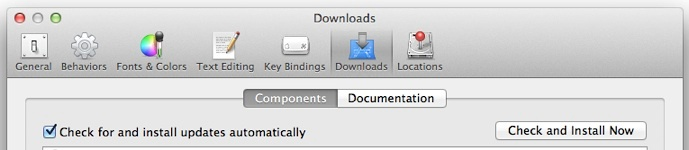

::: {#stp-licenseStatus-banner}
:::

-   [コンテンツにスキップ](https://wiki.jenkins.io/display/JENKINS/Xcode+Plugin#title-heading)
-   [ブレッドクラムにスキップ](https://wiki.jenkins.io/display/JENKINS/Xcode+Plugin#breadcrumbs)
-   [ヘッダー
    メニューにスキップ](https://wiki.jenkins.io/display/JENKINS/Xcode+Plugin#header-menu-bar)
-   [操作メニューにスキップ](https://wiki.jenkins.io/display/JENKINS/Xcode+Plugin#navigation)
-   [クイック検索にスキップ](https://wiki.jenkins.io/display/JENKINS/Xcode+Plugin#quick-search-query)

::: {#page}
::: {#full-height-container}
::: {#header-precursor}
::: {.cell}
:::
:::

::: {.aui-header-inner}
::: {.aui-header-before}
[[リンクされたアプリケーション]{.aui-icon .aui-icon-small
.aui-iconfont-appswitcher}](https://wiki.jenkins.io/display/JENKINS/Xcode+Plugin#app-switcher){.aui-dropdown2-trigger
.app-switcher-trigger}

::: {#app-switcher .aui-dropdown2 .aui-style-default .aui-layer role="menu" aria-hidden="true" is-switcher="true" environment="{\"isUserAdmin\":false,\"isAppSuggestionAvailable\":false,\"isSiteAdminUser\":false}" resolved=""}
::: {.aui-dropdown2-section}
-   [[Jenkins
    JIRA]{.nav-link-label}](https://issues.jenkins-ci.org/secure/MyJiraHome.jspa "https://issues.jenkins-ci.org/secure/MyJiraHome.jspa"){.aui-dropdown2-radio}
-   [[Jenkins
    Wiki]{.nav-link-label}](https://wiki.jenkins.io/ "https://wiki.jenkins.io/"){.aui-dropdown2-radio
    .aui-dropdown2-checked .checked}
:::
:::
:::

::: {.aui-header-primary}
[](https://wiki.jenkins.io/) {#logo .aui-header-logo .aui-header-logo-custom}
======================================================================================================

-   [スペース[]{.icon
    .aui-icon-dropdown}](https://wiki.jenkins.io/display/JENKINS/Xcode+Plugin#space-menu-link-content "スペース"){#space-menu-link
    .aui-dropdown2-trigger .aui-nav-link}
    ::: {#space-menu-link-content .aui-dropdown2 .aui-style-default .aui-dropdown2-in-header .aui-layer role="menu" aria-hidden="true" resolved=""}
    ::: {role="presentation"}
    :::
    :::

-   
:::

::: {.aui-header-secondary}
-   ::: {#search-ui .aui-quicksearch .dont-default-focus .header-quicksearch}
    ::: {#quick-search-alert role="alert"}
    Enter キーを押して検索
    :::

    ::: {.aui-spinner .spinner}
    :::
    :::

-   [[ヘルプ]{.aui-icon .aui-icon-small
    .aui-iconfont-question-filled}](https://wiki.jenkins.io/display/JENKINS/Xcode+Plugin# "ヘルプ"){#help-menu-link
    .aui-nav-link .aui-dropdown2-trigger
    .aui-dropdown2-trigger-arrowless}
    ::: {.aui-dropdown2-section}
    -   [オンライン
        ヘルプ](https://docs.atlassian.com/confluence/docs-615/ "Confluence ドキュメンテーション ホームに移動します"){#confluence-help-link}
    -   [キーボード
        ショートカット](https://wiki.jenkins.io/display/JENKINS/Xcode+Plugin# "利用可能なキーボード ショートカットを表示します (?)"){#keyboard-shortcuts-link}
    -   [フィード
        ビルダー](https://wiki.jenkins.io/dashboard/configurerssfeed.action "カスタム RSS フィードを作成します。"){#feed-builder-link}
    -   [最新情報](https://confluence.atlassian.com/display/DOC/Confluence+6.15+Release+Notes){#whats-new-menu-link}
    -   [利用可能なガジェット](https://wiki.jenkins.io/display/JENKINS/Xcode+Plugin# "Confluence が提供するガジェットの参照"){#gadget-directory-link
        .user-item .administration-link}
    -   [Confluenceについて](https://wiki.jenkins.io/aboutconfluencepage.action "Confluenceについてより詳しい情報を得る"){#confluence-about-link}
    :::

-   -   -   -   [ログイン](https://wiki.jenkins.io/login.action?os_destination=%2Fdisplay%2FJENKINS%2FXcode%2BPlugin){#login-link
    .user-item .login-link}
:::
:::

\

::: {.ia-splitter}
::: {.ia-splitter-left}
::: {.ia-fixed-sidebar style="width: 285px; visibility: visible; top: 40px; left: 0px;"}
::: {.acs-side-bar .ia-scrollable-section}
::: {.acs-side-bar-space-info .tipsy-enabled configure-tooltip="スペース情報の編集"}
::: {.avatar}
::: {.space-logo key="JENKINS" name="Jenkins" entity-type="confluence.space"}
::: {.avatar-img-container}
::: {.avatar-img-wrapper}
[{.avatar-img}](https://wiki.jenkins.io/display/JENKINS/Home?src=sidebar "Jenkins")
:::
:::
:::
:::

::: {.space-information-container}
::: {.name}
[Jenkins](https://wiki.jenkins.io/display/JENKINS/Home?src=sidebar "Jenkins")
:::

::: {.flyout-handle .icon .aui-icon .aui-icon-small .aui-iconfont-edit}
:::
:::
:::

::: {.acs-side-bar-content}
::: {.acs-nav-wrapper}
::: {.acs-nav has-create-permission="false" quick-links-state="null" page-tree-state="null" nav-type="pages"}
::: {.acs-nav-sections}
::: {.main-links-section}
-   [[]{.icon}[ページ]{.acs-nav-item-label}](https://wiki.jenkins.io/collector/pages.action?key=JENKINS&src=sidebar){.acs-nav-item-link
    .tipsy-enabled}
:::

::: {.quick-links-wrapper}
##### スペース ショートカット {#スペース-ショートカット .ia-quick-links-header-title}

::: {.quick-links-section .tipsy-enabled collapsed-tooltip="スペース ショートカット"}
-   [[]{.icon}[Product
    requirements]{.acs-nav-item-label}](https://wiki.jenkins.io/display/JENKINS/Product+requirements?src=spaceshortcut){.acs-nav-item-link
    .tipsy-enabled}
-   [[]{.icon}[How-to
    articles]{.acs-nav-item-label}](https://wiki.jenkins.io/display/JENKINS/How-to+articles?src=spaceshortcut){.acs-nav-item-link
    .tipsy-enabled}
-   [[]{.icon}[Retrospectives]{.acs-nav-item-label}](https://wiki.jenkins.io/display/JENKINS/Retrospectives?src=spaceshortcut){.acs-nav-item-link
    .tipsy-enabled}
-   [[]{.icon}[Troubleshooting
    articles]{.acs-nav-item-label}](https://wiki.jenkins.io/display/JENKINS/Troubleshooting+articles?src=spaceshortcut){.acs-nav-item-link
    .tipsy-enabled}
:::
:::
:::
:::
:::

::: {.ia-secondary-container .tipsy-enabled tree-type="pages" collapsed-tooltip="Child pages"}
::: {.ia-secondary-header}
##### [Child pages]{.label} {#child-pages .ia-secondary-header-title .pages}
:::

::: {.ia-secondary-parent-content}
-   [[]{.icon}[Plugins]{.label}](https://wiki.jenkins.io/display/JENKINS/Plugins?src=contextnavchildmode "Plugins"){.parent-item-link}
:::

::: {.ia-secondary-current-content}
-   []{.icon}[Xcode Plugin]{.label}
:::

::: {.ia-secondary-content}
::: {.contextual-nav-child-pages}
-   []{.icon}[[Pipeline How
    To]{.label}](https://wiki.jenkins.io/display/JENKINS/Pipeline+How+To?src=contextnavchildmode "Pipeline How To")
:::
:::
:::
:::

::: {.hidden}
[](https://wiki.jenkins.io/collector/pages.action?key=JENKINS&src=sidebar " (g 、s)"){#space-pages-link}
:::
:::

::: {.space-tools-section}
::: {#space-tools-menu-additional-items .hidden}
::: {label="Browse pages" href="/pages/reorderpages.action?key=JENKINS"}
Browse pages
:::
:::

[設定]{.aui-icon .aui-icon-small .aui-iconfont-configure}[スペース
ツール]{.aui-button-label}[]{.icon .aui-icon-dropdown}

::: {#space-tools-menu .aui-dropdown2 .aui-style-default .space-tools-dropdown .aui-layer role="menu" aria-hidden="true" aui-alignment="top left" resolved=""}
::: {.aui-dropdown2-section .space-tools-navigation role="presentation"}
::: {role="group"}
-   [概要](https://wiki.jenkins.io/spaces/viewspacesummary.action?key=JENKINS&src=spacetools)
-   [コンテンツ
    ツール](https://wiki.jenkins.io/pages/reorderpages.action?key=JENKINS&src=spacetools)
:::
:::

::: {.aui-dropdown2-section .space-operations role="presentation"}
::: {role="group"}
-   [Browse
    pages](https://wiki.jenkins.io/pages/reorderpages.action?key=JENKINS&src=spacetools)
:::
:::
:::

[]{.expand-collapse-trigger .aui-icon .aui-icon-small
.aui-iconfont-chevron-double-left}
:::

::: {.ia-splitter-handle .tipsy-enabled tooltip="サイドバーを閉じる ( [ )" title=" ([)"}
::: {.ia-splitter-handle-highlight .confluence-icon-grab-handle}
:::
:::
:::
:::

::: {#main .aui-page-panel style="margin-left: 285px; margin-top: 40px;"}
::: {#custom-content-header}
[]{#XcodePlugin-Duetosomemaintenanceissues,thisservicehasbeenswitchedinread-onlymode,youcanfindmoreinformationaboutthe[why|https://groups.google.com/d/msgid/jenkinsci-dev/jIfr-rfo9WizBut_ApNLwBufPREsEQ3qkybbZR9ao9ITNQhi_xeTcwXcQf69xNy7MMc6kKB1du4-sutr6qedHP70}Due to some maintenance issues, this service has been switched in read-only mode, you can find more information about the [why](https://groups.google.com/d/msgid/jenkinsci-dev/jIfr-rfo9WizBut_ApNLwBufPREsEQ3qkybbZR9ao9ITNQhi_xeTcwXcQf69xNy7MMc6kKB1du4-sutr6qedHP70Fxnx-4TsNLg0EkX2aFY%3D%40brokenco.de){.external-link}
-------------------------------------------------------------------------------------------------------------------------------------------------------------------------------------------------------------------------------------------------------------------------------------------------------------------------------------------------------------------------------------------------------------------------------------------------------------------------------------------------------------------------------------------------------------------------------------------------

[]{#XcodePlugin-andhowtomigrateyourplugindocumentationinthis[blogpost|https://jenkins.io/blog/2019/10/21/plugin-docs-on-github/]}and how to migrate your plugin documentation in this [blogpost](https://jenkins.io/blog/2019/10/21/plugin-docs-on-github/){.external-link}
---------------------------------------------------------------------------------------------------------------------------------------------------------------------------------------------------------------------------------------------------------------------------
:::

::: {#main-header-placeholder style="margin: -10px 0px 20px; padding: 0px; height: 70px;"}
[Xcode Plugin](https://wiki.jenkins.io/display/JENKINS/Xcode+Plugin) {#xcode-plugin .with-breadcrumbs style="font-family: -apple-system, system-ui, \"Segoe UI\", Roboto, Oxygen, Ubuntu, \"Fira Sans\", \"Droid Sans\", \"Helvetica Neue\", sans-serif; font-size: 28px; font-style: normal; font-weight: 500; text-decoration: none solid rgb(210, 73, 57); letter-spacing: -0.28px; text-align: start; padding: 35px 0px 0px; margin-right: 0px; margin-bottom: 0px; margin-left: 0px;"}
====================================================================
:::

::: {#main-header .overlay-header style="width: 1633px; position: fixed; right: 0px; top: 40px; margin-top: 0px; padding: 10px 40px; z-index: 100;"}
::: {#navigation .content-navigation .view}
-   [ []{.aui-icon .aui-icon-small .aui-iconfont-more}
    ](https://wiki.jenkins.io/display/JENKINS/Xcode+Plugin#){#action-menu-link
    .action .aui-dropdown2-trigger-arrowless .aui-button
    .aui-button-subtle .ajs-menu-title .aui-dropdown2-trigger}
    ::: {#action-menu .aui-dropdown2 .aui-style-default .aui-layer .most-right-menu-item aria-hidden="true" resolved=""}
    ::: {.aui-dropdown2-section}
    -   [ 添付ファイル (8)([t]{.underline})
        ](https://wiki.jenkins.io/pages/viewpageattachments.action?pageId=59506753 "添付ファイルの表示 (t)"){#view-attachments-link
        .action-view-attachments}
    -   [ ページ履歴
        ](https://wiki.jenkins.io/pages/viewpreviousversions.action?pageId=59506753){#action-view-history-link
        .action-view-history}
    :::

    ::: {.aui-dropdown2-section}
    -   [ ページ情報
        ](https://wiki.jenkins.io/pages/viewinfo.action?pageId=59506753){#view-page-info-link
        .action-view-info}
    -   [解決済みコメント (0)](https://wiki.jenkins.io/display/JENKINS/Xcode+Plugin#){#view-resolved-comments}
    -   [ 階層で表示
        ](https://wiki.jenkins.io/pages/reorderpages.action?key=JENKINS&openId=59506753#selectedPageInHierarchy){#view-in-hierarchy-link}
    -   [ ソースの表示
        ](https://wiki.jenkins.io/plugins/viewsource/viewpagesrc.action?pageId=59506753){#action-view-source-link
        .action-view-source .popup-link}
    -   [ PDF へエクスポート
        ](https://wiki.jenkins.io/spaces/flyingpdf/pdfpageexport.action?pageId=59506753){#action-export-pdf-link}
    -   [ Word にエクスポート
        ](https://wiki.jenkins.io/exportword?pageId=59506753){#action-export-word-link
        .action-export-word}
    :::
    :::
:::

::: {#title-heading .pagetitle .with-breadcrumbs}
::: {#breadcrumb-section}
1.  [ページ](https://wiki.jenkins.io/collector/pages.action?key=JENKINS&src=breadcrumbs-collector)
2.  [Home](https://wiki.jenkins.io/display/JENKINS/Home?src=breadcrumbs)
3.  [Plugins](https://wiki.jenkins.io/display/JENKINS/Plugins?src=breadcrumbs-parent)
:::

[バナーの末尾へスキップ](https://wiki.jenkins.io/display/JENKINS/Xcode+Plugin#page-banner-end){.assistive}

::: {#page-banner-start .assistive}
:::

::: {#page-metadata-banner}
-   [[](https://wiki.jenkins.io/display/JENKINS/Xcode+Plugin "無制限"){#content-metadata-page-restrictions-hidden
    .hidden}[](https://wiki.jenkins.io/pages/viewpageattachments.action?pageId=59506753&metadataLink=true "8 添付ファイル"){#content-metadata-attachments
    .aui-icon .aui-icon-small
    .aui-iconfont-attachment}]{#system-content-items}
-   [[JIRAリンク](https://wiki.jenkins.io/display/JENKINS/Xcode+Plugin){#content-metadata-jira
    .aui-button .aui-button-subtle .content-metadata-jira
    .tipsy-disabled .hidden}]{#content-metadata-jira-wrapper}
:::

[バナーの冒頭に移動](https://wiki.jenkins.io/display/JENKINS/Xcode+Plugin#page-banner-start){.assistive}

::: {#page-banner-end .assistive}
:::

[Xcode Plugin](https://wiki.jenkins.io/display/JENKINS/Xcode+Plugin) {#title-text .with-breadcrumbs style="display: none;"}
====================================================================
:::
:::

::: {#sidebar-container}
:::

::: {#content .page .view}
::: {#action-messages}
:::

[メタデータの末尾にスキップ](https://wiki.jenkins.io/display/JENKINS/Xcode+Plugin#page-metadata-end){.assistive}

::: {#page-metadata-start .assistive}
:::

::: {.page-metadata}
-   [ [Unknown User (aheritier)]{.unknown-user}]{.author} が作成し、[8
    20,
    2019](https://wiki.jenkins.io/pages/diffpagesbyversion.action?pageId=59506753&selectedPageVersions=106&selectedPageVersions=107 "変更を表示"){.last-modified}
    に [ [Unknown User (kazuhidet)]{.unknown-user}]{.editor} が最終更新
:::

[メタデータの先頭に移動](https://wiki.jenkins.io/display/JENKINS/Xcode+Plugin#page-metadata-start){.assistive}

::: {#page-metadata-end .assistive}
:::

::: {#main-content .wiki-content}
::: {.sectionColumnWrapper .conf-macro .output-block hasbody="true" macro-name="section"}
::: {.sectionMacro}
::: {.sectionMacroRow}
::: {.columnMacro .conf-macro .output-block hasbody="true" macro-name="column"}
+-----------------------------------------------------------------------+
| ::: {.tablesorter-header-inner}                                       |
| Plugin Information                                                    |
| :::                                                                   |
+=======================================================================+
| View Xcode integration [on the plugin                                 |
| site](https://plugins.jenkins.io/xcode-plugin){.external-link} for    |
| more information.                                                     |
+-----------------------------------------------------------------------+
:::

::: {.columnMacro .conf-macro .output-block hasbody="true" macro-name="column"}
::: {.confluence-information-macro .confluence-information-macro-information .conf-macro .output-block hasbody="true" macro-name="info"}
I need your help!!

[ ]{.aui-icon .aui-icon-small .aui-iconfont-info
.confluence-information-macro-icon}

::: {.confluence-information-macro-body}
To help us maintain the plugin, you can take contact to jerome.lacoste
*at* gmail.com in particular if you are able to test upcoming releases

Thank you!
:::
:::

::: {.confluence-information-macro .confluence-information-macro-tip .conf-macro .output-block hasbody="true" macro-name="tip"}
A problem, An idea ?

[ ]{.aui-icon .aui-icon-small .aui-iconfont-approve
.confluence-information-macro-icon}

::: {.confluence-information-macro-body}
*Please use our tasks and issues tracker to report bugs, improvements or
new feature.*

-   [[{.confluence-embedded-image
    .confluence-external-resource}]{.confluence-embedded-file-wrapper}
    Report a
    bug](https://issues.jenkins-ci.org/secure/CreateIssueDetails!init.jspa?Create=Create&components=16124&pid=10172&issuetype=1){.external-link}
-   [[{.confluence-embedded-image
    .confluence-external-resource}]{.confluence-embedded-file-wrapper}
    Ask for a new
    feature](https://issues.jenkins-ci.org/secure/CreateIssueDetails!init.jspa?Create=Create&components=16124&pid=10172&issuetype=2){.external-link}
-   [[{.confluence-embedded-image
    .confluence-external-resource}]{.confluence-embedded-file-wrapper}
    Ask for an improvement of an existing
    feature](https://issues.jenkins-ci.org/secure/CreateIssueDetails!init.jspa?Create=Create&components=16124&pid=10172&issuetype=4){.external-link}

Also if you want to propose some code change using a Github pull
request, please open also a Jira issue. It is easier for developers to
track them.
:::
:::

::: {.confluence-information-macro .confluence-information-macro-information .conf-macro .output-block hasbody="true" macro-name="info"}
Important!

[ ]{.aui-icon .aui-icon-small .aui-iconfont-info
.confluence-information-macro-icon}

::: {.confluence-information-macro-body}
We will soon release a new version of the Jenkins Xcode Integrate
Plugin.

In this version, compatibility with the current version is maintained.
However, major changes have been made to the handling of macOS
keychains.

Information to access the keychain is moved from configuration to
credentials.\
After that, the information for accessing the keychain must be
registered in the credentials.
:::
:::
:::
:::
:::
:::

::: {.sectionColumnWrapper .conf-macro .output-block hasbody="true" macro-name="section"}
::: {.sectionMacro}
::: {.sectionMacroRow}
::: {.columnMacro .conf-macro .output-block hasbody="true" macro-name="column"}
This plugin adds the ability to call Xcode command line tools to
automate build and packaging iOS applications (iPhone, iPad, \...).

::: {.panel .conf-macro .output-block style="border-width: 1px;" hasbody="true" macro-name="panel"}
::: {.panelHeader style="border-bottom-width: 1px;"}
**Table of Contents**
:::

::: {.panelContent}
::: {.toc-macro .client-side-toc-macro .conf-macro .output-block .hidden-outline headerelements="H1,H2,H3,H4,H5,H6,H7" hasbody="false" macro-name="toc"}
-   [[1]{.toc-outline}[Features](https://wiki.jenkins.io/display/JENKINS/Xcode+Plugin#XcodePlugin-Features){.toc-link}]{.toc-item-body
    outline="1"}
    -   [[1.1]{.toc-outline}[Versioning](https://wiki.jenkins.io/display/JENKINS/Xcode+Plugin#XcodePlugin-Versioning){.toc-link}]{.toc-item-body
        outline="1.1"}
    -   [[1.2]{.toc-outline}[Building](https://wiki.jenkins.io/display/JENKINS/Xcode+Plugin#XcodePlugin-Building){.toc-link}]{.toc-item-body
        outline="1.2"}
    -   [[1.3]{.toc-outline}[Packaging](https://wiki.jenkins.io/display/JENKINS/Xcode+Plugin#XcodePlugin-Packaging){.toc-link}]{.toc-item-body
        outline="1.3"}
    -   [[1.4]{.toc-outline}[Signing](https://wiki.jenkins.io/display/JENKINS/Xcode+Plugin#XcodePlugin-Signing){.toc-link}]{.toc-item-body
        outline="1.4"}
        -   [[1.4.1]{.toc-outline}[Allowing Jenkins to stage developer
            profile](https://wiki.jenkins.io/display/JENKINS/Xcode+Plugin#XcodePlugin-AllowingJenkinstostagedeveloperprofile){.toc-link}]{.toc-item-body
            outline="1.4.1"}
        -   [[1.4.2]{.toc-outline}[Work with existing populated
            keychains](https://wiki.jenkins.io/display/JENKINS/Xcode+Plugin#XcodePlugin-Workwithexistingpopulatedkeychains){.toc-link}]{.toc-item-body
            outline="1.4.2"}
    -   [[1.5]{.toc-outline}[Unit
        Testing](https://wiki.jenkins.io/display/JENKINS/Xcode+Plugin#XcodePlugin-UnitTesting){.toc-link}]{.toc-item-body
        outline="1.5"}
    -   [[1.6]{.toc-outline}[Sample of the configuration
        panel](https://wiki.jenkins.io/display/JENKINS/Xcode+Plugin#XcodePlugin-Sampleoftheconfigurationpanel){.toc-link}]{.toc-item-body
        outline="1.6"}
-   [[2]{.toc-outline}[Documentation](https://wiki.jenkins.io/display/JENKINS/Xcode+Plugin#XcodePlugin-Documentation){.toc-link}]{.toc-item-body
    outline="2"}
    -   [[2.1]{.toc-outline}[Installation
        guide](https://wiki.jenkins.io/display/JENKINS/Xcode+Plugin#XcodePlugin-Installationguide){.toc-link}]{.toc-item-body
        outline="2.1"}
    -   [[2.2]{.toc-outline}[Usage
        guide](https://wiki.jenkins.io/display/JENKINS/Xcode+Plugin#XcodePlugin-Usageguide){.toc-link}]{.toc-item-body
        outline="2.2"}
        -   [[2.2.1]{.toc-outline}[Import developer profile
            step](https://wiki.jenkins.io/display/JENKINS/Xcode+Plugin#XcodePlugin-Importdeveloperprofilestep){.toc-link}]{.toc-item-body
            outline="2.2.1"}
        -   [[2.2.2]{.toc-outline}[Import developer profile
            configuration
            parameters](https://wiki.jenkins.io/display/JENKINS/Xcode+Plugin#XcodePlugin-Importdeveloperprofileconfigurationparameters){.toc-link}]{.toc-item-body
            outline="2.2.2"}
        -   [[2.2.3]{.toc-outline}[Setting up a build
            step](https://wiki.jenkins.io/display/JENKINS/Xcode+Plugin#XcodePlugin-Settingupabuildstep){.toc-link}]{.toc-item-body
            outline="2.2.3"}
        -   [[2.2.4]{.toc-outline}[Setting up a unit test
            step](https://wiki.jenkins.io/display/JENKINS/Xcode+Plugin#XcodePlugin-Settingupaunitteststep){.toc-link}]{.toc-item-body
            outline="2.2.4"}
        -   [[2.2.5]{.toc-outline}[XCode Builder configuration
            parameters](https://wiki.jenkins.io/display/JENKINS/Xcode+Plugin#XcodePlugin-XCodeBuilderconfigurationparameters){.toc-link}]{.toc-item-body
            outline="2.2.5"}
        -   [[2.2.6]{.toc-outline}[Setting up a Export IPA
            step](https://wiki.jenkins.io/display/JENKINS/Xcode+Plugin#XcodePlugin-SettingupaExportIPAstep){.toc-link}]{.toc-item-body
            outline="2.2.6"}
        -   [[2.2.7]{.toc-outline}[Export IPA configuration
            parameters](https://wiki.jenkins.io/display/JENKINS/Xcode+Plugin#XcodePlugin-ExportIPAconfigurationparameters){.toc-link}]{.toc-item-body
            outline="2.2.7"}
    -   [[2.3]{.toc-outline}[Using multiple versions of
        xcode.](https://wiki.jenkins.io/display/JENKINS/Xcode+Plugin#XcodePlugin-Usingmultipleversionsofxcode.){.toc-link}]{.toc-item-body
        outline="2.3"}
        -   [[2.3.1]{.toc-outline}[install multiple versions of
            xcode](https://wiki.jenkins.io/display/JENKINS/Xcode+Plugin#XcodePlugin-installmultipleversionsofxcode){.toc-link}]{.toc-item-body
            outline="2.3.1"}
        -   [[2.3.2]{.toc-outline}[Select the xcode version at
            runtime](https://wiki.jenkins.io/display/JENKINS/Xcode+Plugin#XcodePlugin-Selectthexcodeversionatruntime){.toc-link}]{.toc-item-body
            outline="2.3.2"}
        -   [[2.3.3]{.toc-outline}[Select the xcode version at runtime
            (Version 2.0.3 or
            later)](https://wiki.jenkins.io/display/JENKINS/Xcode+Plugin#XcodePlugin-Selectthexcodeversionatruntime(Version2.0.3orlater)){.toc-link}]{.toc-item-body
            outline="2.3.3"}
-   [[3]{.toc-outline}[FAQ](https://wiki.jenkins.io/display/JENKINS/Xcode+Plugin#XcodePlugin-FAQ){.toc-link}]{.toc-item-body
    outline="3"}
    -   [[3.1]{.toc-outline}[User interaction is not
        allowed](https://wiki.jenkins.io/display/JENKINS/Xcode+Plugin#XcodePlugin-Userinteractionisnotallowed){.toc-link}]{.toc-item-body
        outline="3.1"}
    -   [[3.2]{.toc-outline}[No Xcode folder is
        set](https://wiki.jenkins.io/display/JENKINS/Xcode+Plugin#XcodePlugin-NoXcodefolderisset){.toc-link}]{.toc-item-body
        outline="3.2"}
    -   [[3.3]{.toc-outline}[Xcode
        4.3](https://wiki.jenkins.io/display/JENKINS/Xcode+Plugin#XcodePlugin-Xcode4.3){.toc-link}]{.toc-item-body
        outline="3.3"}
-   [[4]{.toc-outline}[Changelog](https://wiki.jenkins.io/display/JENKINS/Xcode+Plugin#XcodePlugin-Changelog){.toc-link}]{.toc-item-body
    outline="4"}
    -   [[4.1]{.toc-outline}[Version 2.0.12 (27th
        May 2019)](https://wiki.jenkins.io/display/JENKINS/Xcode+Plugin#XcodePlugin-Version2.0.12(27thMay2019)){.toc-link}]{.toc-item-body
        outline="4.1"}
    -   [[4.2]{.toc-outline}[Allow to unlock/lock keychain on demand.
        (JENKINS-56909)](https://wiki.jenkins.io/display/JENKINS/Xcode+Plugin#XcodePlugin-Allowtounlock/lockkeychainondemand.(JENKINS-56909)){.toc-link}]{.toc-item-body
        outline="4.2"}
    -   [[4.3]{.toc-outline}[Version 2.0.11 (19th
        Feb 2019)](https://wiki.jenkins.io/display/JENKINS/Xcode+Plugin#XcodePlugin-Version2.0.11(19thFeb2019)){.toc-link}]{.toc-item-body
        outline="4.3"}
    -   [[4.4]{.toc-outline}[Added a function to obtain the status of
        the test from the outline of the test result
        \'TestSummaries.plist\'.](https://wiki.jenkins.io/display/JENKINS/Xcode+Plugin#XcodePlugin-Addedafunctiontoobtainthestatusofthetestfromtheoutlineofthetestresult'TestSummaries.plist'.){.toc-link}]{.toc-item-body
        outline="4.4"}
    -   [[4.5]{.toc-outline}[Version 2.0.10 (19th
        Nov 2018)](https://wiki.jenkins.io/display/JENKINS/Xcode+Plugin#XcodePlugin-Version2.0.10(19thNov2018)){.toc-link}]{.toc-item-body
        outline="4.5"}
    -   [[4.6]{.toc-outline}[Fix broken Xcode Project Parser.
        (JENKINS-54414,
        JENKINS-54113)](https://wiki.jenkins.io/display/JENKINS/Xcode+Plugin#XcodePlugin-FixbrokenXcodeProjectParser.(JENKINS-54414,JENKINS-54113)){.toc-link}]{.toc-item-body
        outline="4.6"}
    -   [[4.7]{.toc-outline}[Version 2.0.9 (2nd
        Nov 2018)](https://wiki.jenkins.io/display/JENKINS/Xcode+Plugin#XcodePlugin-Version2.0.9(2ndNov2018)){.toc-link}]{.toc-item-body
        outline="4.7"}
    -   [[4.8]{.toc-outline}[Added a option to use the \'Legacy Build
        System\' instead of \'New Builld System\' which became available
        from
        Xcode 9.](https://wiki.jenkins.io/display/JENKINS/Xcode+Plugin#XcodePlugin-Addedaoptiontousethe'LegacyBuildSystem'insteadof'NewBuilldSystem'whichbecameavailablefromXcode9.){.toc-link}]{.toc-item-body
        outline="4.8"}
    -   [[4.9]{.toc-outline}[Version 2.0.8 (10th
        Oct 2018)](https://wiki.jenkins.io/display/JENKINS/Xcode+Plugin#XcodePlugin-Version2.0.8(10thOct2018)){.toc-link}]{.toc-item-body
        outline="4.9"}
    -   [[4.10]{.toc-outline}[Version 2.0.7 (20th
        Sep 2018)](https://wiki.jenkins.io/display/JENKINS/Xcode+Plugin#XcodePlugin-Version2.0.7(20thSep2018)){.toc-link}]{.toc-item-body
        outline="4.10"}
    -   [[4.11]{.toc-outline}[Version 2.0.6 (16th
        Aug 2018)](https://wiki.jenkins.io/display/JENKINS/Xcode+Plugin#XcodePlugin-Version2.0.6(16thAug2018)){.toc-link}]{.toc-item-body
        outline="4.11"}
    -   [[4.12]{.toc-outline}[Version 2.0.5 (9th
        Aug 2018)](https://wiki.jenkins.io/display/JENKINS/Xcode+Plugin#XcodePlugin-Version2.0.5(9thAug2018)){.toc-link}]{.toc-item-body
        outline="4.12"}
    -   [[4.13]{.toc-outline}[Version 2.0.4 (22th
        Jun 2018)](https://wiki.jenkins.io/display/JENKINS/Xcode+Plugin#XcodePlugin-Version2.0.4(22thJun2018)){.toc-link}]{.toc-item-body
        outline="4.13"}
    -   [[4.14]{.toc-outline}[Version 2.0.3 (18th
        Jun 2018)](https://wiki.jenkins.io/display/JENKINS/Xcode+Plugin#XcodePlugin-Version2.0.3(18thJun2018)){.toc-link}]{.toc-item-body
        outline="4.14"}
    -   [[4.15]{.toc-outline}[Version 2.0.2 (30th
        Apr 2018)](https://wiki.jenkins.io/display/JENKINS/Xcode+Plugin#XcodePlugin-Version2.0.2(30thApr2018)){.toc-link}]{.toc-item-body
        outline="4.15"}
    -   [[4.16]{.toc-outline}[Version 2.0.1 (26th
        Apr 2018)](https://wiki.jenkins.io/display/JENKINS/Xcode+Plugin#XcodePlugin-Version2.0.1(26thApr2018)){.toc-link}]{.toc-item-body
        outline="4.16"}
    -   [[4.17]{.toc-outline}[Version 2.0.0 (24th
        May 2017)](https://wiki.jenkins.io/display/JENKINS/Xcode+Plugin#XcodePlugin-Version2.0.0(24thMay2017)){.toc-link}]{.toc-item-body
        outline="4.17"}
    -   [[4.18]{.toc-outline}[Version 1.4.11 (21th
        September 2016)](https://wiki.jenkins.io/display/JENKINS/Xcode+Plugin#XcodePlugin-Version1.4.11(21thSeptember2016)){.toc-link}]{.toc-item-body
        outline="4.18"}
    -   [[4.19]{.toc-outline}[Version 1.4.10 (20th
        September 2016)](https://wiki.jenkins.io/display/JENKINS/Xcode+Plugin#XcodePlugin-Version1.4.10(20thSeptember2016)){.toc-link}]{.toc-item-body
        outline="4.19"}
    -   [[4.20]{.toc-outline}[Version 1.4.9 (23rd
        September 2015)](https://wiki.jenkins.io/display/JENKINS/Xcode+Plugin#XcodePlugin-Version1.4.9(23rdSeptember2015)){.toc-link}]{.toc-item-body
        outline="4.20"}
    -   [[4.21]{.toc-outline}[Version 1.4.8 (28th
        February, 2015)](https://wiki.jenkins.io/display/JENKINS/Xcode+Plugin#XcodePlugin-Version1.4.8(28thFebruary,2015)){.toc-link}]{.toc-item-body
        outline="4.21"}
    -   [[4.22]{.toc-outline}[Version 1.4.7 (5th
        January, 2015)](https://wiki.jenkins.io/display/JENKINS/Xcode+Plugin#XcodePlugin-Version1.4.7(5thJanuary,2015)){.toc-link}]{.toc-item-body
        outline="4.22"}
    -   [[4.23]{.toc-outline}[Version 1.4.6 (16th
        December, 2014)](https://wiki.jenkins.io/display/JENKINS/Xcode+Plugin#XcodePlugin-Version1.4.6(16thDecember,2014)){.toc-link}]{.toc-item-body
        outline="4.23"}
    -   [[4.24]{.toc-outline}[Version 1.4.5 (10th
        December, 2014)](https://wiki.jenkins.io/display/JENKINS/Xcode+Plugin#XcodePlugin-Version1.4.5(10thDecember,2014)){.toc-link}]{.toc-item-body
        outline="4.24"}
    -   [[4.25]{.toc-outline}[Version 1.4.2 (31st
        December, 2013)](https://wiki.jenkins.io/display/JENKINS/Xcode+Plugin#XcodePlugin-Version1.4.2(31stDecember,2013)){.toc-link}]{.toc-item-body
        outline="4.25"}
    -   [[4.26]{.toc-outline}[Version 1.4.1 (30th
        October, 2013)](https://wiki.jenkins.io/display/JENKINS/Xcode+Plugin#XcodePlugin-Version1.4.1(30thOctober,2013)){.toc-link}]{.toc-item-body
        outline="4.26"}
    -   [[4.27]{.toc-outline}[Version 1.4 (2nd
        Oct, 2013)](https://wiki.jenkins.io/display/JENKINS/Xcode+Plugin#XcodePlugin-Version1.4(2ndOct,2013)){.toc-link}]{.toc-item-body
        outline="4.27"}
    -   [[4.28]{.toc-outline}[Version 1.3.1 (27th
        March 2012)](https://wiki.jenkins.io/display/JENKINS/Xcode+Plugin#XcodePlugin-Version1.3.1(27thMarch2012)){.toc-link}]{.toc-item-body
        outline="4.28"}
    -   [[4.29]{.toc-outline}[Version 1.3 (20th
        January 2012)](https://wiki.jenkins.io/display/JENKINS/Xcode+Plugin#XcodePlugin-Version1.3(20thJanuary2012)){.toc-link}]{.toc-item-body
        outline="4.29"}
    -   [[4.30]{.toc-outline}[Version 1.2.2 (19th
        December 2011)](https://wiki.jenkins.io/display/JENKINS/Xcode+Plugin#XcodePlugin-Version1.2.2(19thDecember2011)){.toc-link}]{.toc-item-body
        outline="4.30"}
    -   [[4.31]{.toc-outline}[Version 1.2.1 (18th
        December 2011)](https://wiki.jenkins.io/display/JENKINS/Xcode+Plugin#XcodePlugin-Version1.2.1(18thDecember2011)){.toc-link}]{.toc-item-body
        outline="4.31"}
    -   [[4.32]{.toc-outline}[Version 1.2 (8th
        December 2011)](https://wiki.jenkins.io/display/JENKINS/Xcode+Plugin#XcodePlugin-Version1.2(8thDecember2011)){.toc-link}]{.toc-item-body
        outline="4.32"}
    -   [[4.33]{.toc-outline}[Version 1.1 (29th
        November 2011)](https://wiki.jenkins.io/display/JENKINS/Xcode+Plugin#XcodePlugin-Version1.1(29thNovember2011)){.toc-link}]{.toc-item-body
        outline="4.33"}
    -   [[4.34]{.toc-outline}[Version 1.0.1 (14th
        November 2011)](https://wiki.jenkins.io/display/JENKINS/Xcode+Plugin#XcodePlugin-Version1.0.1(14thNovember2011)){.toc-link}]{.toc-item-body
        outline="4.34"}
    -   [[4.35]{.toc-outline}[Version 1.0 (14th
        November 2011)](https://wiki.jenkins.io/display/JENKINS/Xcode+Plugin#XcodePlugin-Version1.0(14thNovember2011)){.toc-link}]{.toc-item-body
        outline="4.35"}
-   [[5]{.toc-outline}[Known
    issues](https://wiki.jenkins.io/display/JENKINS/Xcode+Plugin#XcodePlugin-Knownissues){.toc-link}]{.toc-item-body
    outline="5"}
:::
:::
:::

#### Features {#XcodePlugin-Features}

##### Versioning {#XcodePlugin-Versioning}

This builder can invoke agvtool to dynamically update the
`CFBundleVersion` (a.k.a. Technical Version) or
`CFBundleShortVersionString` (a.k.a. Marketing Version). It supports all
macros from the [Token Macro
Plugin](https://wiki.jenkins.io/display/JENKINS/Token+Macro+Plugin). For
example the value `${BUILD_NUMBER`} will be replaced with the current
build number. We advice you to generate a unique value for each build
for the `CFBundleVersion` if you want for example deploy it into a
private store. In that case you can use for example :
`${JOB_NAME}-${BUILD_NUMBER`}

##### Building {#XcodePlugin-Building}

The target (optional), configuration (e.g. `Debug`, `Release`) and SDK
(optional) can be specified in the per-project config along with whether
to perform a clean before the build phase.

##### Packaging {#XcodePlugin-Packaging}

The builder can be used to package the .app into a .ipa. Since a .app is
actually a directory, it can be awkward to work with and, especially,
distribute. We can simplify this by packaging the .app into a single
.ipa file, which is just a\
zip file with a well-known internal structure

##### Signing {#XcodePlugin-Signing}

This plugin has two features that help you simplify the code signing
process.

###### Allowing Jenkins to stage developer profile {#XcodePlugin-AllowingJenkinstostagedeveloperprofile}

This plugin builds on top of [Credentials
Plugin](https://wiki.jenkins.io/display/JENKINS/Credentials+Plugin) to
allow you to store your Apple Developer Profile (\*.developerprofile)
file. [This file contains a code signing private key, corresponding
developer/distribution certificates, and mobile provisioning
profiles](http://stackoverflow.com/questions/15154211/what-data-are-stored-in-developer-profile-file-exported-from-xcode){.external-link}.
You can [create this file from your
XCode](http://stackoverflow.com/questions/10404931/copying-keys-and-certificates-to-another-one-mac-for-iphone-development){.external-link}.

To upload the developer profile into Jenkins, go to \"Manage
Credentials\" in the system configuration page, and select \"Apple
Developer Profile\" from the \"Add\" button. See [Credentials
Plugin](https://wiki.jenkins.io/display/JENKINS/Credentials+Plugin) for
further details.

To use this profile for signing, add \"Import developer profile\" as a
build step before you run xcode, and select the developer profile to
import into the build machine. This build step will install the
developer profile into the slave\'s keychain.

###### Work with existing populated keychains {#XcodePlugin-Workwithexistingpopulatedkeychains}

If you create a dedicated keychain that stores the code signing private
key and certificate on every build slave, you can configure the plugin
to just unlock this keychain (so that xcode can use it for signing)

::: {.confluence-information-macro .confluence-information-macro-note .conf-macro .output-block hasbody="true" macro-name="note"}
Unlocking

[ ]{.aui-icon .aui-icon-small .aui-iconfont-warning
.confluence-information-macro-icon}

::: {.confluence-information-macro-body}
If you store your keys in the user keychain (most probably) and if you
run jenkins as daemon, make sure you installed a recent version of
jenkins for Mac, or configured the daemon to create a session (through
the CreationSession=true parameter in your org.jenkins-ci.plist daemon
config file). [See
also](http://stackoverflow.com/questions/9626447/unable-to-sign-ios-builds-with-jenkins){.external-link}
:::
:::

::: {.confluence-information-macro .confluence-information-macro-note .conf-macro .output-block hasbody="true" macro-name="note"}
Timeouts

[ ]{.aui-icon .aui-icon-small .aui-iconfont-warning
.confluence-information-macro-icon}

::: {.confluence-information-macro-body}
The keychain has a default timeout of 300 seconds. One can override it
using the security set-keychain-settings command, which isn\'t supported
in the plugin today. Support in the plugin could be improved by adding
options to modify the timeout as part of the build process. See
[JENKINS-17184](https://issues.jenkins-ci.org/browse/JENKINS-17184){.external-link}.
:::
:::

##### Unit Testing {#XcodePlugin-UnitTesting}

This plugin will listen to the xcodebuild output when running OCUnit or
XC tests and write out JUnit-format test reports that Jenkins can
understand. Jenkins will then use these to publish test failure reports
and graphs.
:::

::: {.columnMacro .conf-macro .output-block hasbody="true" macro-name="column"}
##### Sample of the configuration panel {#XcodePlugin-Sampleoftheconfigurationpanel}

[{.confluence-embedded-image
.confluence-content-image-border}]{.confluence-embedded-file-wrapper}
:::
:::
:::
:::

#### Documentation {#XcodePlugin-Documentation}

##### Installation guide {#XcodePlugin-Installationguide}

Obviously, the build machine has to be an OSX machine with XCode
developer tools installed.\
Certificates, Identities and Provisions must be installed on the build
machine separately.\
Just install the latest version of the plugin from the update center and
configure a freestyle job (see [\#Usage
Guide](https://wiki.jenkins.io/display/JENKINS/Xcode+Plugin#XcodePlugin-UsageGuide))
that will use your OSX node (If your central instance isn\'t running
under OSX).\
If xcode related binaries aren\'t stored in the default location, update
the global configuration of the plugin (Manage Jenkins -\> Configure
System)\
[{.confluence-embedded-image
.confluence-content-image-border}]{.confluence-embedded-file-wrapper}

\

If you want to use multiple versions of Xcode to build your application,
use 'Global Tool Configuration' to register the distinguished name and
location of the installed Xcode.

[{.confluence-embedded-image}]{.confluence-embedded-file-wrapper}

##### Usage guide {#XcodePlugin-Usageguide}

###### Import developer profile step {#XcodePlugin-Importdeveloperprofilestep}

By adding the Import developer profile step to Build, you can import
developer profiles exported to Xcode into temporary keychains or
existing keychains.\
The developer profile contains a set of certificates, secret keys and
provisioning profiles necessary for compiling and signing applications,
which is useful for distributing with multiple Jenkins nodes.

###### Import developer profile configuration parameters {#XcodePlugin-Importdeveloperprofileconfigurationparameters}

::: {.table-wrap}
::: {.tablesorter-header-inner}
Parameter
:::
:::
:::
:::
:::
:::
:::
:::

::: {.tablesorter-header-inner}
Pipeline Parameter
:::

::: {.tablesorter-header-inner}
Since version
:::

::: {.tablesorter-header-inner}
Description
:::

::: {.tablesorter-header-inner}
Parameter
:::

::: {.tablesorter-header-inner}
Pipeline Parameter
:::

::: {.tablesorter-header-inner}
Since version
:::

::: {.tablesorter-header-inner}
Description
:::

Developer Profile

profileId

2.0.1

Select the developer profile you exported from Xcode Preference to
import into the keychain. Developer profile must be registered with
Jenkins in advance by \"Credentials\". If you do not select this column,
you can specify the identifier of the developer profile registered in
\"Credentials\" with the next \"Developer Profile ID\".   

Import into existing Keychain

importIntoExistingKeychain

2.0.6

If it is checked, the developer profile will be imported into the
existing keychain. If not checked, create a new key chain with the file
name \"jenkins-\" + \"job name\" newly, and import the developer profile
into this. (In this case, a random character string is automatically
generated and used for the password)    

Target keychain

keychainName

2.0.6

The name of the configured keychain to use to import certificates from
developer profile to sign the package.

Keychain path

keychainPath

2.0.6

Keychain path to import developer profile.

Keychain password

keychainPwd

2.0.6

Password to unlock keychain importing developer profile.

[Limitations]{style="color: rgb(255,0,0);"}

[The Xcode Integration Plugin has the function of importing the secret
key and certificate of the developer account into the temporary key
chain, but as the constraint of macOS can not handle different key chain
for each session, the job handling the key chain If you execute them in
parallel, this will not work properly.]{style="color: rgb(255,0,0);"}

[[As one of workarounds, it is impossible to limit the maximum number of
jobs around Jenkins\' node to 1 and to execute multiple nodes with
different macOS accounts.]{style="color: rgb(0,0,0);"}\
]{style="color: rgb(255,0,0);"}

###### Setting up a build step {#XcodePlugin-Settingupabuildstep}

Add the XCode build step to a free-style project and set the target
(e.g. `MyApp`), configuration (e.g. `Release`) and check the build IPA
and update version number options. This will give you a single,
versioned .ipa file. You can also select to clean the project before a
build; while this will make sure that the project is starting from a
clean state, it will make large projects take a lot longer.

###### Setting up a unit test step {#XcodePlugin-Settingupaunitteststep}

Add the XCode build step and this time specify your unit test target
(e.g. `MyAppTests`), configuration (e.g. `Debug`) and the SDK (e.g.
`Developer/Platforms/iPhoneSimulator.platform/Developer/SDKs/iPhoneSimulator4.1.sdk/`).\
Leave all the checkboxes unselected. The SDK needs to be supplied here
as the unit tests will only be run when building under the simulator\'s
SDK.\
Check the \"Publish JUnit test result report\" option in the project
config and set the value `"*``/test-reports/``*.xml"` under \"Test
report XMLs\". This will tell Jenkins to pick up the JUnit-format test
reports.

###### XCode Builder configuration parameters {#XcodePlugin-XCodeBuilderconfigurationparameters}

::: {.table-wrap}
::: {.tablesorter-header-inner}
Parameter
:::
:::

::: {.tablesorter-header-inner}
Pipeline Parameter
:::

::: {.tablesorter-header-inner}
Since version
:::

::: {.tablesorter-header-inner}
Description
:::

::: {.tablesorter-header-inner}
Parameter
:::

::: {.tablesorter-header-inner}
Pipeline Parameter
:::

::: {.tablesorter-header-inner}
Since version
:::

::: {.tablesorter-header-inner}
Description
:::

Development Team

developmentTeamName

1.4

The name of the configured development team to use to sign the package.
As of XCode 8.3, this is required now to sign an ipa (which now uses
xcodebuilder).

A development team can be configured here by specifying a Development
Team ID, or by creating one in the jenkins global configuration.

Development Team ID

developmentTeamID

1.4

The ID of the Apple development team to use to sign the IPA If
\'Development Team\' is not selected.

Xcode Tools Version

xcodeName

2.0.3

You can select the version of Xcode set by \'Global Tool Configuration\'
by plugin setting.\
If you choose the \'System Default\' for Xcode version, plugin will not
do anything, so you can switch Xcode using environment variable
\'DEVELOPER\_DIR\' as well.   

Use Legacy Build System?

useLegacyBuildSystem

2.0.9

Use the old \'Legacy Build System\' instead of \'New Build System\' of
Xcode 9 and later.

Target

target

1.0

The target to build. If left empty, this will build all targets in the
project. If you wish to build your binary and the unit test module, it
is best to do this as two separate steps each with their own target.
This was, the iPhone Simulator SDK can be specified for the unit tests.

Interpret As Regular Expression

interpretTargetAsRegEx

1.4

Build all entries listed under the \"Targets:\" section of the
xcodebuild -list output that match the regexp.     

Clean before build?

cleanBeforeBuild

1.0

This will delete the build directories before invoking the build. This
will force the rebuilding of ALL dependencies and can make large
projects take a lot longer.

Allow failing build results?

allowFailingBuildResults

1.4

Checking this option will prevent this build step from failing if
xcodebuild exits with a non-zero return code.

No Console Log?

noConsoleLog

2.0.1

Checking this option will not log xcode build output to console output.

Logfile Output directory

logfileOutputDirectory

2.0.1

Specify the directory to output the log of xcodebuild.\
If you leave it blank, it will be output to \"project
directory/builds/\${BUILD\_NUMBER}/log\" with other logs.\
If an output path is specified, it is output as a xcodebuild.log file in
a relative directory under the \"build output directory\" 

ResultBundlePath

resultBundlePath

2.0.11

Leave empty, it will not output a test result and will not analyze the
test results. relative to the project-directory.

Clean ResultBundlePath?

cleanResultBundlePath

2.0.11

This will delete the ResultBundlePath before invoking the build.

Configuration

configuration

1.0

This is the name of the configuration as defined in the XCode project.
By default there are Debug and Release configurations.

Xcode Schema File

xcodeSchema

1.2

Needed if you want to compile for a specific schema instead of a target,
or if you want to generate an archive or an IPA.

Generate Archive?

generateArchive

2.0

Checking this option will generate an xcarchive of the specified scheme.
A workspace and scheme are are also needed for archives.

Pack application, build and sign .ipa?

buildIpa

1.0

The target to build. If left empty, this will build all targets in the
project. If you wish to build your binary and the unit test module, it
is best to do this as two separate steps each with their own target.
This was, the iPhone Simulator SDK can be specified for the unit tests.

Export method

ipaExportMethod

1.4

The export method of the .app to generate the .ipa file. Should be one
in \'development\', \'ad-hoc\', \'enterprise\' or \'app-store\'.

.ipa filename pattern

ipaName

1.4

A pattern for the ipa file name. You may use \${VERSION} and
\${BUILD\_DATE} (yyyy.MM.dd) in this string

Output directory

ipaOutputDirectory

1.4

The output directory for the .ipa file, relative to the build directory.

Upload Bitcode?

uploadBitcode

2.0.3

If Checked, include bitcode in IPA exporting for App Store.\
The default is \"Yes\" (check is on).

Upload Symbols?

uploadSymbols

2.0.3

If Checked, include symbols in IPA exporting for App Store.\
The default is \"Yes\" (check is on).

Compile Bitcode?

compileBitcode

2.0.3

If checked, Xcode will recompiling Bitcode and exporting IPA for the non
App Store.\
The default is \"Yes\" (check is on).

Thinning

thinning

2.0.3

Set this to thin the packages for one or more devices in Xcode when
exporting IPA by methods other than App Store.

Available options are:

-   \<none\> (Xcode export non-thinned generic application),
-   \<thin-for-all-variants\> (Xcode export universal applications and
    all available thinning variants),
-   Or for a model identifier a specific device (eg \"iPhone 7, 1\").

The default is \<none\>.

Pack on demand resources?

~~embedOnDemandResourcesAssetPacksInBundle~~

assetPacksInBundle

2.0.3

Export settings for non App Store.\
If the application is using on demand resources and this item is on, the
asset pack is included in the application bundle, so you can test the
app without the server hosting the asset pack.\
If assetPacksBaseURL is not specified, the default is YES (check is on).

On demand resources asset URL

~~onDemandResourcesAssetPacksBaseURL~~

assetPacksBaseURL

2.0.3

Export settings for non-App Store.\
If the application is using an on demand resource and assetPacksInBundle
is not YES, this must be the base URL that specifies the host of the
asset pack. This will set up the app to download the asset pack from the
specified URL. 

Application URL

appURL

2.0.3

Specify the URL for installing the application when creating the
manifest.plist that is necessary when OTA installing the application
from Web pages or email.

Display image URL

displayImageURL

2.0.3

Export settings for non App Store.\
Specify the URL of the image (57 x 57 pixels) of the icon to be
displayed when installing the application using manifest.plist.

Full size image URL

fullSizeImageURL

2.0.3

Export settings for non App Store.\
Specify the URL of the image (512 x 512 pixels) of the icon to be
displayed when installing the application using manifest.plist.

Asset pack URL

assetPackManifestURL

2.0.3

Export settings for non-App Store App.\
If the application is using on-demand resources and the application will
installing OTA with manifest.plist, this must be the base URL that
specifies the host of the asset pack. This will set up the app to
download the asset pack from the specified URL.

Strip Swift Symbols?

stripSwiftSymbols

2.0.5

If checked, symbols be stripped from Swift libraries when exporting the
application to IPA.

~~Manifest Plist URL~~

~~ipaManifestPlistUrl~~

~~1.5~~

~~The base URL to use to create a Manifest Plist. If omitted no Manifest
Plist will be generated.~~

Manual signing?

manualSigning

[This has been deprecated and has now been replaced by
\"signingMethod\".]{style="color: rgb(255,0,0);"}

2.0.1

For this option you need to manually specify the combination of
Provisioning profile UUID and BundleID.\
This will be useful if you want to change the combination of
Provisioning Profile and Certificate used for CodeSign when you build
the application.

Code signing settings

signingMethod

2.0.7

This attribute can take one of the following three values.

**\"aurtomatic\"** (Check \"Automatic Signing\")

Checking this option will automatically generate Provisioning Profile
and certificates for signing application.

However, please be aware that using this function will automatically
create Provisioning profile and certificates as necessary, so that old
Provisioning profile and certificates will be invalid at that time.

**\"manual\"** (Check \"Manual signing\")

For this option you need to manually specify the combination of
Provisioning profile UUID and BundleID.

This will be useful if you want to change the combination of
Provisioning Profile and Certificate used for CodeSign when you build
the application.

**\"readFromProject\"** (Check \"Read from Xcode Project\")

With this option, it automatically retrieve and sets the combination of
BundleID and Provisioning profile UUID from the Xcode project file.

This is useful when you want to take over the combination of BundleID
and Provisioning profile UUID that you used in the Xcode project (GUI).

Provisioning Profiles Bundle ID

provisioningProfiles: \[\
[provisioningProfileAppI](https://wiki.jenkins.io/display/JENKINS/Xcode+Plugin#){.unresolved}d:\]

2.0.1

Specify the Bundle ID of the application for which code sign to be
performed.\
If the location of the Info.plist file contained in the compiled archive
is set instead of the Bundle ID, read the Bundle ID from the Info.plist
file and use that value.     

Provisioning profiles UUID

provisioningProfiles: \[\
[provisioningProfileU](https://wiki.jenkins.io/display/JENKINS/Xcode+Plugin#){.unresolved}UID\]

2.0.1

Specify the UUID or Specifire of the provisioning profile to use to sign
the application. If the location of the provisioning profile is set
instead of the UUID or Specifire, read the UUID from the provisioning
profile and use that value.     

Copy provisioning profile

copyProvisioningProfile

2.0.7

If Checked, and the filename of provisioning profile is specified in
\"Provisioning profile UUID\", the specified file is copied to a
predetermined place.
(\"/Users/\${HOME}/Library/MobileDevice/Provisioning Profiles/\")

This can be used to overwrite the contents of the developer profile or
system settings in the provisioning profile in the project deployed from
SCM etc.

If the provisioning profile UUID or Specifire is set in \"provisioning
profile UUID\", it does not do anything.

The default is \"Yes\" (check is on)

Change bundle ID?

changeBundleID

1.4

<div>

Checking this option will replace the bundle identifier. \
You will need to specify which bundle ID (CFBundleIdentifier) to use and
where is the Info.plist file located.\
This is handy for example when you want to use a different code signing
identity in your development projects.

</div>

New bundle ID

bundleID

1.4

The new bundle ID. Usually something like com.companyname.projectname.

Info.plist path

bundleIDInfoPlistPath

1.4

The path to the info.plist file which contains the CFBundleIdentifier of
your project.\
Usually something like:

\${WORKSPACE}/ProjectName/Project-Info.plist

Unlock Keychain?

unlockKeychain

1.0

Automatically unlock the keychain before signing the archive?

Keychain name

keychainName

1.4

The name of the configured keychain to use to retrieve certificates to
sign the package.

Keychain path

keychainPath

1.0

The path of the keychain to use to retrieve certificates to sign the
package (default : `${HOME}/Library/Keychains/login.keychain)`.

Keychain password

keychainPwd

1.0

The password of the keychain to use to retrieve certificates to sign the
package.

Clean test reports?

cleanTestReports

1.3

This will delete the processed test reports before invoking the build.
Usually it is a good idea only to do it in test targets, otherwise if
other Xcode target is built before tests -- the build will fail to
collect test reports.

SDK

sdk

1.0

You only need to supply this value if you want to specify the SDK to
build against. If empty, the SDK will be determined by XCode. If you
wish to run OCUnit tests, you will need to use the iPhone Simulator\'s
SDK, for example:
`/Developer/Platforms/iPhoneSimulator.platform/Developer/SDKs/iPhoneSimulator4.1.sdk/`

SYMROOT

symRoot

1.1

You only need to supply this value if you want to specify the SYMROOT
path to use. If empty, the default SYMROOT path will be used (it could
be different depending of your Xcode version). Supports all macros and
also environment and [build
variables](http://ci.jenkins-ci.org/env-vars.html){.external-link} from
the [Token Macro
Plugin](https://wiki.jenkins.io/display/JENKINS/Token+Macro+Plugin). For
example you can use the value : `${WORKSPACE}/build`

Custom xcodebuild arguments

xcodebuildArguments

1.3

Passing custom arguments is convenient when you need to change some
project options for Jenkins build, but don\'t want them to persist in
project file. For example when running application tests, following
settings often are nice fit:
`GCC_SYMBOLS_PRIVATE_EXTERN=NO COPY_PHASE_STRIP=NO`. Otherwise Release
build will usually fail because it won\'t be able to find application
symbols to link with test bundle. Arguments are currently separated by
space, enclosing them in quotes won\'t help.

Xcode Workspace File

xcodeWorkspaceFile

1.2

Only needed if you want to compile a workspace instead of a project. It
takes precedence over \'Xcode Project File\' setting and this job
\'configuration\' parameter.\"

Xcode Project Directory

xcodeProjectPath

1.0

This is the relative path from the workspace to the directory that
contains the XCode project file. You only need to supply this value if
the XCode project you wish to build is not in the root of the workspace.

Xcode Project File

xcodeProjectFile

1.0

If there is more than one XCode project file in the project path, you
will need to specify the file name of the project you wish to build. If
you need to build all project, you will need to create an XCode build
step for each one manually.

Build output directory

buildDir

1.2

The value to use for CONFIGURATION\_BUILD\_DIR setting (BUILD\_DIR in
\>= 2.0.0). You only need to supply this value if you want the product
of the XCode build to be in a location other than the one specified in
project settings and this job \'SYMROOT\' parameter. Supports all macros
and also environment and [build
variables](http://ci.jenkins-ci.org/env-vars.html){.external-link} from
the [Token Macro
Plugin](https://wiki.jenkins.io/display/JENKINS/Token+Macro+Plugin). For
example you can use the value : `${WORKSPACE}/build`

Provide version number and run avgtool?

provideApplicationVersion

1.4

Provide version number and run avgtool before invoking the build.

Marketing version

cfBundleShortVersionStringValue

1.0

This will set the `CFBundleShortVersionString` to the specified string.
Supports all macros and also environment and [build
variables](http://ci.jenkins-ci.org/env-vars.html){.external-link} from
the [Token Macro
Plugin](https://wiki.jenkins.io/display/JENKINS/Token+Macro+Plugin).

Technical version

cfBundleVersionValue

1.0

This will set the `CFBundleVersion` to the specified string. Supports
all macros and also environment and [build
variables](http://ci.jenkins-ci.org/env-vars.html){.external-link} from
the [Token Macro
Plugin](https://wiki.jenkins.io/display/JENKINS/Token+Macro+Plugin). For
example the value `${BUILD_NUMBER`} will be replaced with the current
build number. We advice you to generate a unique value for each build if
you want for example deploy it into a private store. In that case you
can use for example : `${JOB_NAME}-${BUILD_NUMBER`}

###### Setting up a Export IPA step {#XcodePlugin-SettingupaExportIPAstep}

If you add the Export IPA step and set up the information necessary for
exporting the IPA file, the location of the archive, the export method,
code signature information, etc., you can export the IPA from the
archive output in the Xcode Build step.

###### Export IPA configuration parameters {#XcodePlugin-ExportIPAconfigurationparameters}

::: {.table-wrap}
::: {.tablesorter-header-inner}
Parameter
:::
:::

::: {.tablesorter-header-inner}
Pipeline Parameter
:::

::: {.tablesorter-header-inner}
Since version
:::

::: {.tablesorter-header-inner}
Description
:::

::: {.tablesorter-header-inner}
Parameter
:::

::: {.tablesorter-header-inner}
Pipeline Parameter
:::

::: {.tablesorter-header-inner}
Since version
:::

::: {.tablesorter-header-inner}
Description
:::

Development Team

developmentTeamName

2.0.1

The name of the configured development team to use to sign the package.
As of XCode 8.3, this is required now to sign an ipa (which now uses
xcodebuilder).

A development team can be configured here by specifying a Development
Team ID, or by creating one in the jenkins global configuration.

Development Team ID

developmentTeamID

2.0.1

The ID of the Apple development team to use to sign the IPA If
\'Development Team\' is not selected.

Xcode Tools Version

xcodeName

2.0.3

You can select the version of Xcode set by \'Global Tool Configuration\'
by plugin setting.\
If you choose the \'System Default\' for Xcode version, plugin will not
do anything, so you can switch Xcode using environment variable
\'DEVELOPER\_DIR\' as well.   

Archive directory

archiveDir

2.0.1

Specify the location of the path (usually BUILD\_DIR specified by
xcodebuild) to read the Archive for exporting the IPA file.\
Supports all macros and also environment and [build
variables](http://ci.jenkins-ci.org/env-vars.html){.external-link} from
the [Token Macro
Plugin](https://wiki.jenkins-ci.org/display/JENKINS/Token+Macro+Plugin){.external-link}.

For example you can use the value :

\${WORKSPACE}/build

Export method

ipaExportMethod

2.0.1

The export method of the .app to generate the .ipa file. Should be one
in \'development\', \'ad-hoc\', \'enterprise\' or \'app-store\'.

.ipa filename pattern

ipaName

2.0.1

A pattern for the ipa file name. You may use \${VERSION} and
\${BUILD\_DATE} (yyyy.MM.dd) in this string

Output directory

ipaOutputDirectory

2.0.1

The output directory for the .ipa file, relative to the build directory.

Upload Bitcode?

uploadBitcode

2.0.3

If Checked, include bitcode in IPA exporting for App Store.\
The default is \"Yes\" (check is on).

Upload Symbols?

uploadSymbols

2.0.3

If Checked, include symbols in IPA exporting for App Store.\
The default is \"Yes\" (check is on).

Compile Bitcode?

compileBitcode

2.0.3

If checked, Xcode will recompiling Bitcode and exporting IPA for the non
App Store.\
The default is \"Yes\" (check is on).

Thinning

thinning

2.0.3

Set this to thin the packages for one or more devices in Xcode when
exporting IPA by methods other than App Store.

Available options are:

-   \<none\> (Xcode export non-thinned generic application),
-   \<thin-for-all-variants\> (Xcode export universal applications and
    all available thinning variants),
-   Or for a model identifier a specific device (eg \"iPhone 7, 1\").

The default is \<none\>.

Pack on demand resources?

assetPacksInBundle

2.0.3

Export settings for non App Store.\
If the application is using on demand resources and this item is on, the
asset pack is included in the application bundle, so you can test the
app without the server hosting the asset pack.\
If assetPacksBaseURL is not specified, the default is YES (check is on).

On demand resources asset URL

assetPacksBaseURL

2.0.3

Export settings for non-App Store.\
If the application is using an on demand resource and assetPacksInBundle
is not YES, this must be the base URL that specifies the host of the
asset pack. This will set up the app to download the asset pack from the
specified URL. 

Application URL

appURL

2.0.3

Specify the URL for installing the application when creating the
manifest.plist that is necessary when OTA installing the application
from Web pages or email.

Display image URL

displayImageURL

2.0.3

Export settings for non App Store.\
Specify the URL of the image (57 x 57 pixels) of the icon to be
displayed when installing the application using manifest.plist.

Full size image URL

fullSizeImageURL

2.0.3

Export settings for non App Store.\
Specify the URL of the image (512 x 512 pixels) of the icon to be
displayed when installing the application using manifest.plist.

Asset pack URL

assetPackManifestURL

2.0.3

Export settings for non-App Store App.\
If the application is using on-demand resources and the application will
installing OTA with manifest.plist, this must be the base URL that
specifies the host of the asset pack. This will set up the app to
download the asset pack from the specified URL.

Strip Swift Symbols?

stripSwiftSymbols

2.0.5

If checked, symbols be stripped from Swift libraries when exporting the
application to IPA.

Manual signing?

manualSigning

[This has been deprecated and has now been replaced by
\"signingMethod\".]{style="color: rgb(255,0,0);"}

2.0.1

For this option you need to manually specify the combination of
Provisioning profile UUID and BundleID.\
This will be useful if you want to change the combination of
Provisioning Profile and Certificate used for CodeSign when you build
the application.

Code signing settings

signingMethod

2.0.7

This attribute can take one of the following three values.

**\"aurtomatic\"** (Check \"Automatic Signing\")

Checking this option will automatically generate Provisioning Profile
and certificates for signing application.

However, please be aware that using this function will automatically
create Provisioning profile and certificates as necessary, so that old
Provisioning profile and certificates will be invalid at that time.

**\"manual\"** (Check \"Manual signing\")

For this option you need to manually specify the combination of
Provisioning profile UUID and BundleID.

This will be useful if you want to change the combination of
Provisioning Profile and Certificate used for CodeSign when you build
the application.

**\"readFromProject\"** (Check \"Read from Xcode Project\")

With this option, it automatically retrieve and sets the combination of
BundleID and Provisioning profile UUID from the Xcode project file.

This is useful when you want to take over the combination of BundleID
and Provisioning profile UUID that you used in the Xcode project (GUI).

Provisioning Profiles Bundle ID

provisioningProfiles: \[\
[provisioningProfileAppI](https://wiki.jenkins.io/display/JENKINS/Xcode+Plugin#){.unresolved}d:\]

2.0.1

Specify the Bundle ID of the application for which code sign to be
performed.\
If the location of the Info.plist file contained in the compiled archive
is set instead of the Bundle ID, read the Bundle ID from the Info.plist
file and use that value.     

Provisioning profiles UUID

provisioningProfiles: \[\
[provisioningProfileU](https://wiki.jenkins.io/display/JENKINS/Xcode+Plugin#){.unresolved}UID\]

2.0.1

Specify the UUID or Specifire of the provisioning profile to use to sign
the application. If the location of the provisioning profile is set
instead of the UUID or Specifire, read the UUID from the provisioning
profile and use that value.     

Unlock Keychain?

unlockKeychain

2.0.1

Automatically unlock the keychain before signing the archive?

Copy provisioning profile

copyProvisioningProfile

2.0.7

If Checked, and the filename of provisioning profile is specified in
\"Provisioning profile UUID\", the specified file is copied to a
predetermined place.
(\"/Users/\${HOME}/Library/MobileDevice/Provisioning Profiles/\")

This can be used to overwrite the contents of the developer profile or
system settings in the provisioning profile in the project deployed from
SCM etc.

If the provisioning profile UUID or Specifire is set in \"provisioning
profile UUID\", it does not do anything.

The default is \"Yes\" (check is on)

Keychain name

keychainName

2.0.1

The name of the configured keychain to use to retrieve certificates to
sign the package.

Keychain path

keychainPath

2.0.1

The path of the keychain to use to retrieve certificates to sign the
package (default : `${HOME}/Library/Keychains/login.keychain)`.

Keychain password

keychainPwd

2.0.1

The password of the keychain to use to retrieve certificates to sign the
package.

#####  Using multiple versions of xcode. {#XcodePlugin-Usingmultipleversionsofxcode.}

One can easily support multiple versions by using environment variables.
But first one need to install multiple versions on the build server.
Here\'s one strategy:

###### install multiple versions of xcode {#XcodePlugin-installmultipleversionsofxcode}

0\. Note current config.

xcode-select -p

1\. download xcode DMGs from <http://developer.apple.com/downloads/>

2\. enable install from everywhere (under System preferences / Security)

Without that I had problems installing xcode, without graphical
feedback, tested on 10.9.5, freshly booted.

Symptoms were:

-   app not responsive
-   Getting errors like in /var/log/system.log

Someone attempted to start application App:\"Xcode\" asn:0x0-1b62b61
pid:57656 refs=6 @ 0x7fa5d9f6df40 but it still has
\_kLSApplicationLockedInStoppedStateKey=true, so it is is staying
stopped. : LASApplication.cp \#2468 SetApplicationInStoppedState()
q=LSSession 100027/0x186bb queue

3\. open DMG file, copy app to /Applications. This might take a while.

4\. close /Volumes/Xcode (otherwise installation won\'t start)

5\. start Xcode, accept agreement, install missing packages if necessary.
This might take a while. Close xcode after GUI opens.

6\. move freshly installed Xcode to new path, e.g.

sudo mv /Applications/Xcode.app /Applications/Xcode6.1.app

(I use this so that the xcode app appears with version number under
spotlight)

7\. reset default xcode-select if necessary (installation might have
changed it / reset to /Applications/Xcode.app)

sudo xcode-select -s /Applications/Xcode6.1.app

(Note the part above could be fully automated\....)

###### Select the xcode version at runtime {#XcodePlugin-Selectthexcodeversionatruntime}

1\. Use EnvInject plugin\
2. for jobs that require the non default do something like

DEVELOPER\_DIR=/Applications/Xcode6.0.1.app/Contents/Developer

under Inject environment variables to the build process

###### Select the xcode version at runtime (Version 2.0.3 or later) {#XcodePlugin-Selectthexcodeversionatruntime(Version2.0.3orlater)}

1. Register the distinguished name and location of the installed Xcode
using 'Global Tool Configuration'.\
2. Select Xcode registered in \'Global Tool Configuration\' in Job\'s
\'Xcode Tools Version\'.

That\'s it.

#### FAQ {#XcodePlugin-FAQ}

##### User interaction is not allowed {#XcodePlugin-Userinteractionisnotallowed}

When code-signing, a prompt may appear on the build machine asking
whether to allow keychain access.\
This will block the build with a message like
`"User interaction is not allowed"` until it is dismissed.\
Just select \'Always Allow\' the first time and it shouldn\'t need to
ask again.\
[{.confluence-embedded-image
.confluence-content-image-border}]{.confluence-embedded-file-wrapper}

If this prompt is not showing on the build machine, you can force it to
appear by running the codesign command that failed from a terminal on
the build machine:   /usr/bin/codesign \--force \--sign \"iPhone
Distribution: \.....

##### No Xcode folder is set {#XcodePlugin-NoXcodefolderisset}

::: {.code .panel .pdl .conf-macro .output-block style="border-width: 1px;" hasbody="true" macro-name="code"}
::: {.codeContent .panelContent .pdl}
<div>

::: {#highlighter_491012 .syntaxhighlighter .sh-confluence .nogutter .java}
::: {.toolbar}
[?](https://wiki.jenkins.io/display/JENKINS/Xcode+Plugin#){.toolbar_item
.command_help .help}
:::

+-----------------------------------------------------------------------+
| ::: {.container title="Hint: double-click to select code"}            |
| ::: {.line .number1 .index0 .alt2}                                    |
| `[sources] $ /usr/bin/xcodebuild -version`{.java .plain}              |
| :::                                                                   |
|                                                                       |
| ::: {.line .number2 .index1 .alt1}                                    |
| `xcode-select: Error: No Xcode folder is set. Run xcode-select -`{.ja |
| va                                                                    |
| .plain}`switch`{.java .keyword}                                       |
| `<xcode_folder_path> to set the path to the Xcode folder.`{.java      |
| .plain}                                                               |
| :::                                                                   |
|                                                                       |
| ::: {.line .number3 .index2 .alt2}                                    |
| `Error: /usr/bin/xcode-select returned unexpected error.`{.java       |
| .plain}                                                               |
| :::                                                                   |
|                                                                       |
| ::: {.line .number4 .index3 .alt1}                                    |
| `FATAL: Check your XCode installation. Jenkins cannot retrieve its ve |
| rsion.`{.java                                                         |
| .plain}                                                               |
| :::                                                                   |
| :::                                                                   |
+-----------------------------------------------------------------------+
:::

</div>
:::
:::

You probably just installed XCode (by default it is in `/Developer`) but
its path isn\'t configured. You can fix it with

::: {.code .panel .pdl .conf-macro .output-block style="border-width: 1px;" hasbody="true" macro-name="code"}
::: {.codeContent .panelContent .pdl}
<div>

::: {#highlighter_118963 .syntaxhighlighter .sh-confluence .nogutter .java}
::: {.toolbar}
[?](https://wiki.jenkins.io/display/JENKINS/Xcode+Plugin#){.toolbar_item
.command_help .help}
:::

+-----------------------------------------------------------------------+
| ::: {.container title="Hint: double-click to select code"}            |
| ::: {.line .number1 .index0 .alt2}                                    |
| `xcode-select -`{.java .plain}`switch`{.java .keyword}                |
| `/Developer/`{.java .plain}                                           |
| :::                                                                   |
| :::                                                                   |
+-----------------------------------------------------------------------+
:::

</div>
:::
:::

You should now be able to execute `xcodebuild`. Ex :

::: {.code .panel .pdl .conf-macro .output-block style="border-width: 1px;" hasbody="true" macro-name="code"}
::: {.codeContent .panelContent .pdl}
<div>

::: {#highlighter_351107 .syntaxhighlighter .sh-confluence .nogutter .java}
::: {.toolbar}
[?](https://wiki.jenkins.io/display/JENKINS/Xcode+Plugin#){.toolbar_item
.command_help .help}
:::

+-----------------------------------------------------------------------+
| ::: {.container title="Hint: double-click to select code"}            |
| ::: {.line .number1 .index0 .alt2}                                    |
| `host:~ user$ /usr/bin/xcodebuild -version`{.java .plain}             |
| :::                                                                   |
|                                                                       |
| ::: {.line .number2 .index1 .alt1}                                    |
| `Xcode `{.java .plain}`4.2`{.java .value}                             |
| :::                                                                   |
|                                                                       |
| ::: {.line .number3 .index2 .alt2}                                    |
| `Build version 4C199`{.java .plain}                                   |
| :::                                                                   |
| :::                                                                   |
+-----------------------------------------------------------------------+
:::

</div>
:::
:::

##### Xcode 4.3 {#XcodePlugin-Xcode4.3}

XCode 4.3 changes [2
things](https://developer.apple.com/library/mac/#documentation/DeveloperTools/Conceptual/WhatsNewXcode/Articles/xcode_4_3.html){.external-link}
that are important for our usage on a slave or a master :

-   **Command-Line Tools Are Optional** : The command-line tools are not
    bundled with Xcode 4.3 by default. Instead, they have to be
    installed using the Components tab of the Downloads preferences
    panel\
    [{.confluence-embedded-image}]{.confluence-embedded-file-wrapper}
-   **/Developer No Longer Exists** : You may have to reconfigure its
    path like this:

    ::: {.code .panel .pdl .conf-macro .output-block style="border-width: 1px;" hasbody="true" macro-name="code"}
    ::: {.codeContent .panelContent .pdl}
    <div>

    ::: {#highlighter_63153 .syntaxhighlighter .sh-confluence .nogutter .java}
    ::: {.toolbar}
    [?](https://wiki.jenkins.io/display/JENKINS/Xcode+Plugin#){.toolbar_item
    .command_help .help}
    :::

    +-----------------------------------------------------------------------+
    | ::: {.container title="Hint: double-click to select code"}            |
    | ::: {.line .number1 .index0 .alt2}                                    |
    | `sudo xcode-select -`{.java .plain}`switch`{.java .keyword}           |
    | `/Applications/Xcode.app/Contents/Developer/`{.java .plain}           |
    | :::                                                                   |
    | :::                                                                   |
    +-----------------------------------------------------------------------+
    :::

    </div>
    :::
    :::

#### Changelog {#XcodePlugin-Changelog}

##### Version 2.0.12 (27th May 2019) {#XcodePlugin-Version2.0.12(27thMay2019)}

-   ##### Allow to unlock/lock keychain on demand. ([JENKINS-56909](https://issues.jenkins-ci.org/browse/JENKINS-56909){.external-link}) {#XcodePlugin-Allowtounlock/lockkeychainondemand.(JENKINS-56909)}

-   Modified to encrypt the keychain password. ([PR
    \#102](https://github.com/jenkinsci/xcode-plugin/pull/102){.external-link})
-   Fix display bug developer profile credentials and more. ([PR
    \#103](https://github.com/jenkinsci/xcode-plugin/pull/103){.external-link})

##### Version 2.0.11 (19th Feb 2019) {#XcodePlugin-Version2.0.11(19thFeb2019)}

-   ##### Added a function to obtain the status of the test from the outline of the test result \'TestSummaries.plist\'. {#XcodePlugin-Addedafunctiontoobtainthestatusofthetestfromtheoutlineofthetestresult'TestSummaries.plist'.}

##### Version 2.0.10 (19th Nov 2018) {#XcodePlugin-Version2.0.10(19thNov2018)}

-   ##### Fix broken Xcode Project Parser. ([JENKINS-54414](http://jenkins-54414/){.external-link}, [JENKINS-54113](https://issues.jenkins-ci.org/browse/JENKINS-54113){.external-link}) {#XcodePlugin-FixbrokenXcodeProjectParser.(JENKINS-54414,JENKINS-54113)}

##### Version 2.0.9 (2nd Nov 2018) {#XcodePlugin-Version2.0.9(2ndNov2018)}

-   ##### Added a option to use the \'Legacy Build System\' instead of \'New Builld System\' which became available from Xcode 9. {#XcodePlugin-Addedaoptiontousethe'LegacyBuildSystem'insteadof'NewBuilldSystem'whichbecameavailablefromXcode9.}

##### Version 2.0.8 (10th Oct 2018) {#XcodePlugin-Version2.0.8(10thOct2018)}

-   Corresponds when there is no DEVELOPMENT\_TEAM entry in the old
    Xcode project.
-   Delete unnecessary error messages.
-   When copying the provisioning profile from the project location, it
    needs to be done before Xcode compilation, so it is fixed.
-   Fixed a bug that error message got mixed when parsing provisioning
    profile and analysis failed.

##### Version 2.0.7 (20th Sep 2018) {#XcodePlugin-Version2.0.7(20thSep2018)}

-   Added the ability to copy provisioning profile files to manual code
    signing.
-   Change the help for importing developer profile to more detailed
    one.
-   Enhance backward compatibility.
-   Added a function to retrieve information necessary for CodeSign from
    Xcode project.

##### Version 2.0.6 (16th Aug 2018) {#XcodePlugin-Version2.0.6(16thAug2018)}

-   Fixed a bug that key chain was not unlocked properly when importing
    developer profile to keychain.
-   Added input validation when setting up developer profile loader.
-   Added input validation when setting up export IPA.
-   Fix some bugs.

##### Version 2.0.5 (9th Aug 2018) {#XcodePlugin-Version2.0.5(9thAug2018)}

-   More compatibility for Pipeline.
-   Added function to import developer profile into existing keychain.
-   Added a function to set exportOptions.plist an option for deleting
    Swift symbols when exporting IPA.

##### Version 2.0.4 (22th Jun 2018) {#XcodePlugin-Version2.0.4(22thJun2018)}

-   I will display an error message if the developer profile is not
    loaded.

##### Version 2.0.3 (18th Jun 2018) {#XcodePlugin-Version2.0.3(18thJun2018)}

-   Implemented the ability to export IPA files from already compiled
    archives.
-   [JENKINS-50266](https://issues.jenkins-ci.org/browse/JENKINS-50266){.external-link}
    : Fix custom xcodebuild arguments not passed through to export
    archive step.
-   [JENKINS-51418](https://issues.jenkins-ci.org/browse/JENKINS-51418){.external-link}
    : Fix to always be able to use developer team ID as a parameter
    regardless of automatic code signature.
-   Fix the Plugin is abnormally terminate if the out of order of lines
    from Xcodebuild output is changed.
-   Added a function to retrieve necessary information for code
    signature from compiled archive.
-   Support multiple versions of Xcode without using \'EnvInject
    Plugin\'.

##### Version 2.0.2 (30th Apr 2018) {#XcodePlugin-Version2.0.2(30thApr2018)}

-   We released again due to infrastructure related problems, but the
    contents are the same as Ver 2.0.1

##### Version 2.0.1 (26th Apr 2018) {#XcodePlugin-Version2.0.1(26thApr2018)}

-   Supports Xcode 9 ([PR
    \#86](https://github.com/jenkinsci/xcode-plugin/pull/86){.external-link},
    [PR\#87](https://github.com/jenkinsci/xcode-plugin/pull/87){.external-link}, [JENKINS-47744](https://issues.jenkins-ci.org/browse/JENKINS-45509){.external-link}, [JENKINS-45509](https://issues.jenkins-ci.org/browse/JENKINS-45509){.external-link})
-   Adding Pipeline support for importDeveloperProfile and adding
    symbols ([PR
    \#89](https://github.com/jenkinsci/xcode-plugin/pull/89){.external-link})

##### Version 2.0.0 (24th May 2017) {#XcodePlugin-Version2.0.0(24thMay2017)}

-   {.emoticon
    .emoticon-warning} The plugin now requires Java 7 and Jenkins
    core \>= 1.625.1

-   {.emoticon
    .emoticon-warning} The plugin now requires Xcode \>= 7

-   New : Supports Xcode 7/8
    ([PR\#76](https://github.com/jenkinsci/xcode-plugin/pull/76){.external-link},
    [PR\#78](https://github.com/jenkinsci/xcode-plugin/pull/78){.external-link}, [JENKINS-44203](https://issues.jenkins-ci.org/browse/JENKINS-44203){.external-link}, [JENKINS-44151](https://issues.jenkins-ci.org/browse/JENKINS-44151){.external-link}, [JENKINS-43226](https://issues.jenkins-ci.org/browse/JENKINS-43226){.external-link}, [JENKINS-43163](https://issues.jenkins-ci.org/browse/JENKINS-43163){.external-link}, [JENKINS-38799](https://issues.jenkins-ci.org/browse/JENKINS-38799){.external-link}, [JENKINS-38777](https://issues.jenkins-ci.org/browse/JENKINS-38777){.external-link},
    [JENKINS-34307](https://issues.jenkins-ci.org/browse/JENKINS-34307){.external-link}) 
    -   [Replace \'xcrun PackageApplication\' by \'xcodebuild
        -exportArchive\' to package ipa]{.js-issue-title}

    -   [New Development Team parameter which can be configured globally
        in Jenkins Global settings or locally at the project
        level]{.js-issue-title}

-   New : Adds regex for parsing UI test failures (for Xcode 8)
    ([PR\#75](https://github.com/jenkinsci/xcode-plugin/pull/75){.external-link}, [JENKINS-40938](https://issues.jenkins-ci.org/browse/JENKINS-40938){.external-link})

-   New : Adds [Pipeline
    Plugin](https://wiki.jenkins.io/display/JENKINS/Pipeline+Plugin)
    support
    ([PR\#74](https://github.com/jenkinsci/xcode-plugin/pull/74){.external-link}, [JENKINS-42457](https://issues.jenkins-ci.org/browse/JENKINS-42457){.external-link}, [JENKINS-33355](https://issues.jenkins-ci.org/browse/JENKINS-33355){.external-link})

##### Version 1.4.11 (21th September 2016) {#XcodePlugin-Version1.4.11(21thSeptember2016)}

Because XXXX happens

-   Fix: Support configurable ID for developer profile
    ([JENKINS-32987](https://issues.jenkins-ci.org/browse/JENKINS-JENKINS-32987))

##### Version 1.4.10 (20th September 2016) {#XcodePlugin-Version1.4.10(20thSeptember2016)}

-   New: Support configurable ID for developer profile
    ([JENKINS-32987](https://issues.jenkins-ci.org/browse/JENKINS-JENKINS-32987))
-   New: Allow the option not to sign the IPA with xcrun
    ([JENKINS-32370](https://issues.jenkins-ci.org/browse/JENKINS-JENKINS-32370))
-   Fix: use textarea for Xcode Build Arguments
    ([JENKINS-30228](https://issues.jenkins-ci.org/browse/JENKINS-JENKINS-30228))
-   Fix: Generating an archive builds the project twice
    ([JENKINS-30362](https://issues.jenkins-ci.org/browse/JENKINS-JENKINS-30362))
-   Fix: Allowed the use of environment variables in plist url
    ([JENKINS-27236](https://issues.jenkins-ci.org/browse/JENKINS-JENKINS-27236))

##### Version 1.4.9 (23rd September 2015) {#XcodePlugin-Version1.4.9(23rdSeptember2015)}

-   Fix: only prepend -allTargets for -project builds
    ([JENKINS-28256](https://issues.jenkins-ci.org/browse/JENKINS-JENKINS-28256))
-   New: Add support for Xcode 7 date format in Unit Testing build task
    ([pull request
    xcode-plugin/63](http://jenkins-ci.org/pull/xcode-plugin/63))

##### Version 1.4.8 (28th February, 2015) {#XcodePlugin-Version1.4.8(28thFebruary,2015)}

-   Fix: Add timeout to xcodebuild -list to avoid hang on xcode 6 ([pull
    request
    xcode-plugin/58](http://jenkins-ci.org/pull/xcode-plugin/58))
-   New: Support multiple targets to be passed into xcodebuild ([pull
    request
    xcode-plugin/43](http://jenkins-ci.org/pull/xcode-plugin/43))

##### Version 1.4.7 (5th January, 2015) {#XcodePlugin-Version1.4.7(5thJanuary,2015)}

-   Fix: XCTest output parsing: support nested/namespaced test suites
    ([JENKINS-26295](https://issues.jenkins-ci.org/browse/JENKINS-JENKINS-26295))
-   New: XCTest output parsing: handle tests suites exiting with an
    error ([pull request
    xcode-plugin/54](http://jenkins-ci.org/pull/xcode-plugin/54))

##### Version 1.4.6 (16th December, 2014) {#XcodePlugin-Version1.4.6(16thDecember,2014)}

-   Fix: broken dSYM packaging (since 1.4.5)
-   Fix: BUILD\_DATE does not produce the correct last modified date if
    built on a slave machine ([pull request
    xcode-plugin/50](http://jenkins-ci.org/pull/xcode-plugin/50))
-   Fix: make sure to set provideApplicationVersion properly upon
    upgrade from per-1.4.1
    ([JENKINS-26027](https://issues.jenkins-ci.org/browse/JENKINS-JENKINS-26027))
-   New: developerProfileLoader: use show-keychain-info to display job
    specific keychain information
-   New: support XC test output
    ([JENKINS-19955](https://issues.jenkins-ci.org/browse/JENKINS-JENKINS-19955))
-   New: display warning when simulator SDK selected and IPA about to be
    packaged
    ([JENKINS-21293](https://issues.jenkins-ci.org/browse/JENKINS-JENKINS-21293))
-   New: document xcodebuildArguments
    ([JENKINS-13930](https://issues.jenkins-ci.org/browse/JENKINS-JENKINS-13930))

##### Version 1.4.5 (10th December, 2014) {#XcodePlugin-Version1.4.5(10thDecember,2014)}

-   Fix: only zip the DSYM if the DSYM file was actually created and
    fail the build if the operation failed
-   Fix: Fail the build if we fail to create an ipa.
-   Fix: \"keychain with the same name already exists\"
    ([JENKINS-22130](https://issues.jenkins-ci.org/browse/JENKINS-JENKINS-22130))
-   New: XCode 6 compatibility ([pull request
    xcode-plugin/48](http://jenkins-ci.org/pull/xcode-plugin/48))
-   New: generate\_manifest added ability to generate enterprise
    distribution manifest plist ([pull request
    xcode-plugin/45](http://jenkins-ci.org/pull/xcode-plugin/45))
-   Fix: getKeychain returns a global keychain preferred over path
    ([pull request
    xcode-plugin/41](http://jenkins-ci.org/pull/xcode-plugin/41))
-   New: Ability to change the Bundle identifier (CFBundleIdentifier)
    for an xcode build ([pull request
    xcode-plugin/39](http://jenkins-ci.org/pull/xcode-plugin/39))

##### Version 1.4.2 (31st December, 2013) {#XcodePlugin-Version1.4.2(31stDecember,2013)}

-   Fix: Avoid NPE on plugin version update
    ([JENKINS-19886](https://issues.jenkins-ci.org/browse/JENKINS-JENKINS-19886),
    [pull request
    xcode-plugin/37](http://jenkins-ci.org/pull/xcode-plugin/37))

##### Version 1.4.1 (30th October, 2013) {#XcodePlugin-Version1.4.1(30thOctober,2013)}

-   Fix: performance regression in output parsing
    ([JENKINS-20037](https://issues.jenkins-ci.org/browse/JENKINS-JENKINS-20037),
    [pull request
    xcode-plugin/36](http://jenkins-ci.org/pull/xcode-plugin/36))

##### Version 1.4 (2nd Oct, 2013) {#XcodePlugin-Version1.4(2ndOct,2013)}

-   New: added an option to produce .xcarchive
    ([JENKINS-14719](https://issues.jenkins-ci.org/browse/JENKINS-14719))
-   Fix: Fixing show-keychain-info call
    ([JENKINS-xcode-plugin/30](https://issues.jenkins-ci.org/browse/JENKINS-xcode-plugin/30))
-   New: Build wrapper to restore the keychain at the end of the build
    ([pull request
    xcode-plugin/31](http://jenkins-ci.org/pull/xcode-plugin/31))
-   New: Adding the possibility to provide a pattern for the .ipa file
    name ([pull request
    xcode-plugin/33](http://jenkins-ci.org/pull/xcode-plugin/33))
-   New: Added an ability to import \*.developerprofile into a build
    ([pull request
    xcode-plugin/34](http://jenkins-ci.org/pull/xcode-plugin/34))
-   New: UI update: group options into 3 categories ([pull request
    xcode-plugin/28](http://jenkins-ci.org/pull/xcode-plugin/28))
-   New: Introduced the ability to create global keychain configurations
-   New: Add new option \"allow failing build results\" ([pull request
    xcode-plugin/25](http://jenkins-ci.org/pull/xcode-plugin/25))
-   Fix: xcodebuild output parser is more lenient ([pull request
    xcode-plugin/19](http://jenkins-ci.org/pull/xcode-plugin/19))
-   Fix: Can\'t add xcodebuild parameters including whitespace
    ([JENKINS-12800](https://issues.jenkins-ci.org/browse/JENKINS-12800))
-   New: Add a field for entering code signing identity ([pull request
    xcode-plugin/6](http://jenkins-ci.org/pull/xcode-plugin/6))

##### Version 1.3.1 (27th March 2012) {#XcodePlugin-Version1.3.1(27thMarch2012)}

-   Fix: Custom xcodebuild arguments values are not persisted
    ([JENKINS-12510](https://issues.jenkins-ci.org/browse/JENKINS-12510)).

##### Version 1.3 (20th January 2012) {#XcodePlugin-Version1.3(20thJanuary2012)}

-   New : Ability to specify custom arguments to xcodebuild (so that
    values in project file can be overridden). It is needed to specify
    custom build options to make in-app unit tests work.
-   New : Ability to disable clean up of test reports on per-target
    level, so that it is possible to run several targets in single job
    and not mess-up test reports.
-   Fix : The plugin fails by searching for a double .app extension
    while compressing .dsym
    ([JENKINS-12273](https://issues.jenkins-ci.org/browse/JENKINS-12273))
-   Fix : The plugin fails to delete previous generated IPA results in a
    failed build
    ([JENKINS-12237](https://issues.jenkins-ci.org/browse/JENKINS-12237)).
-   Fix : The plugin fails to set default keychain when using an
    alternate (non login) keychain (By default the login keychain is the
    default keychain)
    ([JENKINS-12217](https://issues.jenkins-ci.org/browse/JENKINS-12217)).
-   Fix : Restore Java 1.5 runtime compatibility.
    ([JENKINS-12378](https://issues.jenkins-ci.org/browse/JENKINS-12378))

##### Version 1.2.2 (19th December 2011) {#XcodePlugin-Version1.2.2(19thDecember2011)}

-   Fix : Build IPA fails if the plugin is launched on a remote agent
    using a relative path for its FS Root directory
    ([JENKINS-12144](https://issues.jenkins-ci.org/browse/JENKINS-12144))

##### Version 1.2.1 (18th December 2011) {#XcodePlugin-Version1.2.1(18thDecember2011)}

-   Fix : Build IPA switch doesn\'t work properly for a default Xcode
    project always results in FATAL error
    ([JENKINS-12089](https://issues.jenkins-ci.org/browse/JENKINS-12089))

##### Version 1.2 (8th December 2011) {#XcodePlugin-Version1.2(8thDecember2011)}

-   New build parameter to specify the build output directory. This
    overrides the setting in the user\'s project file, so it will be put
    into a known directory rather than XcodeDerivedData, etc. This makes
    it much easier to set up subsequent build steps in Jenkins that do
    something with the output of the build. It does this by passing the
    setting CONFIGURATION\_BUILD\_DIR to xcodebuild if a path is set for
    this new job config value.
-   Add support for building schemes and workspaces : The plugin now
    supports two extra configuration parameters `xcodeScheme` and
    `xcodeWorkspaceFile`. The scheme maps to xcodebuild\'s parameter
    \"-scheme\" and the workspace to \"-workspace\". The scheme takes
    precedence over the target setting and the workspace takes
    precedence over the project setting.

##### Version 1.1 (29th November 2011) {#XcodePlugin-Version1.1(29thNovember2011)}

-   Upgrade the token macro plugin to version 1.5.1 to support
    environment and build variables
    ([JENKINS-11892](https://issues.jenkins-ci.org/browse/JENKINS-11892))
-   New configuration parameter to set the SYMROOT value passed to the
    build. This parameter accepts environment and build variables and
    Macros
    ([JENKINS-11813](https://issues.jenkins-ci.org/browse/JENKINS-11813))
-   Various code cleanup and improvements.

##### Version 1.0.1 (14th November 2011) {#XcodePlugin-Version1.0.1(14thNovember2011)}

-   Minor fix about the default value and the documentation of the
    keystore path parameter.

##### Version 1.0 (14th November 2011) {#XcodePlugin-Version1.0(14thNovember2011)}

-   Initiated from [Ray Yamamoto Hilton\'s Xcode plugin for
    Hudson](http://rayh.com.au/xcode-hudson-plugin){.external-link} with
    few changes :
    -   It improves jenkins compatibility, and is available in its
        update center.
    -   It uses the [Token Macro
        Plugin](https://wiki.jenkins.io/display/JENKINS/Token+Macro+Plugin)
        to configure values of `CFBundleVersion` and
        `CFBundleShortVersionString`
    -   It allows to configure the keychain to use and to unlock it
    -   It is ready for internationalization

::: {.confluence-information-macro .confluence-information-macro-note .conf-macro .output-block hasbody="true" macro-name="note"}
[ ]{.aui-icon .aui-icon-small .aui-iconfont-warning
.confluence-information-macro-icon}

::: {.confluence-information-macro-body}
If you previously used the version provided by Ray you should be able to
test this one in parallel as it has a new identity. Also you\'ll have to
reconfigure a large part of it if you want to upgrade thus don\'t forget
to save your settings.
:::
:::

#### Known issues {#XcodePlugin-Knownissues}

::: {#refresh-module--1656603798 .refresh-module-id .jira-table}
::: {#refresh--1656603798 .refresh-macro}
:::

::: {#jira-issues--1656603798 .jira-issues style="width: 100%;  overflow: auto;"}
  ------------------------------------------------------------------------------------------------------------------------------------------------- ----------------------------------------------------------------------------------- ---------------------------------------------------------------------------------------------------------------------------------------------------------------------- --------------------------------------- --------------------------------------- ------------------------------------------------------------------------------ ------------------------------------------------------------------------ ----------------------------------------- -------------------------------------- -------------------------------------- ----------------------------------
  [T]{.jim-table-header-content}                                                                                                                    [Key]{.jim-table-header-content}                                                    [Summary]{.jim-table-header-content}                                                                                                                                   [Assignee]{.jim-table-header-content}   [Reporter]{.jim-table-header-content}   [P]{.jim-table-header-content}                                                 [Status]{.jim-table-header-content}                                      [Resolution]{.jim-table-header-content}   [Created]{.jim-table-header-content}   [Updated]{.jim-table-header-content}   [Due]{.jim-table-header-content}
  [{.icon}](https://issues.jenkins-ci.org/browse/JENKINS-59798?src=confmacro)   [JENKINS-59798](https://issues.jenkins-ci.org/browse/JENKINS-59798?src=confmacro)   [Support notarizing as a build step](https://issues.jenkins-ci.org/browse/JENKINS-59798?src=confmacro)                                                                 Unassigned                              Kim Abbott                              {.icon}      [ Open ]{.aui-lozenge .aui-lozenge-subtle .aui-lozenge-default}          Unresolved                                10 16, 2019                            10 16, 2019                            
  [{.icon}](https://issues.jenkins-ci.org/browse/JENKINS-59609?src=confmacro)           [JENKINS-59609](https://issues.jenkins-ci.org/browse/JENKINS-59609?src=confmacro)   [java.lang.NullPointerException on build project](https://issues.jenkins-ci.org/browse/JENKINS-59609?src=confmacro)                                                    Unassigned                              Antonijo Bezmalinovic                   {.icon}      [ Open ]{.aui-lozenge .aui-lozenge-subtle .aui-lozenge-default}          Unresolved                                10 01, 2019                            10 01, 2019                            
  [{.icon}](https://issues.jenkins-ci.org/browse/JENKINS-59523?src=confmacro)           [JENKINS-59523](https://issues.jenkins-ci.org/browse/JENKINS-59523?src=confmacro)   [NPE while reading valid Xcode project with v. 2.0.12](https://issues.jenkins-ci.org/browse/JENKINS-59523?src=confmacro)                                               Unassigned                              Alexander Pogulyaka                     {.icon}    [ Open ]{.aui-lozenge .aui-lozenge-subtle .aui-lozenge-default}          Unresolved                                9 25, 2019                             9 25, 2019                             
  [{.icon}](https://issues.jenkins-ci.org/browse/JENKINS-58237?src=confmacro)           [JENKINS-58237](https://issues.jenkins-ci.org/browse/JENKINS-58237?src=confmacro)   [dSYMs not generated in version 2.0.11](https://issues.jenkins-ci.org/browse/JENKINS-58237?src=confmacro)                                                              Kazuhide Takahashi                      biAji Na                                {.icon}      [ Open ]{.aui-lozenge .aui-lozenge-subtle .aui-lozenge-default}          Unresolved                                6 27, 2019                             7 19, 2019                             
  [{.icon}](https://issues.jenkins-ci.org/browse/JENKINS-57359?src=confmacro)   [JENKINS-57359](https://issues.jenkins-ci.org/browse/JENKINS-57359?src=confmacro)   [Info upgrade version](https://issues.jenkins-ci.org/browse/JENKINS-57359?src=confmacro)                                                                               Unassigned                              Davide Calò                             {.icon}      [ Open ]{.aui-lozenge .aui-lozenge-subtle .aui-lozenge-default}          Unresolved                                5 07, 2019                             5 07, 2019                             
  [{.icon}](https://issues.jenkins-ci.org/browse/JENKINS-57333?src=confmacro)   [JENKINS-57333](https://issues.jenkins-ci.org/browse/JENKINS-57333?src=confmacro)   [Move macOS keychain information from \"Configure System\" to \"Credentials\".](https://issues.jenkins-ci.org/browse/JENKINS-57333?src=confmacro)                      Kazuhide Takahashi                      Kazuhide Takahashi                      {.icon}      [ Open ]{.aui-lozenge .aui-lozenge-subtle .aui-lozenge-default}          Unresolved                                5 06, 2019                             8 20, 2019                             
  [{.icon}](https://issues.jenkins-ci.org/browse/JENKINS-56153?src=confmacro)           [JENKINS-56153](https://issues.jenkins-ci.org/browse/JENKINS-56153?src=confmacro)   [NullPointerException occur when xcodebuild -list -workspace](https://issues.jenkins-ci.org/browse/JENKINS-56153?src=confmacro)                                        Unassigned                              atsuo tokuyama                          {.icon}      [ Open ]{.aui-lozenge .aui-lozenge-subtle .aui-lozenge-default}          Unresolved                                2 15, 2019                             2 15, 2019                             
  [{.icon}](https://issues.jenkins-ci.org/browse/JENKINS-55753?src=confmacro)           [JENKINS-55753](https://issues.jenkins-ci.org/browse/JENKINS-55753?src=confmacro)   [Not able to generate build With Xcode 10.1](https://issues.jenkins-ci.org/browse/JENKINS-55753?src=confmacro)                                                         Unassigned                              SUJIT JHA                               {.icon}   [ Open ]{.aui-lozenge .aui-lozenge-subtle .aui-lozenge-default}          Unresolved                                1 24, 2019                             1 24, 2019                             
  [{.icon}](https://issues.jenkins-ci.org/browse/JENKINS-55366?src=confmacro)         [JENKINS-55366](https://issues.jenkins-ci.org/browse/JENKINS-55366?src=confmacro)   [I have build the .ipa file in mac i have issue](https://issues.jenkins-ci.org/browse/JENKINS-55366?src=confmacro)                                                     Unassigned                              Senthil Kumar                           {.icon}   [ Open ]{.aui-lozenge .aui-lozenge-subtle .aui-lozenge-default}          Unresolved                                12 31, 2018                            3 07, 2019                             
  [{.icon}](https://issues.jenkins-ci.org/browse/JENKINS-55207?src=confmacro)           [JENKINS-55207](https://issues.jenkins-ci.org/browse/JENKINS-55207?src=confmacro)   [NPE at au.com.rayh.BuildConfiguration.\<init\>(BuildConfiguration.java:47)](https://issues.jenkins-ci.org/browse/JENKINS-55207?src=confmacro)                         Unassigned                              Alexey Molchanov                        {.icon}    [ Open ]{.aui-lozenge .aui-lozenge-subtle .aui-lozenge-default}          Unresolved                                12 14, 2018                            12 14, 2018                            
  [{.icon}](https://issues.jenkins-ci.org/browse/JENKINS-54973?src=confmacro)   [JENKINS-54973](https://issues.jenkins-ci.org/browse/JENKINS-54973?src=confmacro)   [Not able to generate build With Xcode 10](https://issues.jenkins-ci.org/browse/JENKINS-54973?src=confmacro)                                                           Unassigned                              Ramakrishna Talupula                    {.icon}      [ Open ]{.aui-lozenge .aui-lozenge-subtle .aui-lozenge-default}          Unresolved                                12 03, 2018                            12 07, 2018                            
  [{.icon}](https://issues.jenkins-ci.org/browse/JENKINS-53966?src=confmacro)          [JENKINS-53966](https://issues.jenkins-ci.org/browse/JENKINS-53966?src=confmacro)   [Import Developer Profile in to keychain.](https://issues.jenkins-ci.org/browse/JENKINS-53966?src=confmacro)                                                           Unassigned                              Kazuhide Takahashi                      {.icon}      [ Open ]{.aui-lozenge .aui-lozenge-subtle .aui-lozenge-default}          Unresolved                                10 10, 2018                            10 10, 2018                            
  [{.icon}](https://issues.jenkins-ci.org/browse/JENKINS-53663?src=confmacro)           [JENKINS-53663](https://issues.jenkins-ci.org/browse/JENKINS-53663?src=confmacro)   [Xcode 10 parallel builds are not supported](https://issues.jenkins-ci.org/browse/JENKINS-53663?src=confmacro)                                                         Unassigned                              Claus Joergensen                        {.icon}      [ Open ]{.aui-lozenge .aui-lozenge-subtle .aui-lozenge-default}          Unresolved                                9 19, 2018                             2 08, 2019                             
  [{.icon}](https://issues.jenkins-ci.org/browse/JENKINS-53647?src=confmacro)   [JENKINS-53647](https://issues.jenkins-ci.org/browse/JENKINS-53647?src=confmacro)   [Xcode 10 Support for iOS Build Teams](https://issues.jenkins-ci.org/browse/JENKINS-53647?src=confmacro)                                                               Unassigned                              Dalton Robertson                        {.icon}      [ Open ]{.aui-lozenge .aui-lozenge-subtle .aui-lozenge-default}          Unresolved                                9 18, 2018                             9 18, 2018                             
  [{.icon}](https://issues.jenkins-ci.org/browse/JENKINS-52770?src=confmacro)           [JENKINS-52770](https://issues.jenkins-ci.org/browse/JENKINS-52770?src=confmacro)   [started.FATAL: Log statements out of sync: current test suite \'Target\_Test.xctest\' not exists](https://issues.jenkins-ci.org/browse/JENKINS-52770?src=confmacro)   Unassigned                              Mohamed Abdelli                         {.icon}    [ Open ]{.aui-lozenge .aui-lozenge-subtle .aui-lozenge-default}          Unresolved                                7 27, 2018                             2 19, 2019                             
  [{.icon}](https://issues.jenkins-ci.org/browse/JENKINS-52741?src=confmacro)           [JENKINS-52741](https://issues.jenkins-ci.org/browse/JENKINS-52741?src=confmacro)   [have to supply all arguments when calling from pipeline](https://issues.jenkins-ci.org/browse/JENKINS-52741?src=confmacro)                                            Unassigned                              Adrian Bridgett                         {.icon}      [ Open ]{.aui-lozenge .aui-lozenge-subtle .aui-lozenge-default}          Unresolved                                7 25, 2018                             8 06, 2018                             
  [{.icon}](https://issues.jenkins-ci.org/browse/JENKINS-51850?src=confmacro)           [JENKINS-51850](https://issues.jenkins-ci.org/browse/JENKINS-51850?src=confmacro)   [Functions of xcode plugin \"Change Bundle ID\" does not work properly.](https://issues.jenkins-ci.org/browse/JENKINS-51850?src=confmacro)                             Unassigned                              Kazuhide Takahashi                      {.icon}      [ In Progress ]{.aui-lozenge .aui-lozenge-subtle .aui-lozenge-current}   Unresolved                                6 11, 2018                             6 14, 2018                             
  [{.icon}](https://issues.jenkins-ci.org/browse/JENKINS-51177?src=confmacro)           [JENKINS-51177](https://issues.jenkins-ci.org/browse/JENKINS-51177?src=confmacro)   [For Xcode9 and above,not able to export the archive](https://issues.jenkins-ci.org/browse/JENKINS-51177?src=confmacro)                                                Unassigned                              Aparna Konakanchi                       {.icon}    [ Open ]{.aui-lozenge .aui-lozenge-subtle .aui-lozenge-default}          Unresolved                                5 07, 2018                             5 07, 2018                             
  [{.icon}](https://issues.jenkins-ci.org/browse/JENKINS-48606?src=confmacro)           [JENKINS-48606](https://issues.jenkins-ci.org/browse/JENKINS-48606?src=confmacro)   [dSYM being archived from the wrong directoty](https://issues.jenkins-ci.org/browse/JENKINS-48606?src=confmacro)                                                       Unassigned                              Deepak Shenoy                           {.icon}      [ Open ]{.aui-lozenge .aui-lozenge-subtle .aui-lozenge-default}          Unresolved                                12 18, 2017                            12 18, 2017                            
  [{.icon}](https://issues.jenkins-ci.org/browse/JENKINS-48590?src=confmacro)           [JENKINS-48590](https://issues.jenkins-ci.org/browse/JENKINS-48590?src=confmacro)   [Failed to export](https://issues.jenkins-ci.org/browse/JENKINS-48590?src=confmacro)                                                                                   Unassigned                              km ln                                   {.icon}    [ Open ]{.aui-lozenge .aui-lozenge-subtle .aui-lozenge-default}          Unresolved                                12 16, 2017                            12 16, 2017                            
  ------------------------------------------------------------------------------------------------------------------------------------------------- ----------------------------------------------------------------------------------- ---------------------------------------------------------------------------------------------------------------------------------------------------------------------- --------------------------------------- --------------------------------------- ------------------------------------------------------------------------------ ------------------------------------------------------------------------ ----------------------------------------- -------------------------------------- -------------------------------------- ----------------------------------
:::

::: {.refresh-issues-bottom}
[ 20件を表示中 / [114
課題](https://issues.jenkins-ci.org/secure/IssueNavigator.jspa?reset=true&jqlQuery=project%20=%20JENKINS%20AND%20status%20in%20%28Open,%20%22In%20Progress%22,%20Reopened%29%20AND%20component%20=%20%27xcode-plugin%27&tempMax=1000&field=key&field=summary&field=status&field=priority&src=confmacro "Jira内の適合するすべての課題を表示。")
]{#total-issues-count .total-issues-count} [ ]{.refresh-action-group}

::: {#refresh-issues-loading--1656603798 .button-spinner .refresh-issues-loading .hidden}
[Loading\...]{.aui-icon .aui-icon-wait}
:::

[]{#refresh-issues-button--1656603798 .icon .icon-refresh
.refresh-action .refresh-issues-button}
[更新]{#refresh-issues-link--1656603798 .refresh-action
.refresh-issues-link} []{#error-message--1656603798 .error-message
.hidden}
:::
:::

::: {#likes-and-labels-container}
::: {#likes-section .no-print style="display: none;"}
[]{.like-summary}
:::

::: {#labels-section .pageSection .group}
::: {.labels-section-content .content-column entityid="59506753" entitytype="page"}
::: {.labels-content}
-   ラベルがありません
:::
:::
:::
:::

::: {#comments-section .pageSection .group}
::: {.section-header}
73 コメント {#comments-section-title .section-title}
-----------
:::

1.  ::: {#comment-thread-59508492}
    ::: {#comment-59508492 .comment}
    {.userLogo
    .logo .anonymous}

    ::: {.comment-header}
    #### [Unknown User (jkohl)]{.unknown-user} {#unknown-user-jkohl .author}
    :::

    ::: {.comment-body}
    ::: {.comment-content .wiki-content}
    By any chances we see support for \*.xcworkspaces? I\'m using
    CocoaPods for dependency management, which relies on Xcode
    workspaces.
    :::

    ::: {.comment-actions}
    -   [固定リンク](https://wiki.jenkins.io/display/JENKINS/Xcode+Plugin?focusedCommentId=59508492#comment-59508492 "このコメントへの固定リンク"){#comment-permalink-59508492}

    <!-- -->

    -   []{.like-summary}
    -   [11 30,
        2011](https://wiki.jenkins.io/display/JENKINS/Xcode+Plugin?focusedCommentId=59508492#comment-59508492 "11 30, 2011 12:39")
    :::
    :::
    :::

    1.  ::: {#comment-thread-59508493}
        ::: {#comment-59508493 .comment .odd}
        {.userLogo
        .logo .anonymous}

        ::: {.comment-header}
        #### [Unknown User (aheritier)]{.unknown-user} {#unknown-user-aheritier .author}
        :::

        ::: {.comment-body}
        ::: {.comment-content .wiki-content}
        It will be with pleasure but even if I am the current maintainer
        of this plugin I have really few few few knowledge about Apple
        and iOS development environment.\
        Open en issue in our tracker (JENKINS project, xcode component)
        (http://issues.jenkins-ci.org/secure/IssueNavigator.jspa?mode=hide&reset=true&jqlQuery=project+%3D+JENKINS+AND+status+in+%28Open%2C+%22In+Progress%22%2C+Reopened%29+AND+component+%3D+\'xcode\')
        with as many details as you can about the evolution you want.
        I\'ll update the plugin with pleasure.
        :::

        ::: {.comment-actions}
        -   [固定リンク](https://wiki.jenkins.io/display/JENKINS/Xcode+Plugin?focusedCommentId=59508493#comment-59508493 "このコメントへの固定リンク"){#comment-permalink-59508493}

        <!-- -->

        -   []{.like-summary}
        -   [11 30,
            2011](https://wiki.jenkins.io/display/JENKINS/Xcode+Plugin?focusedCommentId=59508493#comment-59508493 "11 30, 2011 13:08")
        :::
        :::
        :::

        1.  ::: {#comment-thread-59508494}
            ::: {#comment-59508494 .comment}
            {.userLogo
            .logo .anonymous}

            ::: {.comment-header}
            #### [Unknown User (aheritier)]{.unknown-user} {#unknown-user-aheritier-1 .author}
            :::

            ::: {.comment-body}
            ::: {.comment-content .wiki-content}
            I just discover that the plugin has several pull requests (I
            didn\'t study them). One of them is about schemes and
            workspaces. Isn\'t it what you are looking for ?
            <https://github.com/jenkinsci/xcode-plugin/pulls>
            :::

            ::: {.comment-actions}
            -   [固定リンク](https://wiki.jenkins.io/display/JENKINS/Xcode+Plugin?focusedCommentId=59508494#comment-59508494 "このコメントへの固定リンク"){#comment-permalink-59508494}

            <!-- -->

            -   []{.like-summary}
            -   [11 30,
                2011](https://wiki.jenkins.io/display/JENKINS/Xcode+Plugin?focusedCommentId=59508494#comment-59508494 "11 30, 2011 13:19")
            :::
            :::
            :::
            :::
        :::

    2.  ::: {#comment-thread-59508809}
        ::: {#comment-59508809 .comment .odd}
        {.userLogo
        .logo .anonymous}

        ::: {.comment-header}
        #### [Unknown User (aheritier)]{.unknown-user} {#unknown-user-aheritier-2 .author}
        :::

        ::: {.comment-body}
        ::: {.comment-content .wiki-content}
        1.2 release which adds the support for workspaces will be
        available in few hours.\
        Cheers,
        :::

        ::: {.comment-actions}
        -   [固定リンク](https://wiki.jenkins.io/display/JENKINS/Xcode+Plugin?focusedCommentId=59508809#comment-59508809 "このコメントへの固定リンク"){#comment-permalink-59508809}

        <!-- -->

        -   []{.like-summary}
        -   [12 07,
            2011](https://wiki.jenkins.io/display/JENKINS/Xcode+Plugin?focusedCommentId=59508809#comment-59508809 "12 07, 2011 23:54")
        :::
        :::
        :::
        :::
    :::

2.  ::: {#comment-thread-59508503}
    ::: {#comment-59508503 .comment}
    {.userLogo
    .logo .anonymous}

    ::: {.comment-header}
    #### [Unknown User (nhajratw)]{.unknown-user} {#unknown-user-nhajratw .author}
    :::

    ::: {.comment-body}
    ::: {.comment-content .wiki-content}
    I\'m unable to install this plugin. I\'ve tried on several different
    machines, against several different installations, including the
    latest Jenkins version. I\'m on a Mac. Jenkins is on a Mac.

    This is the error i get:\
    java.lang.NullPointerException\
    at
    hudson.model.UpdateSite\$Plugin.getNeededDependencies(UpdateSite.java:660)\
    at hudson.model.UpdateSite\$Plugin.deploy(UpdateSite.java:702)\
    at hudson.PluginManager.doInstall(PluginManager.java:537)\
    at sun.reflect.NativeMethodAccessorImpl.invoke0(Native Method)\
    at
    sun.reflect.NativeMethodAccessorImpl.invoke(NativeMethodAccessorImpl.java:39)\
    at
    sun.reflect.DelegatingMethodAccessorImpl.invoke(DelegatingMethodAccessorImpl.java:25)\
    at java.lang.reflect.Method.invoke(Method.java:597)\
    at
    org.kohsuke.stapler.Function\$InstanceFunction.invoke(Function.java:282)\
    at org.kohsuke.stapler.Function.bindAndInvoke(Function.java:149)\
    at
    org.kohsuke.stapler.Function.bindAndInvokeAndServeResponse(Function.java:88)\
    at org.kohsuke.stapler.MetaClass\$1.doDispatch(MetaClass.java:104)\
    at
    org.kohsuke.stapler.NameBasedDispatcher.dispatch(NameBasedDispatcher.java:53)\
    at org.kohsuke.stapler.Stapler.tryInvoke(Stapler.java:561)\
    at org.kohsuke.stapler.Stapler.invoke(Stapler.java:646)\
    at org.kohsuke.stapler.MetaClass\$3.doDispatch(MetaClass.java:168)\
    at
    org.kohsuke.stapler.NameBasedDispatcher.dispatch(NameBasedDispatcher.java:53)\
    at org.kohsuke.stapler.Stapler.tryInvoke(Stapler.java:561)\
    at org.kohsuke.stapler.Stapler.invoke(Stapler.java:646)\
    at org.kohsuke.stapler.Stapler.invoke(Stapler.java:477)\
    at org.kohsuke.stapler.Stapler.service(Stapler.java:159)\
    at javax.servlet.http.HttpServlet.service(HttpServlet.java:45)\
    at
    winstone.ServletConfiguration.execute(ServletConfiguration.java:249)\
    at winstone.RequestDispatcher.forward(RequestDispatcher.java:335)\
    at winstone.RequestDispatcher.doFilter(RequestDispatcher.java:378)\
    at
    hudson.util.PluginServletFilter\$1.doFilter(PluginServletFilter.java:95)\
    at
    hudson.util.PluginServletFilter.doFilter(PluginServletFilter.java:87)\
    at
    winstone.FilterConfiguration.execute(FilterConfiguration.java:195)\
    at winstone.RequestDispatcher.doFilter(RequestDispatcher.java:368)\
    at hudson.security.csrf.CrumbFilter.doFilter(CrumbFilter.java:47)\
    at
    winstone.FilterConfiguration.execute(FilterConfiguration.java:195)\
    at winstone.RequestDispatcher.doFilter(RequestDispatcher.java:368)\
    at
    hudson.security.ChainedServletFilter\$1.doFilter(ChainedServletFilter.java:84)\
    at
    hudson.security.ChainedServletFilter.doFilter(ChainedServletFilter.java:76)\
    at hudson.security.HudsonFilter.doFilter(HudsonFilter.java:164)\
    at
    winstone.FilterConfiguration.execute(FilterConfiguration.java:195)\
    at winstone.RequestDispatcher.doFilter(RequestDispatcher.java:368)\
    at
    hudson.util.CharacterEncodingFilter.doFilter(CharacterEncodingFilter.java:81)\
    at
    winstone.FilterConfiguration.execute(FilterConfiguration.java:195)\
    at winstone.RequestDispatcher.doFilter(RequestDispatcher.java:368)\
    at winstone.RequestDispatcher.forward(RequestDispatcher.java:333)\
    at
    winstone.RequestHandlerThread.processRequest(RequestHandlerThread.java:244)\
    at winstone.RequestHandlerThread.run(RequestHandlerThread.java:150)\
    at java.lang.Thread.run(Thread.java:680)
    :::

    ::: {.comment-actions}
    -   [固定リンク](https://wiki.jenkins.io/display/JENKINS/Xcode+Plugin?focusedCommentId=59508503#comment-59508503 "このコメントへの固定リンク"){#comment-permalink-59508503}

    <!-- -->

    -   []{.like-summary}
    -   [11 30,
        2011](https://wiki.jenkins.io/display/JENKINS/Xcode+Plugin?focusedCommentId=59508503#comment-59508503 "11 30, 2011 18:45")
    :::
    :::
    :::

    1.  ::: {#comment-thread-59508505}
        ::: {#comment-59508505 .comment .odd}
        {.userLogo
        .logo .anonymous}

        ::: {.comment-header}
        #### [Unknown User (aheritier)]{.unknown-user} {#unknown-user-aheritier-3 .author}
        :::

        ::: {.comment-body}
        ::: {.comment-content .wiki-content}
        I\'m checking with the team. yesterday I released 2 plugins
        (xcode 1.1 and token-macro 1.5.1) but they don\'t appear
        correctly in the update center
        :::

        ::: {.comment-actions}
        -   [固定リンク](https://wiki.jenkins.io/display/JENKINS/Xcode+Plugin?focusedCommentId=59508505#comment-59508505 "このコメントへの固定リンク"){#comment-permalink-59508505}

        <!-- -->

        -   []{.like-summary}
        -   [11 30,
            2011](https://wiki.jenkins.io/display/JENKINS/Xcode+Plugin?focusedCommentId=59508505#comment-59508505 "11 30, 2011 19:53")
        :::
        :::
        :::

        1.  ::: {#comment-thread-59508810}
            ::: {#comment-59508810 .comment}
            {.userLogo
            .logo .anonymous}

            ::: {.comment-header}
            #### [Unknown User (aheritier)]{.unknown-user} {#unknown-user-aheritier-4 .author}
            :::

            ::: {.comment-body}
            ::: {.comment-content .wiki-content}
            It was an infrastructure issue.
            :::

            ::: {.comment-actions}
            -   [固定リンク](https://wiki.jenkins.io/display/JENKINS/Xcode+Plugin?focusedCommentId=59508810#comment-59508810 "このコメントへの固定リンク"){#comment-permalink-59508810}

            <!-- -->

            -   []{.like-summary}
            -   [12 07,
                2011](https://wiki.jenkins.io/display/JENKINS/Xcode+Plugin?focusedCommentId=59508810#comment-59508810 "12 07, 2011 23:54")
            :::
            :::
            :::
            :::
        :::
    :::

3.  ::: {#comment-thread-59508896}
    ::: {#comment-59508896 .comment .odd}
    {.userLogo
    .logo .anonymous}

    ::: {.comment-header}
    #### [Unknown User (bcrahn33)]{.unknown-user} {#unknown-user-bcrahn33 .author}
    :::

    ::: {.comment-body}
    ::: {.comment-content .wiki-content}
    Is it possible to use this plugin and build once, and create 2 ipa
    files signed by 2 different provision profiles?

    Or should this be done using a custom build script.
    :::

    ::: {.comment-actions}
    -   [固定リンク](https://wiki.jenkins.io/display/JENKINS/Xcode+Plugin?focusedCommentId=59508896#comment-59508896 "このコメントへの固定リンク"){#comment-permalink-59508896}

    <!-- -->

    -   []{.like-summary}
    -   [12 09,
        2011](https://wiki.jenkins.io/display/JENKINS/Xcode+Plugin?focusedCommentId=59508896#comment-59508896 "12 09, 2011 22:44")
    :::
    :::
    :::

    1.  ::: {#comment-thread-59508898}
        ::: {#comment-59508898 .comment}
        {.userLogo
        .logo .anonymous}

        ::: {.comment-header}
        #### [Unknown User (aheritier)]{.unknown-user} {#unknown-user-aheritier-5 .author}
        :::

        ::: {.comment-body}
        ::: {.comment-content .wiki-content}
        Like the plugin is written for now I don\'t thing we could
        achieve that. The question is how we could propose a
        configuration for that.\
        Even if you have only one project, couldn\'t you create 2
        targets, one per ipa. Then in your freestyle job you add the
        xcode task 2 times, one with each target.\
        (I\'m not a xcode developer, my skills are really limited on
        this subject thus maybe what I propose is stupid)
        :::

        ::: {.comment-actions}
        -   [固定リンク](https://wiki.jenkins.io/display/JENKINS/Xcode+Plugin?focusedCommentId=59508898#comment-59508898 "このコメントへの固定リンク"){#comment-permalink-59508898}

        <!-- -->

        -   []{.like-summary}
        -   [12 09,
            2011](https://wiki.jenkins.io/display/JENKINS/Xcode+Plugin?focusedCommentId=59508898#comment-59508898 "12 09, 2011 23:01")
        :::
        :::
        :::
        :::
    :::

4.  ::: {#comment-thread-59508935}
    ::: {#comment-59508935 .comment .odd}
    {.userLogo
    .logo .anonymous}

    ::: {.comment-header}
    #### [Unknown User (tzurs)]{.unknown-user} {#unknown-user-tzurs .author}
    :::

    ::: {.comment-body}
    ::: {.comment-content .wiki-content}
    Hi Everyone,

    First, thanks for creating this, once I get it working smoothly its
    a life saver.

    I\'m having an issue when I check mark the Build IPA thingy. the
    error I get on the build (the xcodebuild phase runs without a
    problem) is:Cleaning up previously generate .ipa files\
    FATAL: /tmp/OPR/output/AdHoc-Distribution/AdHoc-Distribution does
    not exist

    What seems to happen (I set my Build output directory to
    /tmp/OPR/output/AdHoc-Distribution/\
    and my configuration is set to AdHoc-Distributionfor some reason,
    the plugin appends these two looking for an ipa to be placed there
    while the ipa\
    is actually created into /tmp/OPR/output/\
    I don\'t see anywhere in the configuration that I mentioned to clean
    previous .ipa files or anything like that.\
    I\'ve tried various folders for the output but all seem to fail with
    similar problem.

    I\'m attaching the full log if anyone can look at it, would be
    great,\
    thanx!\
    \--tzurs

    (admin note: I removed the log from this comment, as it was too big
    and caused page loading issues. For build logs, please use
    gist.github.com or another pastebin site, etc.)
    :::

    ::: {.comment-actions}
    -   [固定リンク](https://wiki.jenkins.io/display/JENKINS/Xcode+Plugin?focusedCommentId=59508935#comment-59508935 "このコメントへの固定リンク"){#comment-permalink-59508935}

    <!-- -->

    -   []{.like-summary}
    -   [1 11,
        2012](https://wiki.jenkins.io/display/JENKINS/Xcode+Plugin?focusedCommentId=59508935#comment-59508935 "1 11, 2012 21:00")
    :::
    :::
    :::

    1.  ::: {#comment-thread-59508936}
        ::: {#comment-59508936 .comment}
        {.userLogo
        .logo .anonymous}

        ::: {.comment-header}
        #### [Unknown User (aheritier)]{.unknown-user} {#unknown-user-aheritier-6 .author}
        :::

        ::: {.comment-body}
        ::: {.comment-content .wiki-content}
        Hi Tzur,

        I think you are facing the same issue as described at the end of
        this ticket :
        <https://issues.jenkins-ci.org/browse/JENKINS-11813>\
        Can you test the latest this SNAPSHOT of the plugin :
        <https://issues.jenkins-ci.org/secure/attachment/21228/xcode-plugin.hpi>\
        What you describe seems to be conform to the error I saw in the
        code.\
        If it fixes your problem, can you open a new ticket in jira
        ([https://issues.jenkins-ci.org](https://issues.jenkins-ci.org/){.external-link}).
        I\'ll fix the bug and I\'ll push a release as soon as I\'ll have
        your validation.

        Cheers,
        :::

        ::: {.comment-actions}
        -   [固定リンク](https://wiki.jenkins.io/display/JENKINS/Xcode+Plugin?focusedCommentId=59508936#comment-59508936 "このコメントへの固定リンク"){#comment-permalink-59508936}

        <!-- -->

        -   []{.like-summary}
        -   [12 11,
            2011](https://wiki.jenkins.io/display/JENKINS/Xcode+Plugin?focusedCommentId=59508936#comment-59508936 "12 11, 2011 22:01")
        :::
        :::
        :::

        1.  ::: {#comment-thread-59508937}
            ::: {#comment-59508937 .comment .odd}
            {.userLogo
            .logo .anonymous}

            ::: {.comment-header}
            #### [Unknown User (tzurs)]{.unknown-user} {#unknown-user-tzurs-1 .author}
            :::

            ::: {.comment-body}
            ::: {.comment-content .wiki-content}
            Hey Arnaud,

            thanks for your quick reply, I took your snapshot and it DID
            THE JOB. I have to disclaimer and say I also

            changed the job name (it had spaces which seems to confuse
            shells for some reason) but I\'m almost sure

            it was your fix that works for me.

            Before I saw your reply I took a clone of the sources to
            have a look (I\'m not super knowledgeable in GIT but I
            believe I took your branch, not sure how to decide..)

            the construction of folders in the original source does look
            suspicious. in the clone I took it looks still weird to me,
            especially around adding stuff to the buildDirectory
            (.child\...) not sure why this is done but I\'m guessing you
            looked into it.

            I\'ll go ahead and open a ticket if it lets me do it.

            thanks for your help, kudos!

            -t
            :::

            ::: {.comment-actions}
            -   [固定リンク](https://wiki.jenkins.io/display/JENKINS/Xcode+Plugin?focusedCommentId=59508937#comment-59508937 "このコメントへの固定リンク"){#comment-permalink-59508937}

            <!-- -->

            -   []{.like-summary}
            -   [12 11,
                2011](https://wiki.jenkins.io/display/JENKINS/Xcode+Plugin?focusedCommentId=59508937#comment-59508937 "12 11, 2011 22:39")
            :::
            :::
            :::

            1.  ::: {#comment-thread-59508947}
                ::: {#comment-59508947 .comment}
                {.userLogo
                .logo .anonymous}

                ::: {.comment-header}
                #### [Unknown User (aheritier)]{.unknown-user} {#unknown-user-aheritier-7 .author}
                :::

                ::: {.comment-body}
                ::: {.comment-content .wiki-content}
                I didn\'t push the fix in the master repo of the plugin
                but yes you identified rightly the origin of the issue.
                The buildDirectory isn\'t correctly set if the parameter
                is defined.\
                I\'ll try to push it and to release the plugin tonight
                or tomorrow with the fix.\
                When you\'ll have open the issue in Jira, please remove
                the logs from your previous comment as they are taking
                several MB and it is hard to display comments because of
                it.\
                thx.
                :::

                ::: {.comment-actions}
                -   [固定リンク](https://wiki.jenkins.io/display/JENKINS/Xcode+Plugin?focusedCommentId=59508947#comment-59508947 "このコメントへの固定リンク"){#comment-permalink-59508947}

                <!-- -->

                -   []{.like-summary}
                -   [12 12,
                    2011](https://wiki.jenkins.io/display/JENKINS/Xcode+Plugin?focusedCommentId=59508947#comment-59508947 "12 12, 2011 13:50")
                :::
                :::
                :::
                :::
            :::
        :::
    :::

5.  ::: {#comment-thread-59509140}
    ::: {#comment-59509140 .comment .odd}
    {.userLogo
    .logo .anonymous}

    ::: {.comment-header}
    #### [Unknown User (mandeepr)]{.unknown-user} {#unknown-user-mandeepr .author}
    :::

    ::: {.comment-body}
    ::: {.comment-content .wiki-content}
    I currently have a need to build the same XCode project multiple
    times with different Provisioning Profiles and Identities.
     Currently, I do this by appending a
    \'CODE\_SIGN\_IDENTITY=\"xxxxxx\"\' to the \'xcodebuild\' command,
    and \'\--sign \"xxxxxx\"\' to the xcrun command when packaging the
    .ipa, where \"xxxxxx\" is the identity, such as \"iPhone
    Distribution: SomeCompany\".  Do you think you could incorporate
    this into your plugin?

    -Mandeep
    :::

    ::: {.comment-actions}
    -   [固定リンク](https://wiki.jenkins.io/display/JENKINS/Xcode+Plugin?focusedCommentId=59509140#comment-59509140 "このコメントへの固定リンク"){#comment-permalink-59509140}

    <!-- -->

    -   []{.like-summary}
    -   [12 19,
        2011](https://wiki.jenkins.io/display/JENKINS/Xcode+Plugin?focusedCommentId=59509140#comment-59509140 "12 19, 2011 04:27")
    :::
    :::
    :::

    1.  ::: {#comment-thread-59509147}
        ::: {#comment-59509147 .comment}
        {.userLogo
        .logo .anonymous}

        ::: {.comment-header}
        #### [Unknown User (aheritier)]{.unknown-user} {#unknown-user-aheritier-8 .author}
        :::

        ::: {.comment-body}
        ::: {.comment-content .wiki-content}
        Yes I see no problem to add this new option.\
        It seems that \--sign option in xcrun exists only for XCode 4 ?\
        In fact I don\'t see it in the man page
        (<http://developer.apple.com/library/mac/#documentation/Darwin/Reference/ManPages/man1/xcrun.1.html>)
        or with my own command line but I can find various blogs about
        it.

        ::: {.code .panel .pdl .conf-macro .output-block style="border-width: 1px;" hasbody="true" macro-name="code"}
        ::: {.codeContent .panelContent .pdl}
        <div>

        ::: {#highlighter_537681 .syntaxhighlighter .sh-confluence .nogutter .java}
        ::: {.toolbar}
        [?](https://wiki.jenkins.io/display/JENKINS/Xcode+Plugin#){.toolbar_item
        .command_help .help}
        :::

        +-----------------------------------------------------------------------+
        | ::: {.container title="Hint: double-click to select code"}            |
        | ::: {.line .number1 .index0 .alt2}                                    |
        | `arnaud`{.java .plain}`@mbp`{.java .color1}`-arnaud:~ $ xcrun`{.java  |
        | .plain}                                                               |
        | :::                                                                   |
        |                                                                       |
        | ::: {.line .number2 .index1 .alt1}                                    |
        | `xcrun: error: no utility name specified`{.java .plain}               |
        | :::                                                                   |
        |                                                                       |
        | ::: {.line .number3 .index2 .alt2}                                    |
        |                                                                       |
        | :::                                                                   |
        |                                                                       |
        | ::: {.line .number4 .index3 .alt1}                                    |
        | `usage: `{.java .plain}                                               |
        | :::                                                                   |
        |                                                                       |
        | ::: {.line .number5 .index4 .alt2}                                    |
        | `xcrun [-verbose] [-no-cache] [-kill-cache] [-sdk <sdkroot>] [-log] [ |
        | -run] <utility> [utility argument(s) ...]`{.java                      |
        | .plain}                                                               |
        | :::                                                                   |
        |                                                                       |
        | ::: {.line .number6 .index5 .alt1}                                    |
        | `xcrun [-verbose] [-no-cache] [-kill-cache] [-sdk <sdkroot>] -find <u |
        | tility> `{.java                                                       |
        | .plain}                                                               |
        | :::                                                                   |
        |                                                                       |
        | ::: {.line .number7 .index6 .alt2}                                    |
        | `<tool> [tool arguments ...]`{.java .plain}                           |
        | :::                                                                   |
        | :::                                                                   |
        +-----------------------------------------------------------------------+
        :::

        </div>
        :::
        :::

        Please, can you [open an
        issue](https://issues.jenkins-ci.org/secure/CreateIssueDetails!init.jspa?Create=Create&components=16124&pid=10172&issuetype=2){.external-link}
        for this new feature ?\
        I will implement it this week.
        :::

        ::: {.comment-actions}
        -   [固定リンク](https://wiki.jenkins.io/display/JENKINS/Xcode+Plugin?focusedCommentId=59509147#comment-59509147 "このコメントへの固定リンク"){#comment-permalink-59509147}

        <!-- -->

        -   []{.like-summary}
        -   [12 19,
            2011](https://wiki.jenkins.io/display/JENKINS/Xcode+Plugin?focusedCommentId=59509147#comment-59509147 "12 19, 2011 10:46")
        :::
        :::
        :::

        1.  ::: {#comment-thread-59509162}
            ::: {#comment-59509162 .comment .odd}
            {.userLogo
            .logo .anonymous}

            ::: {.comment-header}
            #### [Unknown User (mandeepr)]{.unknown-user} {#unknown-user-mandeepr-1 .author}
            :::

            ::: {.comment-body}
            ::: {.comment-content .wiki-content}
            Thanks alot!  I\'ve added the request
            - <https://issues.jenkins-ci.org/browse/JENKINS-12151>.
             AFAIK, the \--sign option is not an option to xcrun, but to
            the tool you run using xcrun, \"PackageApplication\"
            :::

            ::: {.comment-actions}
            -   [固定リンク](https://wiki.jenkins.io/display/JENKINS/Xcode+Plugin?focusedCommentId=59509162#comment-59509162 "このコメントへの固定リンク"){#comment-permalink-59509162}

            <!-- -->

            -   []{.like-summary}
            -   [12 19,
                2011](https://wiki.jenkins.io/display/JENKINS/Xcode+Plugin?focusedCommentId=59509162#comment-59509162 "12 19, 2011 18:40")
            :::
            :::
            :::

            1.  ::: {#comment-thread-59509163}
                ::: {#comment-59509163 .comment}
                {.userLogo
                .logo .anonymous}

                ::: {.comment-header}
                #### [Unknown User (aheritier)]{.unknown-user} {#unknown-user-aheritier-9 .author}
                :::

                ::: {.comment-body}
                ::: {.comment-content .wiki-content}
                ok. Thx a lot. I discovering iOS devs that\'s why I have
                some stupid questions sometimes. Thx for this, I better
                understand.
                :::

                ::: {.comment-actions}
                -   [固定リンク](https://wiki.jenkins.io/display/JENKINS/Xcode+Plugin?focusedCommentId=59509163#comment-59509163 "このコメントへの固定リンク"){#comment-permalink-59509163}

                <!-- -->

                -   []{.like-summary}
                -   [12 19,
                    2011](https://wiki.jenkins.io/display/JENKINS/Xcode+Plugin?focusedCommentId=59509163#comment-59509163 "12 19, 2011 21:07")
                :::
                :::
                :::
                :::
            :::
        :::
    :::

6.  ::: {#comment-thread-59509748}
    ::: {#comment-59509748 .comment .odd}
    {.userLogo
    .logo .anonymous}

    ::: {.comment-header}
    #### [Unknown User (scook)]{.unknown-user} {#unknown-user-scook .author}
    :::

    ::: {.comment-body}
    ::: {.comment-content .wiki-content}
    If this is not the right forum for my question please redirect me.

    I am trying to use the Xcode builder for a project but I get
    this output almost immediately (NOTE: myjob is not the real name):

    Working directory is /Users/builder/workspace/myjob.\
    \[myjob\] \$ /usr/bin/xcodebuild -version\
    Xcode 4.2\
    Build version 4C199\
    Fetching marketing version number (CFBundleShortVersionString) from
    project.\
    \[myjob\] \$ /usr/bin/agvtool mvers -terse1\
    FATAL: java.lang.String.isEmpty()Z\
    [java.lang.NoSuchMethodError](http://stacktrace.jenkins-ci.org/search?query=java.lang.NoSuchMethodError){.external-link}:
    java.lang.String.isEmpty()Z\
    at
    [au.com.rayh.XCodeBuilder.perform(XCodeBuilder.java:195)](http://stacktrace.jenkins-ci.org/search/?query=au.com.rayh.XCodeBuilder.perform&entity=method){.external-link}\
    at
    [hudson.tasks.BuildStepMonitor\$1.perform(BuildStepMonitor.java:19)](http://stacktrace.jenkins-ci.org/search/?query=hudson.tasks.BuildStepMonitor$1.perform&entity=method){.external-link}\
    at
    [hudson.model.AbstractBuild\$AbstractRunner.perform(AbstractBuild.java:695)](http://stacktrace.jenkins-ci.org/search/?query=hudson.model.AbstractBuild$AbstractRunner.perform&entity=method){.external-link}\
    at
    [hudson.model.Build\$RunnerImpl.build(Build.java:178)](http://stacktrace.jenkins-ci.org/search/?query=hudson.model.Build$RunnerImpl.build&entity=method){.external-link}\
    at
    [hudson.model.Build\$RunnerImpl.doRun(Build.java:139)](http://stacktrace.jenkins-ci.org/search/?query=hudson.model.Build$RunnerImpl.doRun&entity=method){.external-link}\
    at
    [hudson.model.AbstractBuild\$AbstractRunner.run(AbstractBuild.java:461)](http://stacktrace.jenkins-ci.org/search/?query=hudson.model.AbstractBuild$AbstractRunner.run&entity=method){.external-link}\
    at
    [hudson.model.Run.run(Run.java:1404)](http://stacktrace.jenkins-ci.org/search/?query=hudson.model.Run.run&entity=method){.external-link}\
    at
    [hudson.model.FreeStyleBuild.run(FreeStyleBuild.java:46)](http://stacktrace.jenkins-ci.org/search/?query=hudson.model.FreeStyleBuild.run&entity=method){.external-link}\
    at
    [hudson.model.ResourceController.execute(ResourceController.java:88)](http://stacktrace.jenkins-ci.org/search/?query=hudson.model.ResourceController.execute&entity=method){.external-link}\
    at
    [hudson.model.Executor.run(Executor.java:230)](http://stacktrace.jenkins-ci.org/search/?query=hudson.model.Executor.run&entity=method){.external-link}

    My working directory, myjob, has the project directory in it
    (\-\-\-\--.xcodeproj) and when I run the agvtool command manually in
    the myjob directory it displays \"1.0\".  The build machine is a
    Jenkins slave running SnowLeopard.  Any ideas?

    Thanks.
    :::

    ::: {.comment-actions}
    -   [固定リンク](https://wiki.jenkins.io/display/JENKINS/Xcode+Plugin?focusedCommentId=59509748#comment-59509748 "このコメントへの固定リンク"){#comment-permalink-59509748}

    <!-- -->

    -   []{.like-summary}
    -   [1 06,
        2012](https://wiki.jenkins.io/display/JENKINS/Xcode+Plugin?focusedCommentId=59509748#comment-59509748 "1 06, 2012 18:19")
    :::
    :::
    :::

    1.  ::: {#comment-thread-59509774}
        ::: {#comment-59509774 .comment}
        {.userLogo
        .logo .anonymous}

        ::: {.comment-header}
        #### [Unknown User (aheritier)]{.unknown-user} {#unknown-user-aheritier-10 .author}
        :::

        ::: {.comment-body}
        ::: {.comment-content .wiki-content}
        Hi Stephen,

        It is a \"bug\", I didn\'t take care of the Java 5 compatibility
        of the plugin. I suppose you are using Java 5 on this slave ?\
        Can you [report a bug
        please](https://issues.jenkins-ci.org/secure/CreateIssueDetails!init.jspa?Create=Create&components=16124&pid=10172&issuetype=1){.external-link}
        ?\
        I will include the fix in the next bugfix release.

        Arnaud
        :::

        ::: {.comment-actions}
        -   [固定リンク](https://wiki.jenkins.io/display/JENKINS/Xcode+Plugin?focusedCommentId=59509774#comment-59509774 "このコメントへの固定リンク"){#comment-permalink-59509774}

        <!-- -->

        -   []{.like-summary}
        -   [1 07,
            2012](https://wiki.jenkins.io/display/JENKINS/Xcode+Plugin?focusedCommentId=59509774#comment-59509774 "1 07, 2012 20:46")
        :::
        :::
        :::

        1.  ::: {#comment-thread-59509875}
            ::: {#comment-59509875 .comment .odd}
            {.userLogo
            .logo .anonymous}

            ::: {.comment-header}
            #### [Unknown User (scook)]{.unknown-user} {#unknown-user-scook-1 .author}
            :::

            ::: {.comment-body}
            ::: {.comment-content .wiki-content}
            Actually, it is using Java 6:

            worms:\~ builder\$ java -version\
            java version \"1.6.0\_29\"\
            Java(TM) SE Runtime Environment (build
            1.6.0\_29-b11-402-10M3527)\
            Java HotSpot(TM) 64-Bit Server VM (build 20.4-b02-402, mixed
            mode)\
            worms:\~ builder\$
            :::

            ::: {.comment-actions}
            -   [固定リンク](https://wiki.jenkins.io/display/JENKINS/Xcode+Plugin?focusedCommentId=59509875#comment-59509875 "このコメントへの固定リンク"){#comment-permalink-59509875}

            <!-- -->

            -   []{.like-summary}
            -   [1 10,
                2012](https://wiki.jenkins.io/display/JENKINS/Xcode+Plugin?focusedCommentId=59509875#comment-59509875 "1 10, 2012 21:16")
            :::
            :::
            :::

            1.  ::: {#comment-thread-59509897}
                ::: {#comment-59509897 .comment}
                {.userLogo
                .logo .anonymous}

                ::: {.comment-header}
                #### [Unknown User (aheritier)]{.unknown-user} {#unknown-user-aheritier-11 .author}
                :::

                ::: {.comment-body}
                ::: {.comment-content .wiki-content}
                Hi Stephen,

                Can you open an issue with all details you have, and
                logs from agent. it is really strange. I will try to
                propose a fix before the 1.3 release

                Cheers,
                :::

                ::: {.comment-actions}
                -   [固定リンク](https://wiki.jenkins.io/display/JENKINS/Xcode+Plugin?focusedCommentId=59509897#comment-59509897 "このコメントへの固定リンク"){#comment-permalink-59509897}

                <!-- -->

                -   []{.like-summary}
                -   [1 11,
                    2012](https://wiki.jenkins.io/display/JENKINS/Xcode+Plugin?focusedCommentId=59509897#comment-59509897 "1 11, 2012 10:54")
                :::
                :::
                :::

                1.  ::: {#comment-thread-59509919}
                    ::: {#comment-59509919 .comment .odd}
                    {.userLogo
                    .logo .anonymous}

                    ::: {.comment-header}
                    #### [Unknown User (scook)]{.unknown-user} {#unknown-user-scook-2 .author}
                    :::

                    ::: {.comment-body}
                    ::: {.comment-content .wiki-content}
                    I created a bug:
                    <https://issues.jenkins-ci.org/browse/JENKINS-12378>

                    Thanks.
                    :::

                    ::: {.comment-actions}
                    -   [固定リンク](https://wiki.jenkins.io/display/JENKINS/Xcode+Plugin?focusedCommentId=59509919#comment-59509919 "このコメントへの固定リンク"){#comment-permalink-59509919}

                    <!-- -->

                    -   []{.like-summary}
                    -   [1 11,
                        2012](https://wiki.jenkins.io/display/JENKINS/Xcode+Plugin?focusedCommentId=59509919#comment-59509919 "1 11, 2012 15:03")
                    :::
                    :::
                    :::
                    :::
                :::
            :::
        :::
    :::

7.  ::: {#comment-thread-59510766}
    ::: {#comment-59510766 .comment}
    {.userLogo
    .logo .anonymous}

    ::: {.comment-header}
    #### [Unknown User (tom\_alex)]{.unknown-user} {#unknown-user-tom_alex .author}
    :::

    ::: {.comment-body}
    ::: {.comment-content .wiki-content}
    Is there a way to \[optionally\] set the IPA filename?  I\'m
    building from a SVN tag and would like to set the .ipa filename as
    \"App\_\$TAG\".
    :::

    ::: {.comment-actions}
    -   [固定リンク](https://wiki.jenkins.io/display/JENKINS/Xcode+Plugin?focusedCommentId=59510766#comment-59510766 "このコメントへの固定リンク"){#comment-permalink-59510766}

    <!-- -->

    -   []{.like-summary}
    -   [1 30,
        2012](https://wiki.jenkins.io/display/JENKINS/Xcode+Plugin?focusedCommentId=59510766#comment-59510766 "1 30, 2012 16:05")
    :::
    :::
    :::

    1.  ::: {#comment-thread-59510767}
        ::: {#comment-59510767 .comment .odd}
        {.userLogo
        .logo .anonymous}

        ::: {.comment-header}
        #### [Unknown User (aheritier)]{.unknown-user} {#unknown-user-aheritier-12 .author}
        :::

        ::: {.comment-body}
        ::: {.comment-content .wiki-content}
        Not yet, but feel free to ask for an improvement. It shouldn\'t
        be too difficult to do.
        :::

        ::: {.comment-actions}
        -   [固定リンク](https://wiki.jenkins.io/display/JENKINS/Xcode+Plugin?focusedCommentId=59510767#comment-59510767 "このコメントへの固定リンク"){#comment-permalink-59510767}

        <!-- -->

        -   []{.like-summary}
        -   [1 30,
            2012](https://wiki.jenkins.io/display/JENKINS/Xcode+Plugin?focusedCommentId=59510767#comment-59510767 "1 30, 2012 16:13")
        :::
        :::
        :::
        :::
    :::

8.  ::: {#comment-thread-59511146}
    ::: {#comment-59511146 .comment}
    {.userLogo
    .logo .anonymous}

    ::: {.comment-header}
    #### [Unknown User (lindon\_fox)]{.unknown-user} {#unknown-user-lindon_fox .author}
    :::

    ::: {.comment-body}
    ::: {.comment-content .wiki-content}
    Hi,

    I am using this plugin to upload to testFlight an Adhoc build and
    create a zip of the Release build (so if the testing comes back all
    good I have a zip file ready to send off). For the Adhoc build,
    (build step one) I specify the technical version to correlate to the
    jenkins build\_number. The Release build comes after the Adhoc build
    and has the technical version left blank (so it uses whatever is
    set)

    But when I tried to send the release build to apple for the first
    time today, I got an error (see below). Looking in the package, the
    info.plist for the release build has the technical version number of
    the Adhoc build instead of what is specified in the code. It looks
    like the first build step is influencing the second build step.

    Note, this might not be the problem - I have yet to test without
    setting the Adhoc technical version number). Perhaps I am using the
    plugin incorrectly, or maybe this is a bug?

    Thanks in Advance,

    Johnny

    Error

    \"[This bundle is invalid. The key CFBundleVersion in the Info.plist
    file must be a period separated list of non-negative
    integers.]{style="color: rgb(29,29,29);"}\"
    :::

    ::: {.comment-actions}
    -   [固定リンク](https://wiki.jenkins.io/display/JENKINS/Xcode+Plugin?focusedCommentId=59511146#comment-59511146 "このコメントへの固定リンク"){#comment-permalink-59511146}

    <!-- -->

    -   []{.like-summary}
    -   [2 10,
        2012](https://wiki.jenkins.io/display/JENKINS/Xcode+Plugin?focusedCommentId=59511146#comment-59511146 "2 10, 2012 10:13")
    :::
    :::
    :::
    :::

9.  ::: {#comment-thread-63145573}
    ::: {#comment-63145573 .comment .odd}
    {.userLogo
    .logo .anonymous}

    ::: {.comment-header}
    #### [Unknown User (macsimusprime)]{.unknown-user} {#unknown-user-macsimusprime .author}
    :::

    ::: {.comment-body}
    ::: {.comment-content .wiki-content}
    The ipa that is being produced has a return character in the name,
    between the marketing version and the build number. This interferes
    with shell scripts. Any way to get around this?
    :::

    ::: {.comment-actions}
    -   [固定リンク](https://wiki.jenkins.io/display/JENKINS/Xcode+Plugin?focusedCommentId=63145573#comment-63145573 "このコメントへの固定リンク"){#comment-permalink-63145573}

    <!-- -->

    -   []{.like-summary}
    -   [8 17,
        2012](https://wiki.jenkins.io/display/JENKINS/Xcode+Plugin?focusedCommentId=63145573#comment-63145573 "8 17, 2012 21:49")
    :::
    :::
    :::
    :::

10. ::: {#comment-thread-63146007}
    ::: {#comment-63146007 .comment}
    {.userLogo
    .logo .anonymous}

    ::: {.comment-header}
    #### [Unknown User (hoshposh66)]{.unknown-user} {#unknown-user-hoshposh66 .author}
    :::

    ::: {.comment-body}
    ::: {.comment-content .wiki-content}
    How does the commands to perform the codesign get generated within
    the plugin? I tried searching through the source but could not find
    the occurrence. I am trying to track down a problem with codesign
    returning an exit code of 1 when run in the plugin, but working
    correctly when I run it from a terminal.
    :::

    ::: {.comment-actions}
    -   [固定リンク](https://wiki.jenkins.io/display/JENKINS/Xcode+Plugin?focusedCommentId=63146007#comment-63146007 "このコメントへの固定リンク"){#comment-permalink-63146007}

    <!-- -->

    -   []{.like-summary}
    -   [8 24,
        2012](https://wiki.jenkins.io/display/JENKINS/Xcode+Plugin?focusedCommentId=63146007#comment-63146007 "8 24, 2012 18:40")
    :::
    :::
    :::
    :::

11. ::: {#comment-thread-65668018}
    ::: {#comment-65668018 .comment .odd}
    {.userLogo
    .logo .anonymous}

    ::: {.comment-header}
    #### [Unknown User (ohthepain)]{.unknown-user} {#unknown-user-ohthepain .author}
    :::

    ::: {.comment-body}
    ::: {.comment-content .wiki-content}
    I am trying to build a .xcworkspace.

    If I leave the targets blank it tells me that I can\'t specify
    -alltargets with a workspace. If I specify a target it tells me I
    can\'t specify a target with a workspace.
    :::

    ::: {.comment-actions}
    -   [固定リンク](https://wiki.jenkins.io/display/JENKINS/Xcode+Plugin?focusedCommentId=65668018#comment-65668018 "このコメントへの固定リンク"){#comment-permalink-65668018}

    <!-- -->

    -   []{.like-summary}
    -   [11 28,
        2012](https://wiki.jenkins.io/display/JENKINS/Xcode+Plugin?focusedCommentId=65668018#comment-65668018 "11 28, 2012 10:49")
    :::
    :::
    :::

    1.  ::: {#comment-thread-65668153}
        ::: {#comment-65668153 .comment}
        {.userLogo
        .logo .anonymous}

        ::: {.comment-header}
        #### [Unknown User (ohthepain)]{.unknown-user} {#unknown-user-ohthepain-1 .author}
        :::

        ::: {.comment-body}
        ::: {.comment-content .wiki-content}
        How can I build an .xcworkspace and put the results in a given
        folder?

        My old command line was

        xcodebuild -workspace candycrushsaga.xcworkspace
        ONLY\_ACTIVE\_ARCH=NO -scheme candycrushsaga -configuration
        Release \
        xcodebuild -workspace myapp.xcworkspace ONLY\_ACTIVE\_ARCH=NO
        -scheme myapp -configuration Release 

        Adding CONFIGURATION\_BUILD\_DIR=\'./output\' to the command
        line broke the build and I was hoping that this plugin would
        come to the rescue.
        :::

        ::: {.comment-actions}
        -   [固定リンク](https://wiki.jenkins.io/display/JENKINS/Xcode+Plugin?focusedCommentId=65668153#comment-65668153 "このコメントへの固定リンク"){#comment-permalink-65668153}

        <!-- -->

        -   []{.like-summary}
        -   [11 29,
            2012](https://wiki.jenkins.io/display/JENKINS/Xcode+Plugin?focusedCommentId=65668153#comment-65668153 "11 29, 2012 13:15")
        :::
        :::
        :::
        :::
    :::

12. ::: {#comment-thread-65670498}
    ::: {#comment-65670498 .comment .odd}
    {.userLogo
    .logo .anonymous}

    ::: {.comment-header}
    #### [Unknown User (affogato)]{.unknown-user} {#unknown-user-affogato .author}
    :::

    ::: {.comment-body}
    ::: {.comment-content .wiki-content}
    Hi, we had a perplexing issue with the \'archiving\' step failing. I
    thought the solution may be useful to other people.

    **Problem**: Unable to create .ipa due to a long target ipa path
    containing variables.

    **Solution**: Use a relative path for the location of the Info.plist
    for all targets.

    **Explanation**: There was a unit testing target, and the path to
    the Info.plist file contained the variable \$SRCROOT. This caused
    agvtool to not be able to find the marketing version
    (CFBundleShortVersionString) in the plist. It could still find the
    version for the main target, but the \'terse\' version of the
    output, which is used by Jenkins, contained part of the error
    message which was the full path to the Info.plist which it couldn\'t
    find.

    That long path was then appended to the end of the build product
    filename, which caused the problem! 
    :::

    ::: {.comment-actions}
    -   [固定リンク](https://wiki.jenkins.io/display/JENKINS/Xcode+Plugin?focusedCommentId=65670498#comment-65670498 "このコメントへの固定リンク"){#comment-permalink-65670498}

    <!-- -->

    -   []{.like-summary}
    -   [1 26,
        2013](https://wiki.jenkins.io/display/JENKINS/Xcode+Plugin?focusedCommentId=65670498#comment-65670498 "1 26, 2013 13:44")
    :::
    :::
    :::

    1.  ::: {#comment-thread-65671209}
        ::: {#comment-65671209 .comment}
        {.userLogo
        .logo .anonymous}

        ::: {.comment-header}
        #### [Unknown User (mhicauber)]{.unknown-user} {#unknown-user-mhicauber .author}
        :::

        ::: {.comment-body}
        ::: {.comment-content .wiki-content}
        Hi Gideon

        I [have to setup a continuous environment for iOS apps, but had
        no knowledge until this morning of iOS development environement
        \^\^.]{style="color: rgb(0,0,0);"}

        [So now I have my commit build job up and running, but I\'m
        facing the same issue as you for my release job : when trying to
        produce the IPA file, SRCROOT variable doesn\'t get expanded and
        the zip action fails.]{style="color: rgb(0,0,0);"}

        Problem is, all of my different target settings (and there\'s a
        bunch of them) are set using this SRCROOT variable. Is there a
        way to tell xcode to generate relative path instead of SRCROOT
        \' kind of path ?

        Thank you.

        EDIT : indeed your solution work : had to remove the SRCHOME in
        all plist paths for all profiles. Thank you !
        :::

        ::: {.comment-actions}
        -   [固定リンク](https://wiki.jenkins.io/display/JENKINS/Xcode+Plugin?focusedCommentId=65671209#comment-65671209 "このコメントへの固定リンク"){#comment-permalink-65671209}

        <!-- -->

        -   []{.like-summary}
        -   [2 13,
            2013](https://wiki.jenkins.io/display/JENKINS/Xcode+Plugin?focusedCommentId=65671209#comment-65671209 "2 13, 2013 13:58")
        :::
        :::
        :::
        :::
    :::

13. ::: {#comment-thread-67569522}
    ::: {#comment-67569522 .comment .odd}
    {.userLogo
    .logo .anonymous}

    ::: {.comment-header}
    #### [Unknown User (estebanbouza)]{.unknown-user} {#unknown-user-estebanbouza .author}
    :::

    ::: {.comment-body}
    ::: {.comment-content .wiki-content}
    Hi,

    I\'m trying to version the projects like:

    ::: {.code .panel .pdl .conf-macro .output-block style="border-width: 1px;" hasbody="true" macro-name="code"}
    ::: {.codeContent .panelContent .pdl}
    <div>

    ::: {#highlighter_106130 .syntaxhighlighter .sh-confluence .nogutter .java}
    ::: {.toolbar}
    [?](https://wiki.jenkins.io/display/JENKINS/Xcode+Plugin#){.toolbar_item
    .command_help .help}
    :::

    +-----------------------------------------------------------------------+
    | ::: {.container title="Hint: double-click to select code"}            |
    | ::: {.line .number1 .index0 .alt2}                                    |
    | `Marketing Version: <blank, use the project's marketing version>`{.ja |
    | va                                                                    |
    | .plain}                                                               |
    | :::                                                                   |
    |                                                                       |
    | ::: {.line .number2 .index1 .alt1}                                    |
    |                                                                       |
    | :::                                                                   |
    |                                                                       |
    | ::: {.line .number3 .index2 .alt2}                                    |
    | `Technical Version: ${MARKETING_VERSION}.${BUILD_NUMBER}`{.java       |
    | .plain}                                                               |
    | :::                                                                   |
    | :::                                                                   |
    +-----------------------------------------------------------------------+
    :::

    </div>
    :::
    :::

    But the thing is that I can\'t access the marketing version this
    way. Is there any way to achieve this? Either by improving the XCode
    Plugin or by exporting a variable in a previous shell script.
    :::

    ::: {.comment-actions}
    -   [固定リンク](https://wiki.jenkins.io/display/JENKINS/Xcode+Plugin?focusedCommentId=67569522#comment-67569522 "このコメントへの固定リンク"){#comment-permalink-67569522}

    <!-- -->

    -   []{.like-summary}
    -   [6 19,
        2013](https://wiki.jenkins.io/display/JENKINS/Xcode+Plugin?focusedCommentId=67569522#comment-67569522 "6 19, 2013 14:21")
    :::
    :::
    :::
    :::

14. ::: {#comment-thread-73533469}
    ::: {#comment-73533469 .comment}
    {.userLogo
    .logo .anonymous}

    ::: {.comment-header}
    #### [Unknown User (rkarbas)]{.unknown-user} {#unknown-user-rkarbas .author}
    :::

    ::: {.comment-body}
    ::: {.comment-content .wiki-content}
    We are pre-testing the builds with xCode 6 and it seems with
    xcodebuild the clean step sometimes is failing for unknown reasons

    Is it possible to use the xcode plugin to only run the clean step
    and nothing else?

    I can then create another xcode step that only runs the build
    without cleaning
    :::

    ::: {.comment-actions}
    -   [固定リンク](https://wiki.jenkins.io/display/JENKINS/Xcode+Plugin?focusedCommentId=73533469#comment-73533469 "このコメントへの固定リンク"){#comment-permalink-73533469}

    <!-- -->

    -   []{.like-summary}
    -   [8 21,
        2014](https://wiki.jenkins.io/display/JENKINS/Xcode+Plugin?focusedCommentId=73533469#comment-73533469 "8 21, 2014 15:54")
    :::
    :::
    :::
    :::

15. ::: {#comment-thread-73533954}
    ::: {#comment-73533954 .comment .odd}
    {.userLogo
    .logo .anonymous}

    ::: {.comment-header}
    #### [Unknown User (rkarbas)]{.unknown-user} {#unknown-user-rkarbas-1 .author}
    :::

    ::: {.comment-body}
    ::: {.comment-content .wiki-content}
    Is there a chance someone can answer my question for running
    xcodebuild from the plugin with the clean command only?
    :::

    ::: {.comment-actions}
    -   [固定リンク](https://wiki.jenkins.io/display/JENKINS/Xcode+Plugin?focusedCommentId=73533954#comment-73533954 "このコメントへの固定リンク"){#comment-permalink-73533954}

    <!-- -->

    -   []{.like-summary}
    -   [9 03,
        2014](https://wiki.jenkins.io/display/JENKINS/Xcode+Plugin?focusedCommentId=73533954#comment-73533954 "9 03, 2014 14:04")
    :::
    :::
    :::
    :::

16. ::: {#comment-thread-82018811}
    ::: {#comment-82018811 .comment}
    {.userLogo
    .logo .anonymous}

    ::: {.comment-header}
    #### [Unknown User (sheeyam)]{.unknown-user} {#unknown-user-sheeyam .author}
    :::

    ::: {.comment-body}
    ::: {.comment-content .wiki-content}
    [I have installed XCode plugin on Jenkins and figured out how to do
    the versioning.]{style="color: rgb(34,34,34);"}

    []{style="color: rgb(34,34,34);"}

    ::: {.conf-macro .output-block hasbody="true" macro-name="unmigrated-wiki-markup"}
    But my requirement is different. I have set marketing version as
    00.001.\$

    ::: {.error}
    [Unknown macro: {BUILD\_NUMBER}]{.error}
    :::

    . Let say its the 3rd build. It shows as 00.001.3 but what i need is
    00.001.003. How can do this?
    :::

    [Similarly for Build Number 75 : it should be 00.001.075 And for
    build number 300 : it should be
    00.001.300]{style="color: rgb(34,34,34);"}

    []{style="color: rgb(34,34,34);"}

    ::: {.conf-macro .output-block hasbody="true" macro-name="unmigrated-wiki-markup"}
    To be more clear, what I want to know is how we can add leading
    zeros to the

    ::: {.error}
    [Unknown macro: {BUILD\_NUMBER}]{.error}
    :::

    in Jenkins when setting the Marketing version.
    :::

    [Please answer if there is any solution
    available]{style="color: rgb(34,34,34);"}
    :::

    ::: {.comment-actions}
    -   [固定リンク](https://wiki.jenkins.io/display/JENKINS/Xcode+Plugin?focusedCommentId=82018811#comment-82018811 "このコメントへの固定リンク"){#comment-permalink-82018811}

    <!-- -->

    -   []{.like-summary}
    -   [8 06,
        2015](https://wiki.jenkins.io/display/JENKINS/Xcode+Plugin?focusedCommentId=82018811#comment-82018811 "8 06, 2015 13:18")
    :::
    :::
    :::
    :::

17. ::: {#comment-thread-82020634}
    ::: {#comment-82020634 .comment .odd}
    {.userLogo
    .logo .anonymous}

    ::: {.comment-header}
    #### [Unknown User (terbu)]{.unknown-user} {#unknown-user-terbu .author}
    :::

    ::: {.comment-body}
    ::: {.comment-content .wiki-content}
    Hi, I\'m using xcode integration plugin 1.4.8 to automate iOS
    Simulator tests on a Yosemite slave with Xcode 7 installed. I run
    into the following error:

    [08:55:987](https://wiki.jenkins.io/display/JENKINS/Xcode+Plugin#){.unresolved}
    IdCard got available
    [87](https://wiki.jenkins.io/display/JENKINS/Xcode+Plugin#){.unresolved}\
    Test Suite \'All tests\' started at 2015-09-22 14:08:56.613\
    FATAL: Unparseable date: \"2015-09-22 14:08:56.613\"\
    Finished: SUCCESS

    Do you have any idea how to fix this error?

    Thx and best regards,\
    Oliver
    :::

    ::: {.comment-actions}
    -   [固定リンク](https://wiki.jenkins.io/display/JENKINS/Xcode+Plugin?focusedCommentId=82020634#comment-82020634 "このコメントへの固定リンク"){#comment-permalink-82020634}

    <!-- -->

    -   []{.like-summary}
    -   [9 22,
        2015](https://wiki.jenkins.io/display/JENKINS/Xcode+Plugin?focusedCommentId=82020634#comment-82020634 "9 22, 2015 14:38")
    :::
    :::
    :::
    :::

18. ::: {#comment-thread-82673916}
    ::: {#comment-82673916 .comment}
    {.userLogo
    .logo .anonymous}

    ::: {.comment-header}
    #### [Unknown User (sheeyam)]{.unknown-user} {#unknown-user-sheeyam-1 .author}
    :::

    ::: {.comment-body}
    ::: {.comment-content .wiki-content}
    Hi,

    Can anyone advise me on,

    Continuous Integration for  Xcode Projects (iOS/Swift) using Jenkins
    on Windows Machine

    Best

    Sheeyam
    :::

    ::: {.comment-actions}
    -   [固定リンク](https://wiki.jenkins.io/display/JENKINS/Xcode+Plugin?focusedCommentId=82673916#comment-82673916 "このコメントへの固定リンク"){#comment-permalink-82673916}

    <!-- -->

    -   []{.like-summary}
    -   [9 29,
        2015](https://wiki.jenkins.io/display/JENKINS/Xcode+Plugin?focusedCommentId=82673916#comment-82673916 "9 29, 2015 12:20")
    :::
    :::
    :::
    :::

19. ::: {#comment-thread-96796797}
    ::: {#comment-96796797 .comment .odd}
    {.userLogo
    .logo .anonymous}

    ::: {.comment-header}
    #### [Unknown User (brantone)]{.unknown-user} {#unknown-user-brantone .author}
    :::

    ::: {.comment-body}
    ::: {.comment-content .wiki-content}
    Lots of PullRequests still sitting open, greater than few months
    \... any chance of merges??
    :::

    ::: {.comment-actions}
    -   [固定リンク](https://wiki.jenkins.io/display/JENKINS/Xcode+Plugin?focusedCommentId=96796797#comment-96796797 "このコメントへの固定リンク"){#comment-permalink-96796797}

    <!-- -->

    -   []{.like-summary}
    -   [4 01,
        2016](https://wiki.jenkins.io/display/JENKINS/Xcode+Plugin?focusedCommentId=96796797#comment-96796797 "4 01, 2016 01:54")
    :::
    :::
    :::
    :::

20. ::: {#comment-thread-99450937}
    ::: {#comment-99450937 .comment}
    {.userLogo
    .logo .anonymous}

    ::: {.comment-header}
    #### [Unknown User (andreas\_r)]{.unknown-user} {#unknown-user-andreas_r .author}
    :::

    ::: {.comment-body}
    ::: {.comment-content .wiki-content}
    Hello,

    I want to use the new pipeline system that comes with Jenkins 2.0
    and I am migrating all my freestyle jobs that are building iOS apps.
    Unfortunately I don\'t see a way to use the Xcode plugin in
    combination with a Pipeline job. Will there be support? Thanks for
    your answer.
    :::

    ::: {.comment-actions}
    -   [固定リンク](https://wiki.jenkins.io/display/JENKINS/Xcode+Plugin?focusedCommentId=99450937#comment-99450937 "このコメントへの固定リンク"){#comment-permalink-99450937}

    <!-- -->

    -   []{.like-summary}
    -   [7 06,
        2016](https://wiki.jenkins.io/display/JENKINS/Xcode+Plugin?focusedCommentId=99450937#comment-99450937 "7 06, 2016 13:01")
    :::
    :::
    :::
    :::

21. ::: {#comment-thread-99909786}
    ::: {#comment-99909786 .comment .odd}
    {.userLogo
    .logo .anonymous}

    ::: {.comment-header}
    #### [Unknown User (conti\_integ)]{.unknown-user} {#unknown-user-conti_integ .author}
    :::

    ::: {.comment-body}
    ::: {.comment-content .wiki-content}
    Hi I\'m using Jenkins plugin for a while, and it was ok till now. At
    the moment I\'m woorking on a project which I can not build it with
    Jenkins. The problem is that, when I try to run the apllication or
    archive the application in xcode, everything is Ok, and xcode itself
    can run and archive the project easily. But when I try to build the
    application with Jenkins, jenkins say that:

    file not found \#import \<vfrReader/ReaderViewController.h\> \^
    \<unknown\>:0: error: failed to import bridging header

    Just to mention, I use pods to get the vfrReader! Any idea? Any
    suggestion how to solve it?
    :::

    ::: {.comment-actions}
    -   [固定リンク](https://wiki.jenkins.io/display/JENKINS/Xcode+Plugin?focusedCommentId=99909786#comment-99909786 "このコメントへの固定リンク"){#comment-permalink-99909786}

    <!-- -->

    -   []{.like-summary}
    -   [7 30,
        2016](https://wiki.jenkins.io/display/JENKINS/Xcode+Plugin?focusedCommentId=99909786#comment-99909786 "7 30, 2016 11:03")
    :::
    :::
    :::
    :::

22. ::: {#comment-thread-100696926}
    ::: {#comment-100696926 .comment}
    {.userLogo
    .logo .anonymous}

    ::: {.comment-header}
    #### [Unknown User (d4rk)]{.unknown-user} {#unknown-user-d4rk .author}
    :::

    ::: {.comment-body}
    ::: {.comment-content .wiki-content}
    Is this project dead? Last update is almost a year ago.. I reported
    issues, which seems to never get solved :-(

    Looks like I have to go back to good old bash, and do the stuff
    myself :-/
    :::

    ::: {.comment-actions}
    -   [固定リンク](https://wiki.jenkins.io/display/JENKINS/Xcode+Plugin?focusedCommentId=100696926#comment-100696926 "このコメントへの固定リンク"){#comment-permalink-100696926}

    <!-- -->

    -   []{.like-summary}
    -   [9 16,
        2016](https://wiki.jenkins.io/display/JENKINS/Xcode+Plugin?focusedCommentId=100696926#comment-100696926 "9 16, 2016 11:01")
    :::
    :::
    :::

    1.  ::: {#comment-thread-100696933}
        ::: {#comment-100696933 .comment .odd}
        {.userLogo
        .logo .anonymous}

        ::: {.comment-header}
        #### [Unknown User (aheritier)]{.unknown-user} {#unknown-user-aheritier-13 .author}
        :::

        ::: {.comment-body}
        ::: {.comment-content .wiki-content}
        dead \... perhaps not but looking for active maintainers\
        Someone proposed to joined the team on the dev mailing list thus
        I hope he may be able to help.\
        It is always important to have such plugin maintained by people
        who are using them directly and it\'s not my case anymore.\
        I can always apply some quick fixes/PR because I spend a good
        amount of time on it, but I cannot really more validate these
        changes thus I\'m hesitant to do it blindly.\
        All help is welcomed.
        :::

        ::: {.comment-actions}
        -   [固定リンク](https://wiki.jenkins.io/display/JENKINS/Xcode+Plugin?focusedCommentId=100696933#comment-100696933 "このコメントへの固定リンク"){#comment-permalink-100696933}

        <!-- -->

        -   []{.like-summary}
        -   [9 16,
            2016](https://wiki.jenkins.io/display/JENKINS/Xcode+Plugin?focusedCommentId=100696933#comment-100696933 "9 16, 2016 15:44")
        :::
        :::
        :::

        1.  ::: {#comment-thread-100696960}
            ::: {#comment-100696960 .comment}
            {.userLogo
            .logo .anonymous}

            ::: {.comment-header}
            #### [Unknown User (brantone)]{.unknown-user} {#unknown-user-brantone-1 .author}
            :::

            ::: {.comment-body}
            ::: {.comment-content .wiki-content}
            Not sure if that was reference to me (or if someone *else*
            **also** pinged the mailing list) \... but yeah, we use it
            on a daily basis and recently trying to get Xcode 8 going
            can foresee some needed changes. I still haven\'t heard back
            from current maintainer :( 
            :::

            ::: {.comment-actions}
            -   [固定リンク](https://wiki.jenkins.io/display/JENKINS/Xcode+Plugin?focusedCommentId=100696960#comment-100696960 "このコメントへの固定リンク"){#comment-permalink-100696960}

            <!-- -->

            -   []{.like-summary}
            -   [9 17,
                2016](https://wiki.jenkins.io/display/JENKINS/Xcode+Plugin?focusedCommentId=100696960#comment-100696960 "9 17, 2016 05:42")
            :::
            :::
            :::

            1.  ::: {#comment-thread-100697062}
                ::: {#comment-100697062 .comment .odd}
                {.userLogo
                .logo .anonymous}

                ::: {.comment-header}
                #### [Unknown User (aheritier)]{.unknown-user} {#unknown-user-aheritier-14 .author}
                :::

                ::: {.comment-body}
                ::: {.comment-content .wiki-content}
                Yes [Unknown User
                (brantone)](https://wiki.jenkins.io/display/~brantone){.confluence-userlink
                .user-mention .userlink-0} we welcomed you in the team
                and we were waiting for your identifiers :
                <https://groups.google.com/forum/?utm_medium=email&utm_source=footer#!msg/jenkinsci-dev/riLqERwBdZ4/sMvG9JhmDgAJ>\
                Jerome and I will appreciate a lot your help\
                FYI I just release a version 1.4.10 with few little
                pending PRs but there are a lot of stuffs to do with
                this plugin (FYI it doesn\'t build with more recent
                jenkins versions and the new plugins parent POM
                {.emoticon
                .emoticon-sad} )
                :::

                ::: {.comment-actions}
                -   [固定リンク](https://wiki.jenkins.io/display/JENKINS/Xcode+Plugin?focusedCommentId=100697062#comment-100697062 "このコメントへの固定リンク"){#comment-permalink-100697062}

                <!-- -->

                -   []{.like-summary}
                -   [9 20,
                    2016](https://wiki.jenkins.io/display/JENKINS/Xcode+Plugin?focusedCommentId=100697062#comment-100697062 "9 20, 2016 11:52")
                :::
                :::
                :::

                1.  ::: {#comment-thread-100697086}
                    ::: {#comment-100697086 .comment}
                    {.userLogo
                    .logo .anonymous}

                    ::: {.comment-header}
                    #### [Unknown User (brantone)]{.unknown-user} {#unknown-user-brantone-2 .author}
                    :::

                    ::: {.comment-body}
                    ::: {.comment-content .wiki-content}
                    Thanks.
                    :::

                    ::: {.comment-actions}
                    -   [固定リンク](https://wiki.jenkins.io/display/JENKINS/Xcode+Plugin?focusedCommentId=100697086#comment-100697086 "このコメントへの固定リンク"){#comment-permalink-100697086}

                    <!-- -->

                    -   []{.like-summary}
                    -   [9 20,
                        2016](https://wiki.jenkins.io/display/JENKINS/Xcode+Plugin?focusedCommentId=100697086#comment-100697086 "9 20, 2016 18:59")
                    :::
                    :::
                    :::
                    :::
                :::
            :::
        :::
    :::

23. ::: {#comment-thread-101483356}
    ::: {#comment-101483356 .comment .odd}
    {.userLogo
    .logo .anonymous}

    ::: {.comment-header}
    #### [Unknown User (winterbesos)]{.unknown-user} {#unknown-user-winterbesos .author}
    :::

    ::: {.comment-body}
    ::: {.comment-content .wiki-content}
    I have a project which has many target in. But different target need
    different provisioning profile, I specified it in Custom xcodebuild
    arguments with PROVISIONING\_PROFILE\_SPECIFIER=\"xxxxx\". But all
    target build with this provisioning profile. Can I specify different
    profile on different target?     Best :)
    :::

    ::: {.comment-actions}
    -   [固定リンク](https://wiki.jenkins.io/display/JENKINS/Xcode+Plugin?focusedCommentId=101483356#comment-101483356 "このコメントへの固定リンク"){#comment-permalink-101483356}

    <!-- -->

    -   []{.like-summary}
    -   [10 25,
        2016](https://wiki.jenkins.io/display/JENKINS/Xcode+Plugin?focusedCommentId=101483356#comment-101483356 "10 25, 2016 09:30")
    :::
    :::
    :::
    :::

24. ::: {#comment-thread-130951967}
    ::: {#comment-130951967 .comment}
    {.userLogo
    .logo .anonymous}

    ::: {.comment-header}
    #### [Unknown User (john\_fo)]{.unknown-user} {#unknown-user-john_fo .author}
    :::

    ::: {.comment-body}
    ::: {.comment-content .wiki-content}
    Is there any documentation on how to use this plugin from pipelines
    (as introduced on v2.0.0)?
    :::

    ::: {.comment-actions}
    -   [固定リンク](https://wiki.jenkins.io/display/JENKINS/Xcode+Plugin?focusedCommentId=130951967#comment-130951967 "このコメントへの固定リンク"){#comment-permalink-130951967}

    <!-- -->

    -   []{.like-summary}
    -   [6 12,
        2017](https://wiki.jenkins.io/display/JENKINS/Xcode+Plugin?focusedCommentId=130951967#comment-130951967 "6 12, 2017 15:43")
    :::
    :::
    :::

    1.  ::: {#comment-thread-131858439}
        ::: {#comment-131858439 .comment .odd}
        {.userLogo
        .logo .anonymous}

        ::: {.comment-header}
        #### [Unknown User (aheritier)]{.unknown-user} {#unknown-user-aheritier-15 .author}
        :::

        ::: {.comment-body}
        ::: {.comment-content .wiki-content}
        Hi [Unknown User
        (john\_fo)](https://wiki.jenkins.io/display/~john_fo){.confluence-userlink
        .user-mention .userlink-1}, the easiest solution is to use the
        Snippet Generator. You just select the \'step\' element and then
        the XCode build step with the different options you want to use.
        It will generate something like :

        ::: {.code .panel .pdl .conf-macro .output-block style="border-width: 1px;" hasbody="true" macro-name="code"}
        ::: {.codeContent .panelContent .pdl}
        <div>

        ::: {#highlighter_466124 .syntaxhighlighter .sh-confluence .nogutter .java}
        ::: {.toolbar}
        [?](https://wiki.jenkins.io/display/JENKINS/Xcode+Plugin#){.toolbar_item
        .command_help .help}
        :::

        +-----------------------------------------------------------------------+
        | ::: {.container title="Hint: double-click to select code"}            |
        | ::: {.line .number1 .index0 .alt2}                                    |
        | `step([$`{.java .plain}`class`{.java .keyword}`: `{.java              |
        | .plain}`'XCodeBuilder'`{.java                                         |
        | .string}`, allowFailingBuildResults: `{.java .plain}`false`{.java     |
        | .keyword}`, buildDir: `{.java .plain}`''`{.java                       |
        | .string}`, buildIpa: `{.java .plain}`false`{.java                     |
        | .keyword}`, bundleID: `{.java .plain}`''`{.java                       |
        | .string}`, bundleIDInfoPlistPath: `{.java .plain}`''`{.java           |
        | .string}`, cfBundleShortVersionStringValue: `{.java .plain}`''`{.java |
        | .string}`, cfBundleVersionValue: `{.java .plain}`''`{.java            |
        | .string}`, changeBundleID: `{.java .plain}`false`{.java               |
        | .keyword}`, cleanBeforeBuild: `{.java .plain}`false`{.java            |
        | .keyword}`, cleanTestReports: `{.java .plain}`false`{.java            |
        | .keyword}`, configuration: `{.java .plain}`'Release'`{.java           |
        | .string}`, developmentTeamID: `{.java .plain}`''`{.java               |
        | .string}`, developmentTeamName: `{.java                               |
        | .plain}`'none (specify one below)'`{.java                             |
        | .string}`, generateArchive: `{.java .plain}`false`{.java              |
        | .keyword}`, interpretTargetAsRegEx: `{.java .plain}`false`{.java      |
        | .keyword}`, ipaExportMethod: `{.java .plain}`'ad-hoc'`{.java          |
        | .string}`, ipaManifestPlistUrl: `{.java .plain}`''`{.java             |
        | .string}`, ipaName: `{.java .plain}`''`{.java                         |
        | .string}`, ipaOutputDirectory: `{.java .plain}`''`{.java              |
        | .string}`, keychainName: `{.java                                      |
        | .plain}`'none (specify one below)'`{.java                             |
        | .string}`, keychainPath: `{.java .plain}`''`{.java                    |
        | .string}`, keychainPwd: `{.java .plain}`''`{.java                     |
        | .string}`, provideApplicationVersion: `{.java .plain}`false`{.java    |
        | .keyword}`, sdk: `{.java .plain}`''`{.java                            |
        | .string}`, symRoot: `{.java .plain}`''`{.java                         |
        | .string}`, target: `{.java .plain}`'all'`{.java                       |
        | .string}`, unlockKeychain: `{.java .plain}`false`{.java               |
        | .keyword}`, xcodeProjectFile: `{.java .plain}`''`{.java               |
        | .string}`, xcodeProjectPath: `{.java .plain}`''`{.java                |
        | .string}`, xcodeSchema: `{.java .plain}`''`{.java                     |
        | .string}`, xcodeWorkspaceFile: `{.java .plain}`''`{.java              |
        | .string}`, xcodebuildArguments: `{.java .plain}`''`{.java             |
        | .string}`])`{.java .plain}                                            |
        | :::                                                                   |
        | :::                                                                   |
        +-----------------------------------------------------------------------+
        :::

        </div>
        :::
        :::
        :::

        ::: {.comment-actions}
        -   [固定リンク](https://wiki.jenkins.io/display/JENKINS/Xcode+Plugin?focusedCommentId=131858439#comment-131858439 "このコメントへの固定リンク"){#comment-permalink-131858439}

        <!-- -->

        -   []{.like-summary}
        -   [6 12,
            2017](https://wiki.jenkins.io/display/JENKINS/Xcode+Plugin?focusedCommentId=131858439#comment-131858439 "6 12, 2017 22:13")
        :::
        :::
        :::
        :::
    :::

25. ::: {#comment-thread-135464715}
    ::: {#comment-135464715 .comment}
    {.userLogo
    .logo .anonymous}

    ::: {.comment-header}
    #### [Unknown User (mobiledev)]{.unknown-user} {#unknown-user-mobiledev .author}
    :::

    ::: {.comment-body}
    ::: {.comment-content .wiki-content}
    Hi,

    Is there any update
    on [JENKINS-42615](https://issues.jenkins-ci.org/browse/JENKINS-42615?src=confmacro){.external-link} ?
    By when is the fix for the same expected.

    Thanks!
    :::

    ::: {.comment-actions}
    -   [固定リンク](https://wiki.jenkins.io/display/JENKINS/Xcode+Plugin?focusedCommentId=135464715#comment-135464715 "このコメントへの固定リンク"){#comment-permalink-135464715}

    <!-- -->

    -   []{.like-summary}
    -   [9 19,
        2017](https://wiki.jenkins.io/display/JENKINS/Xcode+Plugin?focusedCommentId=135464715#comment-135464715 "9 19, 2017 04:17")
    :::
    :::
    :::
    :::

26. ::: {#comment-thread-135470390}
    ::: {#comment-135470390 .comment .odd}
    {.userLogo
    .logo .anonymous}

    ::: {.comment-header}
    #### [Unknown User (kjbrock)]{.unknown-user} {#unknown-user-kjbrock .author}
    :::

    ::: {.comment-body}
    ::: {.comment-content .wiki-content}
    Hi.  I\'m trying to put together a pipeline for building a project
    which has both iOS and macOS targets.  It\'d be great if I could use
    the Xcode plugin for both iOS and macOS Xcode projects, but it looks
    like the mobile provisioning profiles are the only ones imported
    right now.

    Is there any plan to add import for macOS provisioning profiles
    (\*.provisionprofile) as well as iOS provisioning profiles
    (\*.mobileprovision)?

     

     

     
    :::

    ::: {.comment-actions}
    -   [固定リンク](https://wiki.jenkins.io/display/JENKINS/Xcode+Plugin?focusedCommentId=135470390#comment-135470390 "このコメントへの固定リンク"){#comment-permalink-135470390}

    <!-- -->

    -   []{.like-summary}
    -   [12 06,
        2017](https://wiki.jenkins.io/display/JENKINS/Xcode+Plugin?focusedCommentId=135470390#comment-135470390 "12 06, 2017 19:55")
    :::
    :::
    :::
    :::

27. ::: {#comment-thread-138458487}
    ::: {#comment-138458487 .comment}
    {.userLogo
    .logo .anonymous}

    ::: {.comment-header}
    #### [Unknown User (sujitkumar)]{.unknown-user} {#unknown-user-sujitkumar .author}
    :::

    ::: {.comment-body}
    ::: {.comment-content .wiki-content}
    Hi,

     

    I have exported the developerprofile from my developers MAC machine
    (which is also my Jenkins Slave) and have imported into Jenkins
    credentials. Now when i build my iOS job, following error is
    encountered for the same.

     

    \$ security create-keychain -p \*\*\*\*\*\*\*\* \"jenkins-WorkApp
    iOS unSigned Build\"\
    \$ security unlock-keychain -p \*\*\*\*\*\*\*\* \"jenkins-WorkApp
    iOS unSigned Build\"\
    ERROR: Build step failed with exception\
    java.lang.NullPointerException\
    at
    [java.io](http://java.io/){.external-link}.ByteArrayInputStream.\<init\>(ByteArrayInputStream.java:106)\
    at
    [au.com](http://au.com/){.external-link}.rayh.DeveloperProfileLoader.perform(DeveloperProfileLoader.java:84)\
    at
    [au.com](http://au.com/){.external-link}.rayh.DeveloperProfileLoader.perform(DeveloperProfileLoader.java:119)\
    at
    hudson.tasks.BuildStepMonitor\$1.perform(BuildStepMonitor.java:20)\
    at
    hudson.model.AbstractBuild\$AbstractBuildExecution.perform(AbstractBuild.java:736)\
    at hudson.model.Build\$BuildExecution.build(Build.java:206)\
    at hudson.model.Build\$BuildExecution.doRun(Build.java:163)\
    at
    hudson.model.AbstractBuild\$AbstractBuildExecution.run(AbstractBuild.java:496)\
    at hudson.model.Run.execute(Run.java:1737)\
    at hudson.model.FreeStyleBuild.run(FreeStyleBuild.java:43)\
    at
    hudson.model.ResourceController.execute(ResourceController.java:97)\
    at hudson.model.Executor.run(Executor.java:421)\
    Build step \'Import developer profile\' marked build as failure

     

     

    Please help me with the pointers for the same.
    :::

    ::: {.comment-actions}
    -   [固定リンク](https://wiki.jenkins.io/display/JENKINS/Xcode+Plugin?focusedCommentId=138458487#comment-138458487 "このコメントへの固定リンク"){#comment-permalink-138458487}

    <!-- -->

    -   []{.like-summary}
    -   [6 20,
        2018](https://wiki.jenkins.io/display/JENKINS/Xcode+Plugin?focusedCommentId=138458487#comment-138458487 "6 20, 2018 08:27")
    :::
    :::
    :::
    :::

28. ::: {#comment-thread-138458528}
    ::: {#comment-138458528 .comment .odd}
    {.userLogo
    .logo .anonymous}

    ::: {.comment-header}
    #### [Unknown User (kazuhidet)]{.unknown-user} {#unknown-user-kazuhidet .author}
    :::

    ::: {.comment-body}
    ::: {.comment-content .wiki-content}
    [Unknown User
    (shuntpotbradleyv)](https://wiki.jenkins.io/display/~shuntpotbradleyv){.confluence-userlink
    .user-mention .userlink-2}

    Perhaps when registering Developer Profile into Jenkins with
    \"Credentials\", it seems that you have failed to load Developer
    Profile.\
    Apparently there seems to be a bug in the Developer Profile
    registration logic of \"Credentials\", it will fail frequently to
    load Developer Profile.

    If the developer profile is loaded correctly, click the \"update\"
    button of the registered credentials as shown like attached picture,
    you should see the summary of the registered developer profile.

     

    Reading was done correctly

    [{.confluence-embedded-image
    height="150"}]{.confluence-embedded-file-wrapper
    .confluence-embedded-manual-size}

     
    :::

    ::: {.comment-actions}
    -   [固定リンク](https://wiki.jenkins.io/display/JENKINS/Xcode+Plugin?focusedCommentId=138458528#comment-138458528 "このコメントへの固定リンク"){#comment-permalink-138458528}

    <!-- -->

    -   []{.like-summary}
    -   [6 20,
        2018](https://wiki.jenkins.io/display/JENKINS/Xcode+Plugin?focusedCommentId=138458528#comment-138458528 "6 20, 2018 14:55")
    :::
    :::
    :::
    :::

29. ::: {#comment-thread-143492590}
    ::: {#comment-143492590 .comment}
    {.userLogo
    .logo .anonymous}

    ::: {.comment-header}
    #### [Unknown User (vishalrevdiwala)]{.unknown-user} {#unknown-user-vishalrevdiwala .author}
    :::

    ::: {.comment-body}
    ::: {.comment-content .wiki-content}
    While using Xcode plugin into pipeline, unable to proceed further
    due to attached screenshot error. 

    I gave all mandatory fields which is optional as per plugin docs,
    but in pipeline its mandatory. 

    All help is welcomed. 

     

    [{.confluence-embedded-image
    height="150"}]{.confluence-embedded-file-wrapper
    .confluence-embedded-manual-size}
    :::

    ::: {.comment-actions}
    -   [固定リンク](https://wiki.jenkins.io/display/JENKINS/Xcode+Plugin?focusedCommentId=143492590#comment-143492590 "このコメントへの固定リンク"){#comment-permalink-143492590}

    <!-- -->

    -   []{.like-summary}
    -   [7 12,
        2018](https://wiki.jenkins.io/display/JENKINS/Xcode+Plugin?focusedCommentId=143492590#comment-143492590 "7 12, 2018 07:41")
    :::
    :::
    :::
    :::

30. ::: {#comment-thread-143492677}
    ::: {#comment-143492677 .comment .odd}
    {.userLogo
    .logo .anonymous}

    ::: {.comment-header}
    #### [Unknown User (kazuhidet)]{.unknown-user} {#unknown-user-kazuhidet-1 .author}
    :::

    ::: {.comment-body}
    ::: {.comment-content .wiki-content}
    Unfortunately, Xcode Plugin is not fully compatible with \"Blue
    Ocean Pipeline Editor\" for now.\
    I am planning to improve compatibility further in the future
    improvement, but for now please edit Jenkinsfile by yourself and
    include it in the source tree.

     
    :::

    ::: {.comment-actions}
    -   [固定リンク](https://wiki.jenkins.io/display/JENKINS/Xcode+Plugin?focusedCommentId=143492677#comment-143492677 "このコメントへの固定リンク"){#comment-permalink-143492677}

    <!-- -->

    -   []{.like-summary}
    -   [7 13,
        2018](https://wiki.jenkins.io/display/JENKINS/Xcode+Plugin?focusedCommentId=143492677#comment-143492677 "7 13, 2018 07:46")
    :::
    :::
    :::

    1.  ::: {#comment-thread-143492686}
        ::: {#comment-143492686 .comment}
        {.userLogo
        .logo .anonymous}

        ::: {.comment-header}
        #### [Unknown User (bertr)]{.unknown-user} {#unknown-user-bertr .author}
        :::

        ::: {.comment-body}
        ::: {.comment-content .wiki-content}
        Do you happen to have a sample Jenkinsfile? That would be of
        great help to the team.
        :::

        ::: {.comment-actions}
        -   [固定リンク](https://wiki.jenkins.io/display/JENKINS/Xcode+Plugin?focusedCommentId=143492686#comment-143492686 "このコメントへの固定リンク"){#comment-permalink-143492686}

        <!-- -->

        -   []{.like-summary}
        -   [7 13,
            2018](https://wiki.jenkins.io/display/JENKINS/Xcode+Plugin?focusedCommentId=143492686#comment-143492686 "7 13, 2018 09:45")
        :::
        :::
        :::

        1.  ::: {#comment-thread-143492894}
            ::: {#comment-143492894 .comment .odd}
            {.userLogo
            .logo .anonymous}

            ::: {.comment-header}
            #### [Unknown User (kazuhidet)]{.unknown-user} {#unknown-user-kazuhidet-2 .author}
            :::

            ::: {.comment-body}
            ::: {.comment-content .wiki-content}
            Still, completely compatible with Pipeline compatibility has
            not been completed, but there are snapshots of versions with
            some modifications.

            <https://ci.jenkins.io/job/Plugins/job/xcode-plugin/job/master/55/artifact/target/xcode-plugin.hpi>
            :::

            ::: {.comment-actions}
            -   [固定リンク](https://wiki.jenkins.io/display/JENKINS/Xcode+Plugin?focusedCommentId=143492894#comment-143492894 "このコメントへの固定リンク"){#comment-permalink-143492894}

            <!-- -->

            -   []{.like-summary}
            -   [7 17,
                2018](https://wiki.jenkins.io/display/JENKINS/Xcode+Plugin?focusedCommentId=143492894#comment-143492894 "7 17, 2018 10:36")
            :::
            :::
            :::
            :::
        :::
    :::

31. ::: {#comment-thread-143492868}
    ::: {#comment-143492868 .comment}
    {.userLogo
    .logo .anonymous}

    ::: {.comment-header}
    #### [Unknown User (kazuhidet)]{.unknown-user} {#unknown-user-kazuhidet-3 .author}
    :::

    ::: {.comment-body}
    ::: {.comment-content .wiki-content}
    Pipeline script (Jenkinsfile) Like this. (In this example there is
    also a Watch OS Extension, so it\'s a little complicated.)

     

        import au.com.rayh.ProvisioningProfile

        pipeline {
          agent any
          stages {
            stage('import') {
              steps {
                importDeveloperProfile 'Developer'
              }
            }
            stage('prepare') {
              steps {
                sh 'echo /usr/local/bin/pod install'
              }
            }
            stage('build') {
              steps {
                xcodeBuild(
                   cleanBeforeBuild: true,
                   xcodeSchema: "testapp",
                   target: "WatchKit2Test",
                   developmentTeamName: "Hoge2Network",
                   cfBundleShortVersionStringValue: "1.0.0",
                   bundleID: "net.hoge2.watchkit2.testapp",
                   configuration: "Release",
                   bundleIDInfoPlistPath: "testapp/Info.plist",
                   manualSigning: true,
                   buildIpa: true,
                   generateArchive: true,
                   provisioningProfiles: [
                     [provisioningProfileAppId: 'net.hoge2.watchkit2.testapp', provisioningProfileUUID: 'WatchKit2 Test App Production'],
                     [provisioningProfileAppId: 'net.hoge2.watchkit2.testapp.watchkitapp', provisioningProfileUUID: 'WatchKit2 Test App WatchKit App Production'],
                     [provisioningProfileAppId: 'net.hoge2.watchkit2.testapp.watchkitapp.watchkitextension', provisioningProfileUUID: 'WatchKit2 Test App WatchKit Extension Production']
                   ],
                   ipaExportMethod: "app-store",
                   ipaName: "WatchKit2Test",
                   ipaOutputDirectory: "Release",
                   unlockKeychain: true,
                   keychainName: "Default keychain"
                 )
              }
            }
            stage('export') {
              steps {
                exportIpa(
                   archiveDir: "${WORKSPACE}/build/Release-iphoneos",
                   xcodeSchema: "testapp",
                   developmentTeamName: "Hoge2Network",
                   manualSigning: true,
                   provisioningProfiles: [
                     [provisioningProfileAppId: 'net.hoge2.watchkit2.testapp', provisioningProfileUUID: 'WatchKit2 Test App AdHoc'],
                     [provisioningProfileAppId: 'net.hoge2.watchkit2.testapp.watchkitapp', provisioningProfileUUID: 'WatchKit2 Test App WatchKit App AdHoc'],
                     [provisioningProfileAppId: 'net.hoge2.watchkit2.testapp.watchkitapp.watchkitextension', provisioningProfileUUID: 'WatchKit2 Test App WatchKit Extension AdHoc']
                   ],
                   ipaExportMethod: "ad-hoc",
                   ipaName: "WatchKit2Test",
                   ipaOutputDirectory: "AdHoc"
                 )
               }
             }
            stage('archive') {
              steps {
                archiveArtifacts "build/Release-iphoneos/Release/WatchKit2Test.ipa"
              }
            }
          }
        }

         

    If manualSigning: false (automatic signature), it will be much
    easier as it does not require setting \'provisioningProfiles:\'.
    :::

    ::: {.comment-actions}
    -   [固定リンク](https://wiki.jenkins.io/display/JENKINS/Xcode+Plugin?focusedCommentId=143492868#comment-143492868 "このコメントへの固定リンク"){#comment-permalink-143492868}

    <!-- -->

    -   []{.like-summary}
    -   [7 17,
        2018](https://wiki.jenkins.io/display/JENKINS/Xcode+Plugin?focusedCommentId=143492868#comment-143492868 "7 17, 2018 03:29")
    :::
    :::
    :::
    :::

32. ::: {#comment-thread-143492893}
    ::: {#comment-143492893 .comment .odd}
    {.userLogo
    .logo .anonymous}

    ::: {.comment-header}
    #### [Unknown User (kazuhidet)]{.unknown-user} {#unknown-user-kazuhidet-4 .author}
    :::

    ::: {.comment-body}
    ::: {.comment-content .wiki-content}
    If you set provisioningProfiles in Blueocean\'s Pipeline editor, it
    is described in a format quoted with '\${}' as follows.

        ${[[provisioningProfileAppId: 'net.hoge2.watchkit2.testapp', provisioningProfileUUID: 'WatchKit2 Test App Production'], [provisioningProfileAppId: 'net.hoge2.watchkit2.testapp.watchkitapp', provisioningProfileUUID: 'WatchKit2 Test App WatchKit App Production'], [provisioningProfileAppId: 'net.hoge2.watchkit2.testapp.watchkitapp.watchkitextension', provisioningProfileUUID: 'WatchKit2 Test App WatchKit Extension Production']]}

    If the value is empty it can be written as

        ${[]}

    You should be able to make it blank correctly, so we will fix it in
    the future.
    :::

    ::: {.comment-actions}
    -   [固定リンク](https://wiki.jenkins.io/display/JENKINS/Xcode+Plugin?focusedCommentId=143492893#comment-143492893 "このコメントへの固定リンク"){#comment-permalink-143492893}

    <!-- -->

    -   []{.like-summary}
    -   [7 17,
        2018](https://wiki.jenkins.io/display/JENKINS/Xcode+Plugin?focusedCommentId=143492893#comment-143492893 "7 17, 2018 10:28")
    :::
    :::
    :::

    1.  ::: {#comment-thread-143492998}
        ::: {#comment-143492998 .comment}
        {.userLogo
        .logo .anonymous}

        ::: {.comment-header}
        #### [Unknown User (vishalrevdiwala)]{.unknown-user} {#unknown-user-vishalrevdiwala-1 .author}
        :::

        ::: {.comment-body}
        ::: {.comment-content .wiki-content}
        I tried both the approaches in Blueocean\'s Pipeline editor but
        got the same error.

        ::: {.pipeline-validation-errors}
        ::: {.collapse-height}
        -   Expecting \"class java.util.ArrayList\" for parameter
            \"provisioningProfiles\" but got \"\${\[\]}\" of type class
            java.lang.String instead
        :::
        :::

         
        :::

        ::: {.comment-actions}
        -   [固定リンク](https://wiki.jenkins.io/display/JENKINS/Xcode+Plugin?focusedCommentId=143492998#comment-143492998 "このコメントへの固定リンク"){#comment-permalink-143492998}

        <!-- -->

        -   []{.like-summary}
        -   [7 18,
            2018](https://wiki.jenkins.io/display/JENKINS/Xcode+Plugin?focusedCommentId=143492998#comment-143492998 "7 18, 2018 08:24")
        :::
        :::
        :::

        1.  ::: {#comment-thread-143493002}
            ::: {#comment-143493002 .comment .odd}
            {.userLogo
            .logo .anonymous}

            ::: {.comment-header}
            #### [Unknown User (kazuhidet)]{.unknown-user} {#unknown-user-kazuhidet-5 .author}
            :::

            ::: {.comment-body}
            ::: {.comment-content .wiki-content}
                I also faced the same problem.
                Apparently, when reading and editing the Jenkinsfile already in the project, validation of Pipeline Editor works normally,

                but it seems that validation of Pipeline Editor does not work properly when trying to make a whole new pipeline script.

                Perhaps I think this is a bug in Pipeline Editor.

                I am not a developer of Pipeline Editor, but I am currently working on tracking down the cause.
                In the meantime, once you have committed an empty pipeline script like the following to the repository, edit it and change the value.

             

                pipeline {
                  agent any
                  stages {
                    stage('') {
                      steps {
                        xcodeBuild()
                      }
                    }
                  }
                }
            :::

            ::: {.comment-actions}
            -   [固定リンク](https://wiki.jenkins.io/display/JENKINS/Xcode+Plugin?focusedCommentId=143493002#comment-143493002 "このコメントへの固定リンク"){#comment-permalink-143493002}

            <!-- -->

            -   []{.like-summary}
            -   [7 18,
                2018](https://wiki.jenkins.io/display/JENKINS/Xcode+Plugin?focusedCommentId=143493002#comment-143493002 "7 18, 2018 10:04")
            :::
            :::
            :::

            1.  ::: {#comment-thread-143493018}
                ::: {#comment-143493018 .comment}
                {.userLogo
                .logo .anonymous}

                ::: {.comment-header}
                #### [Unknown User (vishalrevdiwala)]{.unknown-user} {#unknown-user-vishalrevdiwala-2 .author}
                :::

                ::: {.comment-body}
                ::: {.comment-content .wiki-content}
                Thanks for the quick response.

                I\'ve tried following script in Jenkinsfile. But we are
                getting the below error.

                -   -   [ARCHIVE FAILED
                        \*\*]{style="color: rgb(255,102,0);"}\
                        [ The following build commands
                        failed:]{style="color: rgb(255,102,0);"}

                [CompileSwift normal
                armv7]{style="color: rgb(255,102,0);"}

                [CompileSwiftSources normal armv7
                com.apple.xcode.tools.swift.compiler]{style="color: rgb(255,102,0);"}

                [[Here is
                Jenkinsfile:]{style="color: rgb(0,0,0);"}]{style="color: rgb(255,102,0);"}

                [[[[{height="150"}[Jekinsfile.rtf]{.title}](https://wiki.jenkins.io/download/attachments/59506753/Jekinsfile.rtf?version=1&modificationDate=1531921204000&api=v2){.confluence-embedded-file}]{.confluence-embedded-file-wrapper
                .conf-macro .output-inline hasbody="false"
                macro-name="view-file"}]{style="color: rgb(0,0,0);"}]{style="color: rgb(255,102,0);"}

                [[Is Xcode plugin is compatible with
                cocoapods? ]{style="color: rgb(0,0,0);"}]{style="color: rgb(255,102,0);"}

                [[ ]{style="color: rgb(0,0,0);"}\
                ]{style="color: rgb(255,102,0);"}
                :::

                ::: {.comment-actions}
                -   [固定リンク](https://wiki.jenkins.io/display/JENKINS/Xcode+Plugin?focusedCommentId=143493018#comment-143493018 "このコメントへの固定リンク"){#comment-permalink-143493018}

                <!-- -->

                -   []{.like-summary}
                -   [7 18,
                    2018](https://wiki.jenkins.io/display/JENKINS/Xcode+Plugin?focusedCommentId=143493018#comment-143493018 "7 18, 2018 13:42")
                :::
                :::
                :::

                1.  ::: {#comment-thread-143493209}
                    ::: {#comment-143493209 .comment .odd}
                    {.userLogo
                    .logo .anonymous}

                    ::: {.comment-header}
                    #### [Unknown User (kazuhidet)]{.unknown-user} {#unknown-user-kazuhidet-6 .author}
                    :::

                    ::: {.comment-body}
                    ::: {.comment-content .wiki-content}
                    As a project to import framework using cocoapod, I
                    built a sample program of the following URL with
                    pipeline script, but it was able to build without
                    any problems.

                    <https://www.raywenderlich.com/156971/cocoapods-tutorial-swift-getting-started>

                     

                    pipeline {\
                      agent any\
                      stages {\
                        stage(\'import\') {\
                          steps {\
                            mportDeveloperProfile \'Developer\'\
                          }\
                        }\
                        stage(\'prepare\') {\
                          steps {\
                            sh \'\'\'/opt/local/bin/pod install\
                    \'\'\'\
                          }\
                        }\
                        stage(\'build\') {\
                          steps {\
                            xcodeBuild(xcodeSchema: \'IceCreamShop\',
                    target: \'IceCreamShop\', generateArchive: true,
                    buildIpa: true, configuration: \'Release\',
                    xcodeWorkspaceFile: \'IceCreamShop\',
                    developmentTeamID: \'XXXXXXXXXX\', unlockKeychain:
                    true, keychainPath: \'login.keychain\', keychainPwd:
                    \'password\')\
                          }\
                        }\
                      \
                    }

                    \
                    Since I have not seen your program, it is unknown
                    whether or not it corresponds to it, but since I
                    found the following article, please refer to it.

                    \"xcode CI on Jenkins[,]{.s1} XcodeBuild:following
                    build commands failed:\"

                    <https://forums.developer.apple.com/thread/95268>

                     

                    \"Build fails on Xcode 9 / macOS High Sierra
                    [(]{.s1}both for Swift 3.2 and 4.0[)]{.s1}\"

                    <https://github.com/Carthage/Carthage/issues/2226>

                    ``` {.p2}
                     
                    ```
                    :::

                    ::: {.comment-actions}
                    -   [固定リンク](https://wiki.jenkins.io/display/JENKINS/Xcode+Plugin?focusedCommentId=143493209#comment-143493209 "このコメントへの固定リンク"){#comment-permalink-143493209}

                    <!-- -->

                    -   []{.like-summary}
                    -   [7 20,
                        2018](https://wiki.jenkins.io/display/JENKINS/Xcode+Plugin?focusedCommentId=143493209#comment-143493209 "7 20, 2018 06:54")
                    :::
                    :::
                    :::
                    :::
                :::
            :::
        :::
    :::

33. ::: {#comment-thread-143494427}
    ::: {#comment-143494427 .comment}
    {.userLogo
    .logo .anonymous}

    ::: {.comment-header}
    #### [Unknown User (jameshsiao)]{.unknown-user} {#unknown-user-jameshsiao .author}
    :::

    ::: {.comment-body}
    ::: {.comment-content .wiki-content}
    ``` {.console-output}
    Got ** EXPORT FAILED ** on Xcode 9.4.1 / macOS High Sierra
    ```

    Have tried re-login the developer account.

     

    #### Error Domain=DVTPortalServiceErrorDomain Code=1100 \"Your session has expired. Please log in.\" UserInfo={payload=\<CFBasicHash 0x7f8cadfddcd0 \[0x7fff96d73af0\]\>{type = mutable dict, count = 9, {#XcodePlugin-ErrorDomain=DVTPortalServiceErrorDomainCode=1100\"Yoursessionhasexpired.Pleaselogin.\"UserInfo={payload=<CFBasicHash0x7f8cadfddcd0[0x7fff96d73af0]>{type=mutabledict,count=9, .console-output}

     

    Any idea?

    Thanks
    :::

    ::: {.comment-actions}
    -   [固定リンク](https://wiki.jenkins.io/display/JENKINS/Xcode+Plugin?focusedCommentId=143494427#comment-143494427 "このコメントへの固定リンク"){#comment-permalink-143494427}

    <!-- -->

    -   []{.like-summary}
    -   [8 08,
        2018](https://wiki.jenkins.io/display/JENKINS/Xcode+Plugin?focusedCommentId=143494427#comment-143494427 "8 08, 2018 09:22")
    :::
    :::
    :::
    :::

34. ::: {#comment-thread-143494504}
    ::: {#comment-143494504 .comment .odd}
    {.userLogo
    .logo .anonymous}

    ::: {.comment-header}
    #### [Unknown User (kazuhidet)]{.unknown-user} {#unknown-user-kazuhidet-7 .author}
    :::

    ::: {.comment-body}
    ::: {.comment-content .wiki-content}
    In addition to this problem, I know that various problems are
    occurring in the Xcode Integration Plugin due to the strengthening
    of macOS security logic.\
    I can not promise to respond because of the convenience of the Apple
    side, but I want to deal with this problem as much as possible.\
    In the meantime, please try self-solving by relying on the following
    information. (or using manual signing)

    <https://stackoverflow.com/questions/33445745/xcode-export-upload-error-your-session-has-expired-please-log-in>

    <https://github.com/fastlane/fastlane/issues/5384>

    <https://forums.developer.apple.com/thread/87607>

    And if anyone knows a good way to solve this, please let me know.

     
    :::

    ::: {.comment-actions}
    -   [固定リンク](https://wiki.jenkins.io/display/JENKINS/Xcode+Plugin?focusedCommentId=143494504#comment-143494504 "このコメントへの固定リンク"){#comment-permalink-143494504}

    <!-- -->

    -   []{.like-summary}
    -   [8 09,
        2018](https://wiki.jenkins.io/display/JENKINS/Xcode+Plugin?focusedCommentId=143494504#comment-143494504 "8 09, 2018 00:42")
    :::
    :::
    :::
    :::

35. ::: {#comment-thread-143494880}
    ::: {#comment-143494880 .comment}
    {.userLogo
    .logo .anonymous}

    ::: {.comment-header}
    #### [Unknown User (blackhornet)]{.unknown-user} {#unknown-user-blackhornet .author}
    :::

    ::: {.comment-body}
    ::: {.comment-content .wiki-content}
    I have the following setup:

    iOS build slave\
    In Jenkins:

    -   Global configured keychain referencing a keychain on my slave
    -   Freestyle Job with:
        -   Build Environment \> Mobile Provisioning Profile
        -   Import developer Profile step
            -   Import into global configured keychain
        -   Xcode build step
            -   Manual Signing
            -   Unlock Keychain (global referenced configuration)

     

        And I got ** ARCHIVE FAILED ** when

        /usr/bin/codesign '--force' '--sign' '1C4E0B9EA076E4E1A3111A75311EBEF29600F50D' '--verbose' '/Users/jenkins/Library/Developer/Xcode/DerivedData/Todo-bxlesxjxexbqnudsqyqrqcglgziv/Build/Intermediates.noindex/ArchiveIntermediates/Todo/InstallationBuildProductsLocation/Applications/Todo.app/Frameworks/libswiftCore.dylib'
        /Users/jenkins/Library/Developer/Xcode/DerivedData/Todo-bxlesxjxexbqnudsqyqrqcglgziv/Build/Intermediates.noindex/ArchiveIntermediates/Todo/InstallationBuildProductsLocation/Applications/Todo.app/Frameworks/libswiftCore.dylib: replacing existing signature
        /Users/jenkins/Library/Developer/Xcode/DerivedData/Todo-bxlesxjxexbqnudsqyqrqcglgziv/Build/Intermediates.noindex/ArchiveIntermediates/Todo/InstallationBuildProductsLocation/Applications/Todo.app/Frameworks/libswiftCore.dylib: errSecInternalComponent
        error: Task failed with exit 1 signal 0 {
         /usr/bin/codesign '--force' '--sign' '1C4E0B9EA076E4E1A3111A75311EBEF29600F50D' '--verbose' '/Users/jenkins/Library/Developer/Xcode/DerivedData/Todo-bxlesxjxexbqnudsqyqrqcglgziv/Build/Intermediates.noindex/ArchiveIntermediates/Todo/InstallationBuildProductsLocation/Applications/Todo.app/Frameworks/libswiftCore.dylib'
        }

     

    When I change my configuration, remove the \"Import developer
    profile step\" and unlock my default login.keychain on my slave, the
    build is successful.

     

    Is there something I missconfigured in my setup?

    I really would like to store all required informations in my
    Jenkins, so I don\'t have to manage the build slave and update or
    install any profiles on it.

     

    Regards
    :::

    ::: {.comment-actions}
    -   [固定リンク](https://wiki.jenkins.io/display/JENKINS/Xcode+Plugin?focusedCommentId=143494880#comment-143494880 "このコメントへの固定リンク"){#comment-permalink-143494880}

    <!-- -->

    -   []{.like-summary}
    -   [8 15,
        2018](https://wiki.jenkins.io/display/JENKINS/Xcode+Plugin?focusedCommentId=143494880#comment-143494880 "8 15, 2018 08:20")
    :::
    :::
    :::

    1.  ::: {#comment-thread-143494887}
        ::: {#comment-143494887 .comment .odd}
        {.userLogo
        .logo .anonymous}

        ::: {.comment-header}
        #### [Unknown User (blackhornet)]{.unknown-user} {#unknown-user-blackhornet-1 .author}
        :::

        ::: {.comment-body}
        ::: {.comment-content .wiki-content}
        Looks like my referenced keychain on the build slave was not
        correctly unlocked.

         

        After I executed the xcodebuild command, several popups occured
        where I was requested to enter the keychain password.

        Does anybody knows, if this happens whenever a new identity is
        about to be added to the keychain? Or only now the first time
        usage of it?
        :::

        ::: {.comment-actions}
        -   [固定リンク](https://wiki.jenkins.io/display/JENKINS/Xcode+Plugin?focusedCommentId=143494887#comment-143494887 "このコメントへの固定リンク"){#comment-permalink-143494887}

        <!-- -->

        -   []{.like-summary}
        -   [8 15,
            2018](https://wiki.jenkins.io/display/JENKINS/Xcode+Plugin?focusedCommentId=143494887#comment-143494887 "8 15, 2018 10:36")
        :::
        :::
        :::
        :::

    2.  ::: {#comment-thread-143495100}
        ::: {#comment-143495100 .comment}
        {.userLogo
        .logo .anonymous}

        ::: {.comment-header}
        #### [Unknown User (kazuhidet)]{.unknown-user} {#unknown-user-kazuhidet-8 .author}
        :::

        ::: {.comment-body}
        ::: {.comment-content .wiki-content}
        Version 2.0.6 fixes the logic associated with importing
        developer profiles and unlocking keychains.\
        If you useing the certificate as \"Automatically manage
        signing\", it can not be processed normally, but the defects in
        other cases may be corrected.
        :::

        ::: {.comment-actions}
        -   [固定リンク](https://wiki.jenkins.io/display/JENKINS/Xcode+Plugin?focusedCommentId=143495100#comment-143495100 "このコメントへの固定リンク"){#comment-permalink-143495100}

        <!-- -->

        -   []{.like-summary}
        -   [8 17,
            2018](https://wiki.jenkins.io/display/JENKINS/Xcode+Plugin?focusedCommentId=143495100#comment-143495100 "8 17, 2018 08:14")
        :::
        :::
        :::

        1.  ::: {#comment-thread-145359040}
            ::: {#comment-145359040 .comment .odd}
            {.userLogo
            .logo .anonymous}

            ::: {.comment-header}
            #### [Unknown User (blackhornet)]{.unknown-user} {#unknown-user-blackhornet-2 .author}
            :::

            ::: {.comment-body}
            ::: {.comment-content .wiki-content}
            Still need to unlock the keychain on my build machine
            manually.

            identities are imported successfully, but when I execute the
            /usr/bin/xcodebuild command on the build machine the
            keychain needs to be unlocked for the new
            identity {.emoticon
            .emoticon-sad}

            Is there a way to remove the need to unlock the keychain?

            Maybe when importing the identity **xcodebuild** should be
            added to AccessControl like *codesign* and *productsign*
            already is??
            :::

            ::: {.comment-actions}
            -   [固定リンク](https://wiki.jenkins.io/display/JENKINS/Xcode+Plugin?focusedCommentId=145359040#comment-145359040 "このコメントへの固定リンク"){#comment-permalink-145359040}

            <!-- -->

            -   []{.like-summary}
            -   [8 29,
                2018](https://wiki.jenkins.io/display/JENKINS/Xcode+Plugin?focusedCommentId=145359040#comment-145359040 "8 29, 2018 19:15")
            :::
            :::
            :::

            1.  ::: {#comment-thread-145359057}
                ::: {#comment-145359057 .comment}
                {.userLogo
                .logo .anonymous}

                ::: {.comment-header}
                #### [Unknown User (kazuhidet)]{.unknown-user} {#unknown-user-kazuhidet-9 .author}
                :::

                ::: {.comment-body}
                ::: {.comment-content .wiki-content}
                1\. If you import the developer profile into the temporary keychain, in
                that case the keychain is already unlocked so \"Unlock Keychain?\" With
                \"Code signing & OS X keychain options\" Is unnecessary.

                2\. If you import the developer profile into the existing keychain, in
                that case it is necessary to unlock the key chain again with \"Unlock
                Keychain?\" Of \"Code signing & OS X keychain options\".

                3\. If you are running Jenkins in the background with another account
                etc. And if you are using launchctl etc for its launch, you need to add
                the following option to the launch .plist file so that the session can
                be used with background process.

                Otherwise the authority on the keychain will not be
                carried over between the steps.

                \<key\>SessionCreate\</key\>\
                \<true /\>
                :::

                ::: {.comment-actions}
                -   [固定リンク](https://wiki.jenkins.io/display/JENKINS/Xcode+Plugin?focusedCommentId=145359057#comment-145359057 "このコメントへの固定リンク"){#comment-permalink-145359057}

                <!-- -->

                -   []{.like-summary}
                -   [8 29,
                    2018](https://wiki.jenkins.io/display/JENKINS/Xcode+Plugin?focusedCommentId=145359057#comment-145359057 "8 29, 2018 23:11")
                :::
                :::
                :::

                1.  ::: {#comment-thread-145359068}
                    ::: {#comment-145359068 .comment .odd}
                    {.userLogo
                    .logo .anonymous}

                    ::: {.comment-header}
                    #### [Unknown User (blackhornet)]{.unknown-user} {#unknown-user-blackhornet-3 .author}
                    :::

                    ::: {.comment-body}
                    ::: {.comment-content .wiki-content}
                    Thank you for the quick feedback,

                    actually I\'m doing this in my pipeline job, so
                    Option 2 would fit in my case?

                        xcodeBuild(
                         buildIpa: true, 
                         cleanBeforeBuild: true, 
                         configuration: "$XCODE_CONFIGURATION", 
                         developmentTeamID: "$DEVELOPMENT_TEAMID", 
                         ipaExportMethod: "$IPA_EXPORT_METHOD",
                         ipaName: 'Application', 
                         keychainName: "$KEYCHAIN_NAME", 
                         unlockKeychain: true,
                         provisioningProfiles: [[provisioningProfileAppId: "$PROVISIONING_PROFILE_APPID", provisioningProfileUUID: "$PROVISIONING_PROFILE_UUID"]], 
                         manualSigning: true,
                         target: "$XCODE_TARGET", 
                         xcodeProjectPath: "$PROJECT_PATH", 
                         xcodeSchema: "$XCODE_SCHEMA"
                         )

                    The KEYCHAIN\_NAME is referencing as Keychain I
                    configured in the Jenkins system configuration.

                    Keychain
                    path: \${HOME}/Library/Keychains/jenkins.keychain

                    The correct password is given.

                     

                    In fact I run my builds on a build agent on a XCLOUD
                    server, not the Jenkins itself\...if this is of
                    importance to know.
                    :::

                    ::: {.comment-actions}
                    -   [固定リンク](https://wiki.jenkins.io/display/JENKINS/Xcode+Plugin?focusedCommentId=145359068#comment-145359068 "このコメントへの固定リンク"){#comment-permalink-145359068}

                    <!-- -->

                    -   []{.like-summary}
                    -   [8 30,
                        2018](https://wiki.jenkins.io/display/JENKINS/Xcode+Plugin?focusedCommentId=145359068#comment-145359068 "8 30, 2018 06:34")
                    :::
                    :::
                    :::

                    1.  ::: {#comment-thread-145359132}
                        ::: {#comment-145359132 .comment}
                        {.userLogo
                        .logo .anonymous}

                        ::: {.comment-header}
                        #### [Unknown User (kazuhidet)]{.unknown-user} {#unknown-user-kazuhidet-10 .author}
                        :::

                        ::: {.comment-body}
                        ::: {.comment-content .wiki-content}
                        Since various security related functions were
                        strengthened in recent macOS, as a hindrance to
                        that, unless you take more steps than before,
                        you can not access the certificate and secret
                        key with CI tool like Jenkins.\
                        It seems useless unless you allow the access to
                        the key chain to Apple tools with the security
                        command as in the following article.

                        <https://stackoverflow.com/questions/39868578/security-codesign-in-sierra-keychain-ignores-access-control-settings-and-ui-p>

                        like this.

                        security set-key-partition-list -S
                        apple-tool:,apple: -s -k \${KEYCHAIN\_PASSWORD}
                        \${KEYCHAIN\_PATH}

                        When Xcode Plugin creates a new keychain and
                        imports developer profile, this procedure is
                        followed, but when importing to the existing
                        keychain, I do not do it. (Since there is a
                        possibility that others will be affected)

                        It may be a good idea to put this procedure
                        between \"importing developer profile\" and
                        \"build\" using \"Running shell script\".

                         

                        Example groovy script

                        PROJECT\_NAME = \"WatchKit2Test\"\
                        PROJECT\_SCHEMA = \"testapp\"\
                        BUILD\_TARGET = \"WatchKit2Test\"\
                        INFO\_PLIST = \"testapp/Info.plist\"\
                        VERSION = \"1.0\"\
                        SHORT\_VERSION = \"1.0\"\
                        BUNDLE\_ID =
                        \"[net.hoge2](http://jp.co/){.external-link}.watchkit2.testapp\"\
                        OUTPUT\_FILE\_NAME = \"\${BUILD\_TARGET}.ipa\"\
                        DEVELOPMENT\_TEAM = \"My company Inc\"\
                        KEYCHAIN\_PASSWORD = \"keychainpassword\"\
                        KEYCHAIN\_PATH =
                        \"\~/Library/Keychains/login.keychain-db\"\
                        \
                        node(\'Development-Mac\') {\
                            def repositoryName = \'WatchKit2TestApp\'\
                            def repositoryURL = \'Your repository url
                        here\'\
                            def buildBranchName\
                        \
                            stage(\'InputParam\') {\
                                // Get list of branches remotely and
                        format for pull down list.\
                                def branchList = sh(script: \"git
                        ls-remote \--heads \${repositoryURL} \| sed -e
                        \'s\#.\*refs/heads/\#\#\'\", returnStdout:
                        true)\
                        \
                                // Timeout occurs after five minutes
                        have elapsed while waiting for input.\
                                timeout(time:5,unit:\"MINUTES\") {\
                                    def defaultBranch = \"develop\"\
                        \
                                    // Waiting for input of deployment
                        settings.\
                                    def inputParam = input(\
                                        message: \'Please set the build
                        parameters\',\
                                        ok: \'Build start\',\
                                        parameters: \[\
                                           
                        \[\$class:\"ChoiceParameterDefinition\",\
                                                name: \'branchName\',\
                                                choices: branchList,\
                                                defaultValue:
                        defaultBranch,\
                                                description: \'Please
                        select branch to build\'\
                                            \],\
                                        \])\
                        \
                                    // Save the acquired branch name in
                        a variable.\
                                    buildBranchName = inputParam\
                                }\
                            }\
                        \
                            stage(\'Git\') {\
                                dir (repositoryName) {\
                                    // Checkout brance.\
                                    git(branch: buildBranchName, url:
                        repositoryURL)\
                                }\
                            }\
                            \
                            stage(\'import\') {\
                                dir (repositoryName) {\
                                    // Import Apple Developer profile.\
                                   
                        importDeveloperProfile(importIntoExistingKeychain:
                        true,\
                                    keychainName: \'Default keychain\',\
                                    profileId:
                        \'5b317a11-eaca-4723-9bd6-79606e719799\')\
                                }\
                            }\
                            \
                            stage(\'Prepare\') {\
                                dir (repositoryName) {\
                                    // If you are using Cocoa Pod etc,
                        prepare for build.\
                                    sh \"security set-key-partition-list
                        -S apple-tool:,apple: -s -k
                        \${KEYCHAIN\_PASSWORD} \${KEYCHAIN\_PATH}\"\
                                }\
                            }\
                        \
                            stage(\'Build\') {\
                                dir (repositoryName) {\
                                    xcodeBuild(\
                                        xcodeSchema:
                        \"\${PROJECT\_SCHEMA}\",\
                                        target: \"\${BUILD\_TARGET}\",\
                                        developmentTeamName:
                        \"\${DEVELOPMENT\_TEAM}\",\
                                        cfBundleShortVersion:
                        \"\${SHORT\_VERSION}\",\
                                        bundleId: \"\${BUNDLE\_ID}\",\
                                        configuration: \"Release\",\
                                        infoPlistPath:
                        \"\${INFO\_PLIST}\",\
                                        manualSigning: true,\
                                        buildIpa: true,\
                                        generateArchive: true,\
                                        provisioningProfiles: \[\
                                            \[provisioningProfileAppId:
                        \'[net.hoge2](http://jp.co/){.external-link}.watchkit2.testapp\',
                        provisioningProfileUUID: \'WatchKit2 Test App
                        Production\'\],\
                                            \[provisioningProfileAppId:
                        \'[net.hoge2](http://jp.co/){.external-link}.watchkit2.testapp.watchkitapp\',
                        provisioningProfileUUID: \'WatchKit2 Test App
                        WatchKit App Production\'\],\
                                            \[provisioningProfileAppId:
                        \'[net.hoge2](http://jp.co/){.external-link}.watchkit2.testapp.watchkitapp.watchkitextension\',
                        provisioningProfileUUID: \'WatchKit2 Test App
                        WatchKit Extension Production\'\]\
                                        \],\
                                        ipaExportMethod: \"app-store\",\
                                        ipaName: \"\${BUILD\_TARGET}\",\
                                        ipaOutputDirectory: \"Release\"\
                                    )\
                                }\
                            }\
                        \
                            stage(\'Export\') {\
                                dir (repositoryName) {\
                                    exportIpa(\
                                        archiveDir:
                        \"\${WORKSPACE}/\${repositoryName}/build/Release-iphoneos\",\
                                        xcodeSchema:
                        \"\${PROJECT\_SCHEMA}\",\
                                        developmentTeamName:
                        \"\${DEVELOPMENT\_TEAM}\",\
                                        configuration: \"AdHoc\",\
                                        infoPlistPath:
                        \"\${INFO\_PLIST}\",\
                                        manualSigning: true,\
                                        provisioningProfiles: \[\
                                            \[provisioningProfileAppId:
                        \'[net.hoge2](http://jp.co/){.external-link}.watchkit2.testapp\',
                        provisioningProfileUUID: \'WatchKit2 Test App
                        AdHoc\'\],\
                                            \[provisioningProfileAppId:
                        \'[net.hoge2](http://jp.co/){.external-link}.watchkit2.testapp.watchkitapp\',
                        provisioningProfileUUID: \'WatchKit2 Test App
                        WatchKit App AdHoc\'\],\
                                            \[provisioningProfileAppId:
                        \'[net.hoge2](http://jp.co/){.external-link}.watchkit2.testapp.watchkitapp.watchkitextension\',
                        provisioningProfileUUID: \'WatchKit2 Test App
                        WatchKit Extension AdHoc\'\]\
                                        \],\
                                        ipaExportMethod: \"ad-hoc\",\
                                        ipaName: \"\${BUILD\_TARGET}\",\
                                        ipaOutputDirectory: \"AdHoc\"\
                                    )\
                                }\
                            }\
                        \
                            stage(\'Archive\') {\
                                dir (repositoryName) {\
                                    // Archive and save the build
                        results.\
                                    archiveArtifacts
                        \"build/Release-iphoneos/Release/\${OUTPUT\_FILE\_NAME}\"\
                                }\
                            }\
                        }
                        :::

                        ::: {.comment-actions}
                        -   [固定リンク](https://wiki.jenkins.io/display/JENKINS/Xcode+Plugin?focusedCommentId=145359132#comment-145359132 "このコメントへの固定リンク"){#comment-permalink-145359132}

                        <!-- -->

                        -   []{.like-summary}
                        -   [8 31,
                            2018](https://wiki.jenkins.io/display/JENKINS/Xcode+Plugin?focusedCommentId=145359132#comment-145359132 "8 31, 2018 03:39")
                        :::
                        :::
                        :::

                        1.  ::: {#comment-thread-145359152}
                            ::: {#comment-145359152 .comment .odd}
                            {.userLogo
                            .logo .anonymous}

                            ::: {.comment-header}
                            #### [Unknown User (blackhornet)]{.unknown-user} {#unknown-user-blackhornet-4 .author}
                            :::

                            ::: {.comment-body}
                            ::: {.comment-content .wiki-content}
                            Great, I will try this, thank you.

                            Do you know if it is possible to get the
                            KEYCHAIN\_PASSWORD and KEYCHAIN\_PATH that
                            is defined in the System configuration,
                            instead of revealing it in the jobs?
                            :::

                            ::: {.comment-actions}
                            -   [固定リンク](https://wiki.jenkins.io/display/JENKINS/Xcode+Plugin?focusedCommentId=145359152#comment-145359152 "このコメントへの固定リンク"){#comment-permalink-145359152}

                            <!-- -->

                            -   []{.like-summary}
                            -   [8 31,
                                2018](https://wiki.jenkins.io/display/JENKINS/Xcode+Plugin?focusedCommentId=145359152#comment-145359152 "8 31, 2018 06:15")
                            :::
                            :::
                            :::

                            1.  ::: {#comment-thread-151060523}
                                ::: {#comment-151060523 .comment}
                                {.userLogo
                                .logo .anonymous}

                                ::: {.comment-header}
                                #### [Unknown User (kazuhidet)]{.unknown-user} {#unknown-user-kazuhidet-11 .author}
                                :::

                                ::: {.comment-body}
                                ::: {.comment-content .wiki-content}
                                I\'m sorry.

                                Work was busy last week and I could not
                                answer.

                                \

                                Regarding KEYCHAIN\_PASSWORD and
                                KEYCHAIN\_PATH, unfortunately we can not
                                retrieve these two values from plug in
                                from other steps.

                                It seems that it was possible to use
                                \"EnvInject Plugin\" etc. before, but it
                                seems that this method does not go well
                                with pipeline processing.

                                \

                                As for this problem, I am exploring
                                whether there is any good way, but
                                please advise if anyone has a good idea.

                                \

                                Also, should the authentication
                                information for accessing the keychain
                                not at the global setting of the plugin,
                                should we move to the credencial
                                setting? I believe.

                                \
                                :::

                                ::: {.comment-actions}
                                -   [固定リンク](https://wiki.jenkins.io/display/JENKINS/Xcode+Plugin?focusedCommentId=151060523#comment-151060523 "このコメントへの固定リンク"){#comment-permalink-151060523}

                                <!-- -->

                                -   []{.like-summary}
                                -   [9 07,
                                    2018](https://wiki.jenkins.io/display/JENKINS/Xcode+Plugin?focusedCommentId=151060523#comment-151060523 "9 07, 2018 04:51")
                                :::
                                :::
                                :::
                                :::
                            :::
                        :::
                    :::
                :::
            :::
        :::
    :::
:::

::: {#space-tools-web-items .hidden}
::: {label="概要" href="/spaces/viewspacesummary.action?key=JENKINS"}
概要
:::

::: {label="コンテンツ ツール" href="/pages/reorderpages.action?key=JENKINS"}
コンテンツ ツール
:::
:::

::: {#footer role="contentinfo" style="margin-left: 285px;"}
::: {.section .footer-body}
Powered by Jenkins に認可された **Atlassian Confluence オープン ソース
プロジェクト無償ライセンス**。[Confluence
を今すぐお試しください](http://www.atlassian.com/c/conf/11461)。\

-   [アトラシアンConfluence](http://www.atlassian.com/software/confluence){.hover-footer-link}が提供[6.15.9]{#footer-build-information}
-   アトラシアンのConfluenceによって印刷されました6.15.9
-   [バグ報告](https://support.atlassian.com/help/confluence){.hover-footer-link}
-   [Atlassian
    ニュース](http://www.atlassian.com/about/connected.jsp?s_kwcid=Confluence-stayintouch){.hover-footer-link}

::: {#footer-logo}
[Atlassian](http://www.atlassian.com/)
:::
:::
:::

[{\"serverDuration\": 8392, \"requestCorrelationId\":
\"da9be8d01ae3baa0\"}]{#confluence-server-performance
style="display:none;"}

::: {#editor-preload-container style="display: none;"}
::: {.hidden}
1.  [Jenkins](https://wiki.jenkins.io/display/JENKINS)
2.  [ページ](https://wiki.jenkins.io/collector/pages.action?key=JENKINS)
3.  [Home](https://wiki.jenkins.io/display/JENKINS/Home)
4.  [Plugins](https://wiki.jenkins.io/display/JENKINS/Plugins)
5.  [[Xcode
    Plugin](https://wiki.jenkins.io/display/JENKINS/Xcode+Plugin)]{.edited-page-title}
:::

::: {#anonymous-warning .aui-message .aui-message-warning .closeable}
ログインしていません。加える変更にはすべて[匿名]{.smalltext}と記されます。
すでにアカウントを持っている場合、[ログイン](https://wiki.jenkins.io/login.action?os_destination=%2Fdisplay%2FJENKINS%2FXcode%2BPlugin)できます。
:::

::: {.editor-container}
::: {#link-browser-tab-items .hidden}
::: {title="検索" weight="10"}
search
:::

::: {title="ファイル" weight="30"}
attachments
:::

::: {title="Webリンク" weight="40"}
weblink
:::

::: {title="詳細" weight="50"}
advanced
:::
:::

::: {#image-properties-tab-items .hidden}
::: {title="効果" weight="10"}
image-effects
:::

::: {title="タイトル" weight="20"}
image-attributes
:::
:::

::: {#toolbar}
::: {#rte-toolbar .aui-toolbar .aui-toolbar2}
::: {.aui-toolbar2-primary .toolbar-primary}
-   ::: {#format-dropdown}
    ::: {.aui-dd-parent}
    [[段落]{.dropdown-text} []{.icon .aui-icon .aui-icon-small
    .aui-iconfont-dropdown}](https://wiki.jenkins.io/display/JENKINS/Xcode+Plugin#){#format-dropdown-display
    .toolbar-trigger .aui-dd-trigger .aui-button}
    -   [段落](https://wiki.jenkins.io/display/JENKINS/Xcode+Plugin#){.item-link}
    -   [見出し
        1](https://wiki.jenkins.io/display/JENKINS/Xcode+Plugin#){.item-link}
    -   [見出し
        2](https://wiki.jenkins.io/display/JENKINS/Xcode+Plugin#){.item-link}
    -   [見出し
        3](https://wiki.jenkins.io/display/JENKINS/Xcode+Plugin#){.item-link}
    -   [見出し
        4](https://wiki.jenkins.io/display/JENKINS/Xcode+Plugin#){.item-link}
    -   [見出し
        5](https://wiki.jenkins.io/display/JENKINS/Xcode+Plugin#){.item-link}
    -   [見出し
        6](https://wiki.jenkins.io/display/JENKINS/Xcode+Plugin#){.item-link}
    -   [書式設定済み](https://wiki.jenkins.io/display/JENKINS/Xcode+Plugin#){.item-link}
    -   [引用符](https://wiki.jenkins.io/display/JENKINS/Xcode+Plugin#){.item-link}
    :::
    :::

<!-- -->

-   [[[太字]{.icon .aui-icon .aui-icon-small
    .aui-iconfont-editor-bold}](https://wiki.jenkins.io/display/JENKINS/Xcode+Plugin#){.toolbar-trigger}]{#rte-button-bold}
-   [[[斜体]{.icon .aui-icon .aui-icon-small
    .aui-iconfont-editor-italic}](https://wiki.jenkins.io/display/JENKINS/Xcode+Plugin#){.toolbar-trigger}]{#rte-button-italic}
-   [[[下線]{.icon .aui-icon .aui-icon-small
    .aui-iconfont-editor-underline}](https://wiki.jenkins.io/display/JENKINS/Xcode+Plugin#){.toolbar-trigger}]{#rte-button-underline}
-   [[[カラー ピッカー]{.icon .aui-icon .aui-icon-small
    .aui-iconfont-editor-color}[]{.selected-color}](https://wiki.jenkins.io/display/JENKINS/Xcode+Plugin#){#rte-button-color
    .toolbar-trigger .aui-button}]{#color-picker-control}
    ::: {.aui-dd-parent}
    [[その他の色]{.icon .aui-icon .aui-icon-small
    .aui-iconfont-dropdown}](https://wiki.jenkins.io/display/JENKINS/Xcode+Plugin#){#rte-button-color-selector
    .toolbar-trigger .aui-dd-trigger .aui-button}
    ::: {.color-picker-container}
    ::: {.color-picker .aui-dropdown .hidden}
    -   [ ](https://wiki.jenkins.io/display/JENKINS/Xcode+Plugin#)
    -   [ ](https://wiki.jenkins.io/display/JENKINS/Xcode+Plugin#)
    -   [ ](https://wiki.jenkins.io/display/JENKINS/Xcode+Plugin#)
    -   [ ](https://wiki.jenkins.io/display/JENKINS/Xcode+Plugin#)
    -   [ ](https://wiki.jenkins.io/display/JENKINS/Xcode+Plugin#)
    -   [ ](https://wiki.jenkins.io/display/JENKINS/Xcode+Plugin#)
    -   [ ](https://wiki.jenkins.io/display/JENKINS/Xcode+Plugin#)
    -   [ ](https://wiki.jenkins.io/display/JENKINS/Xcode+Plugin#)
    -   [ ](https://wiki.jenkins.io/display/JENKINS/Xcode+Plugin#)
    -   [ ](https://wiki.jenkins.io/display/JENKINS/Xcode+Plugin#)
    -   [ ](https://wiki.jenkins.io/display/JENKINS/Xcode+Plugin#)
    -   [ ](https://wiki.jenkins.io/display/JENKINS/Xcode+Plugin#)
    -   [ ](https://wiki.jenkins.io/display/JENKINS/Xcode+Plugin#)
    -   [ ](https://wiki.jenkins.io/display/JENKINS/Xcode+Plugin#)
    -   [ ](https://wiki.jenkins.io/display/JENKINS/Xcode+Plugin#)
    -   [ ](https://wiki.jenkins.io/display/JENKINS/Xcode+Plugin#)
    -   [ ](https://wiki.jenkins.io/display/JENKINS/Xcode+Plugin#)
    -   [ ](https://wiki.jenkins.io/display/JENKINS/Xcode+Plugin#)
    -   [ ](https://wiki.jenkins.io/display/JENKINS/Xcode+Plugin#)
    -   [ ](https://wiki.jenkins.io/display/JENKINS/Xcode+Plugin#)
    -   [ ](https://wiki.jenkins.io/display/JENKINS/Xcode+Plugin#)
    -   [ ](https://wiki.jenkins.io/display/JENKINS/Xcode+Plugin#)
    -   [ ](https://wiki.jenkins.io/display/JENKINS/Xcode+Plugin#)
    -   [ ](https://wiki.jenkins.io/display/JENKINS/Xcode+Plugin#)
    -   [ ](https://wiki.jenkins.io/display/JENKINS/Xcode+Plugin#)
    -   [ ](https://wiki.jenkins.io/display/JENKINS/Xcode+Plugin#)
    -   [ ](https://wiki.jenkins.io/display/JENKINS/Xcode+Plugin#)
    -   [ ](https://wiki.jenkins.io/display/JENKINS/Xcode+Plugin#)
    -   [ ](https://wiki.jenkins.io/display/JENKINS/Xcode+Plugin#)
    -   [ ](https://wiki.jenkins.io/display/JENKINS/Xcode+Plugin#)
    -   [ ](https://wiki.jenkins.io/display/JENKINS/Xcode+Plugin#)
    -   [ ](https://wiki.jenkins.io/display/JENKINS/Xcode+Plugin#)
    -   [ ](https://wiki.jenkins.io/display/JENKINS/Xcode+Plugin#)
    -   [ ](https://wiki.jenkins.io/display/JENKINS/Xcode+Plugin#)
    -   [ ](https://wiki.jenkins.io/display/JENKINS/Xcode+Plugin#)
    -   [ ](https://wiki.jenkins.io/display/JENKINS/Xcode+Plugin#)
    -   [ ](https://wiki.jenkins.io/display/JENKINS/Xcode+Plugin#)
    -   [ ](https://wiki.jenkins.io/display/JENKINS/Xcode+Plugin#)
    -   [ ](https://wiki.jenkins.io/display/JENKINS/Xcode+Plugin#)
    -   [ ](https://wiki.jenkins.io/display/JENKINS/Xcode+Plugin#)
    :::
    :::
    :::

-   ::: {#more-menu}
    ::: {.aui-dd-parent}
    [[書式設定]{.icon .aui-icon .aui-icon-small
    .aui-iconfont-editor-styles} []{.icon .aui-icon .aui-icon-small
    .aui-iconfont-dropdown}](https://wiki.jenkins.io/display/JENKINS/Xcode+Plugin#){#rte-button-more
    .toolbar-trigger .aui-dd-trigger .aui-button}
    ::: {#rte-button-more-menu .aui-dropdown .grouped .hidden}
    ::: {.grouped-dropdown-item}
    -   [[]{.icon .aui-icon .aui-icon-small .aui-iconfont-check .hidden}
        取り消し線](https://wiki.jenkins.io/display/JENKINS/Xcode+Plugin#){#rte-strikethrough
        .item-link}
    -   [[]{.icon .aui-icon .aui-icon-small .aui-iconfont-check .hidden}
        下付き文字](https://wiki.jenkins.io/display/JENKINS/Xcode+Plugin#){#rte-sub
        .item-link}
    -   [[]{.icon .aui-icon .aui-icon-small .aui-iconfont-check .hidden}
        上付き文字](https://wiki.jenkins.io/display/JENKINS/Xcode+Plugin#){#rte-sup
        .item-link}
    -   [[]{.icon .aui-icon .aui-icon-small .aui-iconfont-check .hidden}
        等幅フォント](https://wiki.jenkins.io/display/JENKINS/Xcode+Plugin#){#rte-monospace
        .item-link}
    :::

    ::: {.grouped-dropdown-item}
    -   [書式のクリア](https://wiki.jenkins.io/display/JENKINS/Xcode+Plugin#){#rte-removeformat
        .item-link}
    :::
    :::
    :::
    :::

<!-- -->

-   [[[記号付きリスト]{.icon .aui-icon .aui-icon-small
    .aui-iconfont-editor-list-bullet}](https://wiki.jenkins.io/display/JENKINS/Xcode+Plugin#){.toolbar-trigger}]{#rte-button-bullist}
-   [[[番号付きリスト]{.icon .aui-icon .aui-icon-small
    .aui-iconfont-editor-list-number}](https://wiki.jenkins.io/display/JENKINS/Xcode+Plugin#){.toolbar-trigger}]{#rte-button-numlist}

<!-- -->

-   [[[タスク リスト]{.icon .aui-icon .aui-icon-small
    .aui-iconfont-editor-task}](https://wiki.jenkins.io/display/JENKINS/Xcode+Plugin#){.toolbar-trigger}]{#rte-button-tasklist}

<!-- -->

-   [[[インデント解除]{.icon .aui-icon .aui-icon-small
    .aui-iconfont-indent-left}](https://wiki.jenkins.io/display/JENKINS/Xcode+Plugin#){.toolbar-trigger}]{#rte-button-outdent}
-   [[[インデント]{.icon .aui-icon .aui-icon-small
    .aui-iconfont-indent-right}](https://wiki.jenkins.io/display/JENKINS/Xcode+Plugin#){.toolbar-trigger}]{#rte-button-indent}

<!-- -->

-   [[[左揃え]{.icon .aui-icon .aui-icon-small
    .aui-iconfont-editor-align-left}](https://wiki.jenkins.io/display/JENKINS/Xcode+Plugin#){.toolbar-trigger}]{#rte-button-justifyleft}
-   [[[中央揃え]{.icon .aui-icon .aui-icon-small
    .aui-iconfont-editor-align-center}](https://wiki.jenkins.io/display/JENKINS/Xcode+Plugin#){.toolbar-trigger}]{#rte-button-justifycenter}
-   [[[右揃え]{.icon .aui-icon .aui-icon-small
    .aui-iconfont-editor-align-right}](https://wiki.jenkins.io/display/JENKINS/Xcode+Plugin#){.toolbar-trigger}]{#rte-button-justifyright}

<!-- -->

-   [[[ページレイアウト]{.icon .aui-icon .aui-icon-small
    .aui-iconfont-editor-layout}](https://wiki.jenkins.io/display/JENKINS/Xcode+Plugin#){#rte-button-pagelayout-2
    .aui-button .aui-button-subtle .toolbar-trigger}]{#page-layout-2}

<!-- -->

<!-- -->

-   [[]{.icon .aui-icon .aui-icon-small .aui-iconfont-link}
    [リンク]{.trigger-text}](https://wiki.jenkins.io/display/JENKINS/Xcode+Plugin#){#rte-button-link
    .toolbar-trigger .aui-button .aui-button-subtle}

<!-- -->

-   ::: {#insert-table-dropdown}
    ::: {.aui-dd-parent}
    [[]{.icon .aui-icon .aui-icon-small .aui-iconfont-editor-table}
    [表]{.dropdown-text} []{.icon .aui-icon .aui-icon-small
    .aui-iconfont-dropdown}](https://wiki.jenkins.io/display/JENKINS/Xcode+Plugin#){#rte-button-insert-table
    .toolbar-trigger .aui-dd-trigger .aui-button .aui-button-subtle}
    ::: {#table-picker-container .hidden .aui-box-shadow}
    ::: {.table-picker-box tooltip="Shift キーを押しながら、見出しなしの表を作成します。"}
    ::: {.table-picker-background}
    ::: {.picker .picker-cell}
    :::

    ::: {.picker .picker-heading .heading}
    :::

    ::: {.picker .picker-selected-cell}
    :::

    ::: {.picker .picker-selected-heading .heading}
    :::
    :::
    :::
    :::
    :::
    :::

<!-- -->

-   ::: {#insert-menu}
    ::: {.aui-dd-parent}
    [[]{.icon .aui-icon .aui-icon-small .aui-iconfont-add}
    [挿入]{.dropdown-text} []{.icon .aui-icon .aui-icon-small
    .aui-iconfont-dropdown}](https://wiki.jenkins.io/display/JENKINS/Xcode+Plugin#){#rte-button-insert
    .toolbar-trigger .aui-dd-trigger .aui-button .aui-button-subtle}
    ::: {#insert-menu-options .aui-dropdown .grouped .hidden}
    ::: {.grouped-dropdown-item}
    [コンテンツを挿入します]{.assistive}
    -   [[]{.icon .aui-icon .aui-icon-small .aui-iconfont-image}
        ファイルと画像](https://wiki.jenkins.io/display/JENKINS/Xcode+Plugin#){#rte-insert-image
        .item-link}
    -   [[]{.icon .aui-icon .aui-icon-small .aui-iconfont-link}
        リンク](https://wiki.jenkins.io/display/JENKINS/Xcode+Plugin#){#rte-insert-link
        .item-link}
    -   [[]{.icon .aui-icon .aui-icon-small .aui-iconfont-code}
        マークアップ](https://wiki.jenkins.io/display/JENKINS/Xcode+Plugin#){#rte-insert-wikimarkup
        .item-link}
    -   [[]{.icon .aui-icon .aui-icon-small
        .aui-iconfont-horizontal-rule}
        水平ルーラー](https://wiki.jenkins.io/display/JENKINS/Xcode+Plugin#){#rte-insert-hr
        .item-link}
    -   [[]{.icon .aui-icon .aui-icon-small .aui-iconfont-task}
        タスクリスト](https://wiki.jenkins.io/display/JENKINS/Xcode+Plugin#){#rte-insert-tasklist
        .item-link}
    -   [[]{.icon .aui-icon .aui-icon-small .aui-iconfont-calendar}
        日付](https://wiki.jenkins.io/display/JENKINS/Xcode+Plugin#){#rte-insert-date
        .item-link}
    -   [[]{.icon .aui-icon .aui-icon-small .aui-iconfont-emoji}
        絵文字](https://wiki.jenkins.io/display/JENKINS/Xcode+Plugin#){#rte-insert-emoticon
        .item-link}
    -   [[]{.icon .aui-icon .aui-icon-small .aui-iconfont-symbol}
        記号](https://wiki.jenkins.io/display/JENKINS/Xcode+Plugin#){#rte-insert-symbol
        .item-link}

    [マクロを挿入します]{.assistive}
    -   [[]{.icon .aui-icon .aui-icon-small .aui-iconfont-mention}
        ユーザーのメンション](https://wiki.jenkins.io/display/JENKINS/Xcode+Plugin#){#insertmention-button
        .item-link}
    -   [[]{.icon .aui-icon .aui-icon-small .aui-iconfont-jira}
        Jira課題/フィルタ](https://wiki.jenkins.io/display/JENKINS/Xcode+Plugin#){#jiralink
        .item-link}
    -   [[]{.icon .aui-icon .aui-icon-small .aui-iconfont-info-filled}
        情報](https://wiki.jenkins.io/display/JENKINS/Xcode+Plugin#){#info
        .item-link}
    -   [[]{.icon .confluence-icon-status-macro}
        ステータス](https://wiki.jenkins.io/display/JENKINS/Xcode+Plugin#){#status
        .item-link}
    -   [[]{.icon .aui-icon .aui-icon-small .aui-iconfont-gallery}
        ギャラリー](https://wiki.jenkins.io/display/JENKINS/Xcode+Plugin#){#gallery
        .item-link}
    -   [[]{.icon .aui-icon .aui-icon-small .aui-iconfont-overview}
        目次](https://wiki.jenkins.io/display/JENKINS/Xcode+Plugin#){#toc
        .item-link}
    :::

    ::: {.grouped-dropdown-item}
    -   [その他のマクロ\...](https://wiki.jenkins.io/display/JENKINS/Xcode+Plugin#){#rte-insert-macro
        .item-link}
    :::
    :::
    :::
    :::

<!-- -->

-   ::: {#pagelayout-menu}
    ::: {.aui-dd-parent}
    [[ページレイアウト]{.icon .aui-icon .aui-icon-small
    .aui-iconfont-layout .pagelayout-default} []{.icon .aui-icon
    .aui-icon-small
    .aui-iconfont-dropdown}](https://wiki.jenkins.io/display/JENKINS/Xcode+Plugin#){#rte-button-pagelayout
    .toolbar-trigger .aui-dd-trigger .aui-button .aui-button-subtle}
    -   [[]{.icon .aui-icon .aui-icon-small .aui-iconfont-check .hidden}
        [レイアウトがありません]{.icon .aui-icon .aui-icon-small
        .aui-iconfont-layout
        .pagelayout-none}](https://wiki.jenkins.io/display/JENKINS/Xcode+Plugin#){.item-link}
    -   [[]{.icon .aui-icon .aui-icon-small .aui-iconfont-check .hidden}
        [2 カラム (シンプル)]{.icon .aui-icon .aui-icon-small
        .aui-iconfont-layout
        .pagelayout-two-simple}](https://wiki.jenkins.io/display/JENKINS/Xcode+Plugin#){.item-link}
    -   [[]{.icon .aui-icon .aui-icon-small .aui-iconfont-check .hidden}
        [2 カラム (シンプル、左サイドバー)]{.icon .aui-icon
        .aui-icon-small .aui-iconfont-layout
        .pagelayout-two-simple-left}](https://wiki.jenkins.io/display/JENKINS/Xcode+Plugin#){.item-link}
    -   [[]{.icon .aui-icon .aui-icon-small .aui-iconfont-check .hidden}
        [2 カラム (シンプル、右サイドバー)]{.icon .aui-icon
        .aui-icon-small .aui-iconfont-layout
        .pagelayout-two-simple-right}](https://wiki.jenkins.io/display/JENKINS/Xcode+Plugin#){.item-link}
    -   [[]{.icon .aui-icon .aui-icon-small .aui-iconfont-check .hidden}
        [3 カラム (シンプル)]{.icon .aui-icon .aui-icon-small
        .aui-iconfont-layout
        .pagelayout-three-simple}](https://wiki.jenkins.io/display/JENKINS/Xcode+Plugin#){.item-link}
    -   [[]{.icon .aui-icon .aui-icon-small .aui-iconfont-check .hidden}
        [2 カラム]{.icon .aui-icon .aui-icon-small .aui-iconfont-layout
        .pagelayout-two}](https://wiki.jenkins.io/display/JENKINS/Xcode+Plugin#){.item-link}
    -   [[]{.icon .aui-icon .aui-icon-small .aui-iconfont-check .hidden}
        [2 カラム (左サイドバー)]{.icon .aui-icon .aui-icon-small
        .aui-iconfont-layout
        .pagelayout-two-left}](https://wiki.jenkins.io/display/JENKINS/Xcode+Plugin#){.item-link}
    -   [[]{.icon .aui-icon .aui-icon-small .aui-iconfont-check .hidden}
        [2 カラム (右サイドバー)]{.icon .aui-icon .aui-icon-small
        .aui-iconfont-layout
        .pagelayout-two-right}](https://wiki.jenkins.io/display/JENKINS/Xcode+Plugin#){.item-link}
    -   [[]{.icon .aui-icon .aui-icon-small .aui-iconfont-check .hidden}
        [3 カラム]{.icon .aui-icon .aui-icon-small .aui-iconfont-layout
        .pagelayout-three}](https://wiki.jenkins.io/display/JENKINS/Xcode+Plugin#){.item-link}
    -   [[]{.icon .aui-icon .aui-icon-small .aui-iconfont-check .hidden}
        [3 カラム (左右サイドバー)]{.icon .aui-icon .aui-icon-small
        .aui-iconfont-layout
        .pagelayout-three-sidebars}](https://wiki.jenkins.io/display/JENKINS/Xcode+Plugin#){.item-link}
    :::
    :::

<!-- -->

-   [[[元に戻す]{.icon .aui-icon .aui-icon-small
    .aui-iconfont-undo}](https://wiki.jenkins.io/display/JENKINS/Xcode+Plugin#){.toolbar-trigger}]{#rte-button-undo}
-   [[[やり直し]{.icon .aui-icon .aui-icon-small
    .aui-iconfont-redo}](https://wiki.jenkins.io/display/JENKINS/Xcode+Plugin#){.toolbar-trigger}]{#rte-button-redo}
:::

::: {#draft-status style="display:none"}
:::

::: {.aui-toolbar2-secondary}
-   [[[検索/置換]{.icon .aui-icon .aui-icon-small
    .aui-iconfont-search}](https://wiki.jenkins.io/display/JENKINS/Xcode+Plugin#){.toolbar-trigger}]{#rte-button-searchreplace}

<!-- -->

-   [[[キーボードショートカット ヘルプ]{.icon .aui-icon .aui-icon-small
    .aui-iconfont-editor-help}](https://wiki.jenkins.io/display/JENKINS/Xcode+Plugin#){.toolbar-trigger}]{#rte-button-help}
:::
:::
:::

::: {#editor-notifications-container}
::: {#editor-messages}
::: {#anonymous-warning .aui-message .aui-message-warning .closeable}
ログインしていません。加える変更にはすべて[匿名]{.smalltext}と記されます。
すでにアカウントを持っている場合、[ログイン](https://wiki.jenkins.io/login.action?os_destination=%2Fdisplay%2FJENKINS%2FXcode%2BPlugin)できます。
:::

::: {#heartbeat-div .hidden}
::: {.aui-message .info .closeable}
[]{.aui-icon
.icon-info}[]{#other-users-span}さんもこのページを編集中です。
あなたの変更を保存すると、このユーザーによる変更とマージされます。
:::
:::
:::

::: {#all-messages}
::: {#action-messages}
:::
:::
:::

::: {#editor-precursor}
::: {.cell}
::: {.aui-buttons .aui-toolbar2}
[]{.icon .aui-icon .aui-icon-small .aui-iconfont-devtools-tag}
:::

::: {#content-title-div}
:::
:::
:::

::: {#wysiwyg}
::: {#rte .cell .editor-default}
:::
:::

::: {#editor-html-source-container .hidden}
:::

::: {#preview}
::: {#previewArea .cell}
:::
:::

::: {#savebar-container}
::: {#rte-savebar .aui-toolbar .aui-toolbar2}
::: {.toolbar-split .toolbar-split-row .toolbar-split-captcha}
::: {.toolbar-group}
::: {.toolbar-item}
::: {.captcha .field-group}
[このキャプチャを使用できない場合、\<a href=\"administrators.action\"
tabindex=\"5\"\>管理者に連絡\</a\>し、サポートを受けてください。]{.assistive}[CAPTCHA
画像]{.image}
:::
:::
:::
:::

::: {.toolbar-split .toolbar-split-row}
::: {.toolbar-split .toolbar-split-left}
::: {.aui-buttons}
:::
:::

::: {.toolbar-split .toolbar-split-right}
::: {#pluggable-status-container .toolbar-item .rte-toolbar-pluggable-status}
::: {#pluggable-status}
:::
:::

::: {#rte-savebar-tinymce-plugin-point .aui-buttons}
:::

::: {.aui-buttons}
[ ]{#rte-spinner .toolbar-item}
:::

::: {.aui-buttons .toolbar-group-edit .assistive}
[編集]{.trigger-text}
:::

::: {.aui-buttons .toolbar-group-preview .toolbar-group-preview-page .toolbar-group-preview-non-shared-draft}
[プレビュー]{.trigger-text}
:::

::: {.save-button-container}
[保存]{.trigger-text}
:::

::: {.aui-buttons .cancel-button-container-shared-draft}
閉じる
:::
:::
:::
:::
:::
:::
:::
