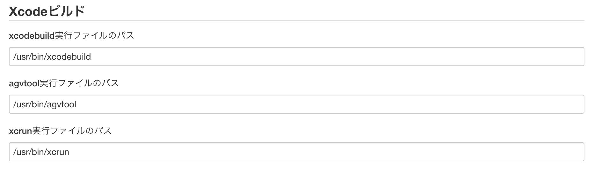
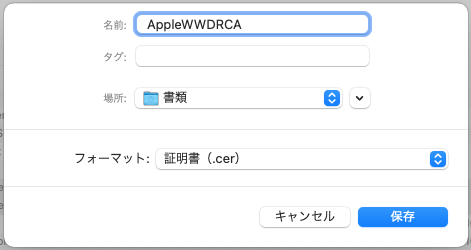
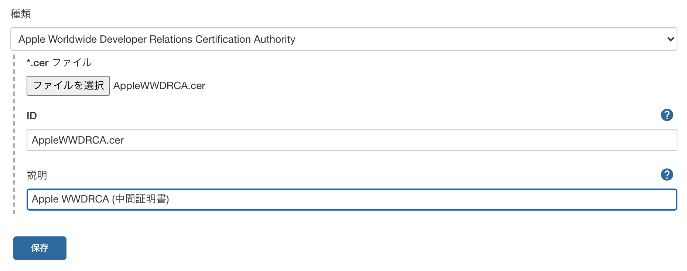
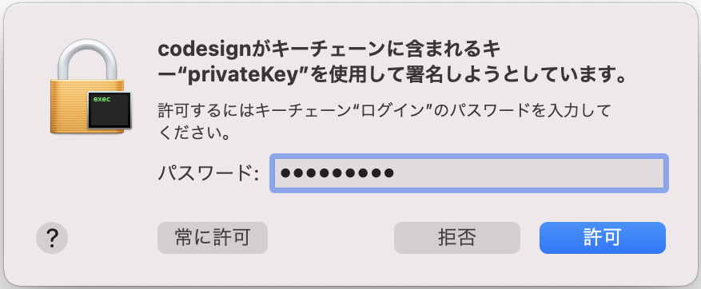
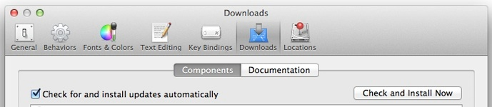

Xcode plugin
------------

このプラグインは、Xcodeコマンドラインツールを呼び出して、iOSアプリケーション(iPhone、iPadなど)のビルドとパッケージ化を自動化する機能を追加します。
* Jiraですべての問題または機能のリクエストを報告する: https://issues.jenkins-ci.org/issues/?jql=component%20%3D%20xcode-plugin

[メールで](http://jenkins-ci.org/content/mailing-lists) または [ircで](http://jenkins-ci.org/content/chat) Jenkinsコミュニティに連絡してサポートを受けてください。

*あなたの助けが必要です！！
メンテナは共同メンテナを探しています。*

プラグインの保守を支援するために、特に今後のリリースをテストできる場合は、「kazuhide.t アットマーク linux-powered.com」に連絡してください。

ありがとうございました！

問題、アイデア？

*バグ、改善、または新機能を報告するには、タスクと問題トラッカーを使用してください。*

-   [Report a bug](https://issues.jenkins-ci.org/secure/CreateIssueDetails!init.jspa?Create=Create&components=16124&pid=10172&issuetype=1)
-   [Ask for a new feature](https://issues.jenkins-ci.org/secure/CreateIssueDetails!init.jspa?Create=Create&components=16124&pid=10172&issuetype=2)
-   [Ask for an improvement of an existing feature](https://issues.jenkins-ci.org/secure/CreateIssueDetails!init.jspa?Create=Create&components=16124&pid=10172&issuetype=4)

また、Githubのプルリクエストを使用してコードの変更を提案する場合にはJiraのIssueもオープンしてください。
開発者が問題を追跡するのが簡単になります。

*重要！*

最新バージョンは、2.0.12より前のバージョンとの互換性が維持されています。
ただし、macOSキーチェーンの処理に大きな変更が加えられました。

キーチェーンにアクセスするための情報は、「設定」から「認証情報」に移動されています。
今後はキーチェーンにアクセスするための情報は「認証情報」に登録する必要があります。

#### 機能

このプラグインは、Xcodeコマンドラインツールを呼び出して、iOSアプリケーション(iPhone、iPadなど)のビルドとパッケージ化を自動化する機能を追加します。

##### バージョン付け

ビルドではagvtoolを呼び出して
`CFBundleVersion` (別名テクニカルバージョン)や `CFBundleShortVersionString` (別名マーケティングバージョン)を動的に更新できます。
'$'で始まるすべてのマクロをサポートします。 
たとえば、値 `${BUILD_NUMBER}` は現在のビルド番号に置き換えられます。
たとえばアプリをプライベートストアにデプロイする場合には `CFBundleVersion` にビルドごとに一意の値を生成することが推奨されますが、
このような場合、たとえば次のように使用できます： `${JOB_NAME}-${BUILD_NUMBER}`

##### ビルド

ビルドフェーズの前にクリーンアップを実行するかどうか、ターゲット(オプション)、構成(`Debug`や`Release`など)、SDK(オプション)などをプロジェクトごとに構成で指定できます。

##### パッケージ化

Xcodeビルドを使用して.appを.ipaにパッケージ化できます。
.appは実際にはディレクトリであるため、取扱い、特に配布などが面倒な場合があります。
.appを単一の.ipaファイルにパッケージ化することでこれを単純化できます。
これは、よく知られた内部構造を持つ単なるzipファイルです。

##### アプリへの署名

このプラグインにはコード署名プロセスを簡素化するのに役立つ2つの機能があります。

###### Jenkinsが開発者プロファイルをステージングできるようにする

このプラグインは、Apple Developer Profile (*.developerprofile)ファイルを保存できるように構成されています。
[このファイルには、コード署名秘密鍵、対応する開発者/配布証明書、およびモバイルプロビジョニングプロファイルが含まれています。](http://stackoverflow.com/questions/15154211/what-data-are-stored-in-developer-profile-file-exported-from-xcode)
あなたは[XCodeからこのファイルを作成できます](http://stackoverflow.com/questions/10404931/copying-keys-and-certificates-to-another-one-mac-for-iphone-development).

開発者プロファイルをJenkinsにアップロードするには、「Jenkinsの設定」ページの「Manage Credential(認証情報の管理)」に移動し、「認証情報の追加」ボタンから「Apple Developer Profile」を選択します。
詳細については、「ヘルプ」を参照してください。

このプロファイルを署名に使用するにはXcodeを実行する前にビルドステップとして「開発者プロファイルのインポート」を追加し、ビルドマシンにインポートする開発者プロファイルを選択します。
このビルド手順では開発者プロファイルをスレーブのキーチェーンにインストールします。

###### 既存の設定済みキーチェーンを操作する

すべてのビルドスレーブにコード署名秘密鍵と証明書を格納する専用のキーチェーンを作成する場合、このキーチェーンのロックを解除するようにプラグインを構成できます(xcodeが署名に使用できるようにするため)

ロックの解除

キーを(おそらくは)ユーザーキーチェーンに保存し、jenkinsをデーモンとして実行する場合にはmacOS用jenkinsの最新バージョンをインストールしたか？、
そしてセッションを作成するようにデーモンを構成したことを確認してください。(org.jenkins-ci.plistデーモン構成ファイルの`CreationSession = true` パラメーターを使用)
[参考](http://stackoverflow.com/questions/9626447/unable-to-sign-ios-builds-with-jenkins)

タイムアウト

キーチェーンのデフォルトのタイムアウトは300秒です。 現在プラグインでサポートされていないsecurityset-keychain-settingsコマンドを使用してオーバーライドできます。 プラグインのサポートは、ビルドプロセスの一部としてタイムアウトを変更するオプションを追加することで改善できます。
[JENKINS-17184を参照](https://issues.jenkins-ci.org/browse/JENKINS-17184)

##### ユニットテスト

このプラグインは、OCUnitまたはXCtestsを実行するときにxcodebuildの出力をリッスンし、Jenkinsが理解できるJUnit形式のテストレポートを書き出します。
その後、ジェンキンスはこれらを使用して、テストの失敗レポートとグラフを公開します。

##### 構成パネルのサンプル


#### Documentation

##### インストールガイド

もちろんビルドマシンはXcode開発ツールがインストールされたmacOS Xマシンである必要があります。
証明書、ID、およびプロビジョニングはそれぞれのビルドマシンにインストールする必要があります。

(これについては最新版のプラグインでは改善されていています。
ビルドステップに先立ちマスターノードで「デベロッパープロファイルのインポート」を行うことでマスターノードからスレーブのノードへと「デベロッパープロファイル」を配布することができます。)

アップデートセンターからプラグインの最新バージョンをインストールし、フリースタイルジョブ(#使い方のガイドを参照)でmacOS Xノードを使用するように構成するだけです(セントラルインスタンスがmacOSで実行されていない場合)。
Xcode関連のバイナリがデフォルトの場所に保存されていない場合は、プラグインのグローバル構成を更新します(Jenkinsの管理->システムの設定)



複数のバージョンのXcodeを使用してアプリケーションを構築する場合は、「Global Tool Configuration」を使用して、インストールされているXcodeの名前とパス(場所)を登録します。


##### 使い方のガイド

###### 開発者プロファイルのインポート手順

「開発者プロファイルのインポート」ステップを「ビルド」に追加することでXcodeからエクスポートされた開発者プロファイルを一時キーチェーンまたは既存のキーチェーンにインポートします。
開発者プロファイルにはアプリケーションのコンパイルと署名に必要な一連の証明書、秘密鍵、およびプロビジョニングプロファイルが含まれています。
これは複数のJenkinsノードで配布パッケージをビルドする場合に便利です。

###### 開発者プロファイルのインポート構成パラメーター

| パラメータ                      | Pipelineのパラメータ         | サポートバージョン | 概要                                                                                                                                                                                                                                                                                                                                |
|-------------------------------|----------------------------|---------------|--------------------------------------------------------------------------------------------------------------------------------------------------------------------------------------------------------------------------------------------------------------------------------------------------------------------------------------------|
| 開発者プロファイル               | profileId                  | 2.0.1         | XcodeのPreferenceからエクスポートした開発者プロファイルを選択してキーチェーンにインポートします。 開発者プロファイルは「認証情報」によって事前にJenkinsに登録する必要があります。|
| 既存のキーチェーンにインポート     | importIntoExistingKeychain | 2.0.6         | チェックすると開発者プロファイルが既存のキーチェーンにインポートされます。 チェックされていない場合は、ファイル名「jenkins-」+「ジョブ名」で新しいキーチェーンを新たに作成し、開発者プロファイルをこれにインポートします。(この場合、ランダムな文字列が自動的に生成され、パスワードに使用されます)|
| 対象のキーチェーン               | keychainId                 | 2.0.13        | パッケージに署名するために開発者プロファイルから証明書をインポートするために使用する、構成済みのキーチェーンのID。|
| ~~対象のキーチェーン~~           | ~~keychainName~~<br>これは非推奨になり「keychainId」に置き換えられました。| 2.0.6         | パッケージに署名するために開発者プロファイルから証明書をインポートするために使用する、設定済みのキーチェーンの名前。|
| キーチェーンのパス               | keychainPath               | 2.0.6         | 開発者プロファイルをインポートするキーチェーンパス。                                                                                                                                                                                                                                                                                                 |
| キーチェーンのパスワード          | keychainPwd                | 2.0.6         | 開発者プロファイルをインポートするキーチェーンのロックを解除するためのパスワード。                                                                                                                                                                                                                                                                                   |
| AppleWWDRCA                   | appleWWDRCACertId         | 2.0.15        | macOSキーチェーンからエクスポートしたAppleWWDRCA(中間証明書)を選択してJenkinsノードのキーチェーンにインポートします。 AppleWWDRCAは「認証情報」によって予めJenkinsに登録する必要があります。                                                                                                                                   |

###### macOSキーチェーンからAppleWWDRCA(中間証明書)をエクスポートする方法

Xcodeを日常的に使用する環境にあり、Xcodeを使用してアプリにコード署名できる場合はmacOSキーチェーンの中に必要なAppleWWDRCA中間証明書があります。
「キーチェーンアクセス」ユーティリティを使ってこれをエクスポートできます。

macOSキーチェーンからAppleWWDRCA(中間証明書)をエクスポートする場合は、次のようにすべての「Apple Worldwide Developer Relations Certification Authority」(2023年に有効期限切れのものと2030年に有効期限切れのもの)と「AppleDeveloper ID Certification Authority」を選択してエクスポートします。


コンテキストメニューから「3項目を書き出す…」を選択します。


エクスポートするときは、「フォーマット:」に「証明書(.cer)」を選択してください。



Jenkinsノードがクラウドサービスなどのリモートロケーションにある場合など、WWDRCA中間証明書がmacOSにインストールされていない環境では「認証局」ページ(https://www.apple.com)から証明書をダウンロードできます。 Apple DeveloperPortalの/ certificateauthority /）を使用してください。


Apple Developer Portalからダウンロードしたファイル(拡張子.cer)はバイナリ形式のDER形式であるため、opensslコマンドを使用してBASE64でエンコードされたテキストに変換し、ダウンロードした3つのファイルを1つのファイルに結合します。

```shell
% (openssl x509 -in ~/Downloads/DeveloperIDCA.cer -inform der -out - && \
openssl x509 -in ~/Downloads/AppleWWDRCA.cer -inform der -out - && \
openssl x509 -in ~/Downloads/AppleWWDRCAG3.cer -inform der -out -) > AppleWWDRCA.cer
```

キーチェーンアクセスを使用して証明書をエクスポートする場合でも、Apple Developer Portalからダウンロードしたファイルを変換して結合する場合でも、結果のAppleWWDRCA.cerファイルの内容は同じになります。

###### AppleWWDRCA(中間証明書)をJenkinsの認証情報にインポートする方法

ダッシュボードで「Jenkinsの管理」を選択します。


「Manage Credentials」を選択します。


「Stores scoped to Jenkins」から「(grobal)」をクリックし、表示されたページの左上から「クレデンシャルを追加」を選択すると、「グローバル」ドメインに新しいクレデンシャルを追加できます。


そして「認証情報の追加」をクリックします。


「種類」には、「Apple Worldwide Developer Relations Certification Authority」を選択します。
次に、「ファイルを選択」をクリックします。



事前にキーチェーンからエクスポートしたか、Apple Developer Portalからダウンロードした証明書ファイル(.cer)を選択してアップロードします。


###### 制約

Xcode統合プラグインは開発者アカウントの秘密鍵と証明書を一時キーチェーンにインポートする機能を備えていますが、macOSの制約でセッションごとに異なるキーチェーンを処理することができないため、並行してキーチェーンを処理するジョブを実行するとこれは正しく機能しません。

この回避策の1つとして、Jenkinsのノードでのジョブの最大数を1に制限し、異なるmacOSアカウントで複数のノードを実行することは可能です。

###### ビルド手順の追加

「Xcodeビルド手順」をフリースタイルプロジェクトに追加し、「ターゲット」(`MyApp`など)、「Configuration」(`Release`など)を設定し、「アプリケーションを署名、パックして.ipaを作成」をチェックしてバージョン番号オプションを更新します。
これによりバージョン管理された単一の.ipaファイルが提供されます。
ビルド前にプロジェクトをクリーンアップすることを選択することもできます。
これによりプロジェクトがクリーンな状態から開始されるようになりますが、大規模なプロジェクトでビルドにかなり時間がかか流ようになります。

###### ユニットテスト手順の追加

「Xcodeビルド手順」を追加し、今回は単体テストの「ターゲット」(例えば、`MyAppTests`)、「Configuration」(例えば、`Debug`)、SDK(例えば、`Developer/Platforms/iPhoneSimulator.platform/Developer/SDKs/iPhoneSimulator14.4.sdk/`などを指定します）。  
SDKのパスはXcodeのディレクトリ(環境変数`DEVELOPER_DIR`で指定でき、`xcode-select -p`コマンドで確認可能)からの相対位置で指定します。
すべてのチェックボックスをオフのままにします。 

単体テストはシミュレーターのSDKでビルドする場合にのみ実行されるため、SDKをここで指定する必要があります。  
以下の項目は現在のバージョンには存在せず、代わりに「ResultBundlePath」が指定されているかどうかでテストレポート出力の有無を判断します。(ResultBundlePathが空ならレポートは出力されない)  
~~プロジェクト構成の「JUnitテスト結果レポートの公開」オプションをチェックし、「テストレポートXML」の下に値 `" * `` / test-reports / `` * .xml "`を設定します。 これにより、JenkinsはJUnit形式のテストレポートを取得するようになります。~~

###### XCodeビルドの設定パラメーター

| パラメータ                      | Pipelineのパラメータ        | ポートバージョン | 概要                                                                                                                                                                                                                                                                                                                                |
|-------------------------------|---------------------------|---------------|--------------------------------------------------------------------------------------------------------------------------------------------------------------------------------------------------------------------------------------------------------------------------------------------------------------------------------------------|
|開発者チーム      	            |developmentTeamName	    |1.4        	|パッケージへの署名に使用する登録済みの開発チームの名前。<br>Xcode 8.3以降、これはipaに署名する(現在はxcodebuilderを使用)ために必要です。<br>チームを設定するには、ここでJenkinsグローバル構成で登録したチームの名前を選択するか次で開発チームIDを指定できます。|
|開発者チームのID              	|developmentTeamID	        |1.4	        |「開発者チーム」が選択されていない場合にIPAに署名するために使用するApple開発者チームのIDを指定します。|
|Xcode toolsのバージョン          |xcodeName                  |2.0.3	        |「Jenkinsの設定」の「Global Tool Configuration」で設定したXcodeのバージョンを選択できます。<br> Xcodeのバージョンで「システムの設定」を選択した場合、プラグインは何もしないので環境変数「DEVELOPER_DIR」を使用してXcodeを切り替えることができます。|
|旧来のビルドシステムを使用する   	|useLegacyBuildSystem	    |2.0.9      	|Xcode 9以降の「New Build System」の代わりに、旧来の「Regacy Build System」を使用します。|
|ターゲット                     	|target	                    |1.0            |ビルドするターゲット。 空のままにするとプロジェクト内のすべてのターゲットがビルドされます。 バイナリと単体テスト用のモジュールを構築する場合には、それぞれを独自のターゲットを持つ2つの別々のビルド手順として設定するとよいでしょう。そうすることでiPhone Simulator SDKを単体テストで指定できます。|
|ターゲットを正規表現で評価          |interpretTargetAsRegEx	    |1.4	        |xcodebuild -listの出力で「Targets:」部分ににリストされる中から正規表現に一致するすべてのエントリをビルドします。|  
|ビルド前に消去                    |cleanBeforeBuild	        |1.0            |チェックするとビルドを開始する前にビルドディレクトリが削除されます。 これによりすべての依存関係の再ビルドが強制され、大規模なプロジェクトのビルドにかかる時間が大幅に長くなる可能性があります。|
|処理に失敗しても続行               |allowFailingBuildResults	|1.4	        |このオプションをチェックするとxcodebuildがゼロ以外の終了コードで終了した場合でもこのビルドステップが失敗するのを防ぐことができます。|
|コンソールログを出力しない	        |noConsoleLog	            |2.0.1	        |このオプションをチェックするとxcodeビルドの出力はコンソールログに記録されません。|
|ログファイルの出力先             　|logfileOutputDirectory	    |2.0.1	        |xcodebuildのログを出力するディレクトリを指定します。<br>空白のままにすると他のログとともに「プロジェクトディレクトリ/builds/${BUILD_NUMBER}/log」に出力されます。<br>出力パスを指定した場合、「ビルド出力ディレクトリ」以下の相対ディレクトリにxcodebuild.logファイルとして出力されます。|
|ResultBundlePath           	|resultBundlePath          	|2.0.11	        |テスト結果の出力リディレクトリを設定します。<br>空のままにするとテスト結果は出力されず、テスト結果の分析も行われません。プロジェクトディレクトリ以下の相対位置で指定します。|
|ResultBundlePathを消去        	|cleanResultBundlePath	    |2.0.11     	|これによりビルドを呼び出す前にResultBundlePathが削除されます。|
|Configuration	                |configuration	            |1.0	        |Xcodeプロジェクトで定義されている「Configuration」の名前を指定します。 デフォルトでは「Debug」と「Release」Configurationがあります。|
|Xcode Schemaファイル             |xcodeSchema	            |1.2	        |ターゲットではなく特定のスキーマ用にコンパイルする場合、またはアーカイブやIPAを生成する場合に必要です。|
|アーカイブを作成                  |generateArchive	        |2.0	        |このオプションをチェックすると指定したスキームのxcarchiveが生成されます。アーカイブにはワークスペースとスキームも必要です。|
|アプリケーションに署名、パックして.ipaを作成|buildIpa	            |1.0	        |ここがチェックされていたならxcarchiveからパックされた単一の.ipaファイルを生成します。<br>.ipaファイルはアプリをテストサイトで配布したりApp Storeへとアップロードするのに使います。|
|エクスポートの方法	            |ipaExportMethod	        |1.4	        |.ipaファイルを生成するための.appのエクスポート方法。「development」、「ad-doc」、「enterprise」、または「app-store」のいずれかである必要があります。|
|.ipaファイル名のパターン           |ipaName	                |1.4	        |生成する.ipaファイル名のパターン。 この文字列ではマクロ ${VERSION} と ${BUILD_DATE} (yyyy.MM.dd)を使用できます。|
|出力ディレクトリ   	            |ipaOutputDirectory	        |1.4	        |ビルドディレクトリからの相対位置で指定した.ipaファイルの出力ディレクトリ。|
|Bitcodeをアップロード             |uploadBitcode	            |2.0.3	        |チェックされている場合にはApp StoreのIPAエクスポートにBitcodeを含めます。<br>デフォルトは「はい」(チェックはオンです)です。|
|シンボルをアップロード             |uploadSymbols	            |2.0.3	        |チェックされている場合にはApp StoreのIPAエクスポートにシンボルを含めます。<br>デフォルトは「はい」(チェックはオンです)です。|
|Bitcodeをコンパイル              |compileBitcode	            |2.0.3      	|チェックされているなら、アプリケーションをIPAにエクスポートする際にBitcodeから再コンパイルします。<br>デフォルトは「はい」(チェックはオン)です。|
|最適化                          |thinning	                |2.0.3          |App Storeでの配布用以外のIPAをエクスポートするときにアプリ内の複数のデバイス向けパッケージを最適化するように設定します。<br><br>使用可能なオプションは次のとおりです。<br> - \<none> (Xcodeは最適化されない汎用アプリケーションをエクスポートします。)<br> - \<thin-for-all-variants> (Xcodeはユニバーサルアプリと最適化可能なすべての対象向けのアプリをエクスポートします。)<br> - モデル識別子の場合は特定のデバイス(「iPhone7,1」など向けのアプリをエクスポートします。)<br>デフォルトは\<none>です。|
|オンデマンドリソースを含める        |~~embedOnDemandResourcesAssetPacksInBundle~~<br>assetPacksInBundle|	2.0.3	|App Storeでの配布用以外のIPAをエクスポートするときの設定です。<br>アプリケーションがオンデマンドリソースを使用していて、この項目がオンの場合、アセットパックはアプリケーションバンドルに含まれるため、アセットパックをホストしているサーバーなしでアプリをテストできます。<br> AssetPacksBaseURLが指定されていない場合、デフォルトでオンになります(チェックがオンになっています)。|
|オンデマンドリソースのURL         	|~~onDemandResourcesAssetPacksBaseURL~~<br>assetPacksBaseURL	|2.0.3	|App Storeでの配布用以外のIPAをエクスポートするときの設定です。<br>アプリケーションがオンデマンドリソースを使用していて、assetPacksInBundleがオンでない場合、これはアセットパックのホストを指定するベースURLである必要があります。 これにより指定したURLからアセットパックをダウンロードするようにアプリが設定されます。|
|アプリケーションのURL             |appURL	                    |2.0.3	        |App Storeでの配布用以外のIPAをエクスポートするときの設定です。<br>OTAでWebページや電子メールからアプリケーションをインストールするときに必要なmanifest.plistを作成するときに、アプリケーションをインストールするためのURLを指定します。|
|表示するイメージのURL             |displayImageURL	        |2.0.3	        |App Storeでの配布用以外のIPAをエクスポートするときの設定です。<br>manifest.plistを使用してアプリケーションをインストールするときに表示されるアイコンの画像(57x57ピクセル)のURLを指定します。|
|フルサイズイメージのURL	        |fullSizeImageURL	        |2.0.3      	|App Storeでの配布用以外のIPAをエクスポートするときの設定です。<br>manifest.plistを使用してアプリケーションをインストールするときに表示されるアイコンの画像(512x512ピクセル)のURLを指定します。|
|アセットパックのURL               |assetPackManifestURL	    |2.0.3	        |App Storeでの配布用以外のIPAをエクスポートするときの設定です。<br>アプリケーションがオンデマンドリソースを使用していて、アプリケーションがmanifest.plistを使用してOTAインストールする場合、これはアセットパックのホストを指定するベースURLである必要があります。 これにより指定したURLからアセットパックをダウンロードするようにアプリが設定されます。|
|Swiftのシンボルを削除             |stripSwiftSymbols	        |2.0.5	        |チェックするとアプリケーションをIPAにエクスポートするときにシンボルがSwiftライブラリから削除されます。|
|~~手動でコード署名を行なう~~       |~~manualSigning~~<br>これは非推奨となり「signingMethod」に置き換えられました。|2.0.1	|このオプションでは、プロビジョニングプロファイルUUIDとBundleIDの組み合わせを手動で指定する必要があります。<br>これは、組み合わせを変更する場合に役立ちます。 アプリケーションのビルド時にCodeSignに使用されるプロビジョニングプロファイルと証明書の一覧。|
|コード署名とキーチェーンのオプション  |signingMethod	            |2.0.7      	|ここでは次の3つの値のいずれかを指定できます。<br> 自動で署名 (「自動署名」をオンにする)<br>このオプションをオンにすると、アプリケーションに署名するためのプロビジョニングプロファイルと証明書が自動的に生成されます。<br>この機能を使用すると、必要に応じてプロビジョニングプロファイルと証明書が自動的に作成されるため、その時点で古いプロビジョニングプロファイルと証明書は無効になるので注意してください。<br>手動で設定 (「手動で設定」をチェック)<br>このオプションでは、プロビジョニングプロファイルUUIDとBundleIDの組み合わせを手動で指定します。<br>これは、アプリケーションのビルド時にCodeSignに使用されるプロビジョニングプロファイルと証明書の組み合わせを変更する場合に役立ちます。<br> プロジェクトから読み取る (「プロジェクトに従う」をオンにします。）<br>このオプションを使用すると、XcodeプロジェクトファイルからBundleIDとプロビジョニングプロファイルUUIDの組み合わせを自動的に取得して設定します。<br>これはXcodeプロジェクト(GUI)で使用したプロビジョニングプロファイルのUUIDやBundle IDの組み合わせをそのまま引き継ぐ場合に便利です。|
|Bundle ID                      |provisioningProfiles: [provisioningProfileAppId]	|2.0.1	|コードサインを実行するアプリケーションのバンドルIDを指定します。<br>バンドルIDの代わりにコンパイル済みアーカイブに含まれるInfo.plistファイルの場所が設定されている場合は、Info.plistファイルからバンドルIDを読み取り、その値を使用します。|
|Provisioning profiles UUID	    |provisioningProfiles: [provisioningProfileUUID]    |2.0.1	|アプリケーションの署名に使用するプロビジョニングプロファイルのUUIDまたはSpecifireを指定します。<br>UUIDまたはSpecifireの代わりにプロビジョニングプロファイルの場所が設定されている場合は、プロビジョニングプロファイルからUUIDを読み取り、その値を使用します。|
|プロビジョニングプロファイルをコピーする|copyProvisioningProfile	|2.0.7      	|チェックすると、プロビジョニングプロファイルのファイル名が「プロビジョニングプロファイルUUID」で指定されている場合、指定されたファイルが所定の場所にコピーされます。 ("/Users/${HOME}/Library/MobileDevice/Provisioning Profiles/")<br>これを使用して、SCMなどからデプロイされたプロジェクトのプロビジョニングプロファイルの開発者プロファイルまたはシステム設定の内容を上書きできます。< br>プロビジョニングプロファイルUUIDまたはSpecifireが「プロビジョニングプロファイルUUID」に設定されている場合、何も実行されません。<br>デフォルトは「はい」(チェックがオン)です。|
|Bundle IDの変更                 |changeBundleID	            |1.4	        |このオプションをチェックするとバンドル識別子が置き換えられます。<br>使用するバンドルID(CFBundleIdentifier)と、Info.plistファイルの場所を指定する必要があります。<br>これは開発プロジェクトのコード署名IDに別のバンドルIDを使用する場合などに便利です。|
|新しいBundle ID	                |bundleID	                |1.4	        |新しいバンドルID。 通常、com.companyname.projectnameのような形式です。|
|Info.plistのパス	            |bundleIDInfoPlistPath  	|1.4	        |プロジェクトのCFBundleIdentifierを含むinfo.plistファイルへのパス。<br>通常は次のようになります。<br> ${WORKSPACE}/ProjectName/Project-Info.plist|
|キーチェーンをアンロック           |unlockKeychain	            |1.0	        |チェックするとアーカイブに署名する前に、キーチェーンのロックを自動的に解除します。|
|キーチェーン                     |keychainId<br>             |2.0.13	        |パッケージに署名するための証明書を取得するために使用する、登録済みのキーチェーン情報のID。<br>キーチェーンの情報は事前に「認証情報」へと登録しておきます。|
|~~キーチェーンの名前~~            |~~keychainName~~<br>これは非推奨となり「keychainId」に置き換えられました。|1.4	        |パッケージに署名するための証明書を取得するために使用する、登録済みのキーチェーンの名前。|
|キーチェーンのパス                |keychainPath	            |1.0	        |パッケージに署名するための証明書を取得するために使用するキーチェーンのパス。 (デフォルトは：${HOME}/Library/Keychains/login.keychain-db)|
|キーチェーンのパスワード           |keychainPwd	            |1.0	        |パッケージに署名するための証明書を取得するために使用するキーチェーンのパスワード。|
|テスト結果をクリーン     	        |cleanTestReports	        |1.3	        |これにより、ビルドを呼び出す前に過去に作成されたテストレポートが削除されます。 一般的にはテストターゲットでのみ実行することをお勧めします。さもないとテストの前に他のXcodeターゲットがビルドされた場合、ビルドでテストレポートの収集に失敗してしまいす。|
|SDK	                        |sdk                    	|1.0            |ビルドの対象となるSDKを指定する場合にのみ、この値を指定する必要があります。 指定されていない場合にはSDKはXCodeによって決定されます。 OCUnitテストを実行する場合はiPhoneシミュレーターのSDKを使用する必要があります。<br>(例：/Developer/Platforms/iPhoneSimulator.platform/Developer/SDKs/iPhoneSimulator14.4.sdk4.1.sdk/)|
|SYMROOT                        |symRoot                    |1.1            |使用するSYMROOTパスを指定する場合にのみ、この値を指定する必要があります。 空の場合、デフォルトのSYMROOTパスが使用されます(Xcodeのバージョンによって異なる場合があります)。 Token Macro Pluginからのすべてのマクロと環境およびビルド変数をサポートします。 例えば次のような値を使用できます：${WORKSPACE}/build|
|xcodebuildの追加パラメーター      |xcodebuildArguments	    |1.3	        |Jenkinsビルドの一部のプロジェクトオプションを変更する必要があるが、それらをプロジェクトファイルに保持したくない場合は、カスタム引数を渡すと便利です。 たとえば、アプリケーションテストを実行する場合、次の設定が適していることがよくあります：GCC_SYMBOLS_PRIVATE_EXTERN = NO COPY_PHASE_STRIP = NO。 そうしないと、テストバンドルにリンクするアプリケーションシンボルが見つからないため、リリースビルドは通常失敗します。 引数は現在スペースで区切られているため、引用符で囲むことは役に立ちません。|
|Xcode Workspaceファイル         |xcodeWorkspaceFile         |1.2            |プロジェクトではなくワークスペースをコンパイルする場合にのみ必要です。「Xcodeプロジェクトファイル」設定およびこのジョブの「設定」パラメータよりも優先されます。|
|Xcodeプロジェクトのディレクトリ     |xcodeProjectPath	        |1.0            |これは、ワークスペースからXcodeプロジェクトファイルを含むディレクトリへの相対パスです。<br>この値を指定する必要があるのは、ビルドするXcodeプロジェクトがワークスペースのルートにない場合のみです。|
|Xcode Projectファイル            |xcodeProjectFile       	|1.0            |プロジェクトパスに複数のXcodeプロジェクトファイルがある場合は、ビルドするプロジェクトのファイル名を指定する必要があります。<br>すべてのプロジェクトをビルドする必要がある場合は、手動でそれぞれのXcodeビルドステップを作成する必要があります。|
|ビルドの出力ディレクトリ           |buildDir	                |1.2            |CONFIGURATION_BUILD_DIR設定に使用する値(2.0.0のBUILD_DIR)。 XCodeビルドの製品を、プロジェクト設定およびこのジョブの「SYMROOT」パラメーターで指定された場所以外の場所に配置する場合にのみ、この値を指定する必要があります。<br>Token Macro Pluginのすべてのマクロと環境およびビルド変数をサポートします。<br>たとえば次のような値が使用できます：${WORKSPACE}/build|
|avgtoolを使用してバージョンを操作   |ProvideApplicationVersion  |1.4            |ビルドを呼び出す前にバージョン番号を指定してavgtoolを実行します。|
|マーケティングバージョン           |cfBundleShortVersionStringValue|1.0        |これにより、CFBundleShortVersionStringが指定された文字列に設定されます。 Token Macro Pluginから、すべてのマクロと環境およびビルド変数をサポートします。|
|テクニカルバージョン	            |cfBundleVersionValue   	|1.0            |これにより、CFBundleVersionが指定された文字列に設定されます。 Token Macro Pluginから、すべてのマクロと環境およびビルド変数をサポートします。 たとえば、値$ {BUILD_NUMBER}は現在のビルド番号に置き換えられます。 たとえばプライベートストアにデプロイする場合は、ビルドごとに一意の値を生成することをお勧めします。 その場合、たとえば次を使用できます：$ {JOB_NAME}-$ {BUILD_NUMBER}|
|~~Manifest PlistのURL~~         |~~ipaManifestPlistUrl~~<br>これは2.0.3で廃止されました。 |1.5	        |マニフェストPlistの作成に使用するベースURL。 省略した場合、マニフェストリストは生成されません。|

###### IPAのエクスポートを設定

IPAのエクスポートステップを追加し、IPAファイルのエクスポートに必要な情報、アーカイブの場所、エクスポート方法、コード署名情報などを設定すると、Xcodeビルドステップのアーカイブ出力からIPAをエクスポートできます。

###### IPAのエクスポート設定パラメータ

| パラメータ                      | Pipelineのパラメータ        | ポートバージョン | 概要                                                                                                                                                                                                                                                                                                                                |
|-------------------------------|---------------------------|---------------|--------------------------------------------------------------------------------------------------------------------------------------------------------------------------------------------------------------------------------------------------------------------------------------------------------------------------------------------|
|開発者チーム      	            |developmentTeamName	    |2.0.1       	|パッケージへの署名に使用する登録済みの開発チームの名前。<br>Xcode 8.3以降、これはipaに署名する(現在はxcodebuilderを使用)ために必要です。<br>チームを設定するには、ここでJenkinsグローバル構成で登録したチームの名前を選択するか次で開発チームIDを指定できます。|
|開発者チームのID              	|developmentTeamID	        |2.0.1	        |「開発者チーム」が選択されていない場合にIPAに署名するために使用するApple開発者チームのIDを指定します。|
|Xcode toolsのバージョン          |xcodeName                  |2.0.3	        |「Jenkinsの設定」の「Global Tool Configuration」で設定したXcodeのバージョンを選択できます。<br> Xcodeのバージョンで「システムの設定」を選択した場合、プラグインは何もしないので環境変数「DEVELOPER_DIR」を使用してXcodeを切り替えることができます。|
|アーカイブのディレクトリ           |archiveDir	                |2.0.1	        |IPAファイルをエクスポートするためにアーカイブを読み取るパスの場所(通常はxcodebuildで指定されたBUILD_DIR)を指定します。<br>すべてのマクロをサポートし、トークンマクロプラグインから環境変数とビルド変数もサポートします。<br><br>例えば次のような値を使用できます：<br>${WORKSPACE}/build|
|エクスポートの方法	            |ipaExportMethod	        |2.0.1	        |.ipaファイルを生成するための.appのエクスポート方法。「development」、「ad-doc」、「enterprise」、または「app-store」のいずれかである必要があります。|
|.ipaファイル名のパターン           |ipaName	                |2.0.1	        |生成する.ipaファイル名のパターン。 この文字列ではマクロ ${VERSION} と ${BUILD_DATE} (yyyy.MM.dd)を使用できます。|
|出力ディレクトリ   	            |ipaOutputDirectory	        |2.0.1	        |ビルドディレクトリからの相対位置で指定した.ipaファイルの出力ディレクトリ。|
|Bitcodeをアップロード             |uploadBitcode	            |2.0.3	        |チェックされている場合にはApp StoreのIPAエクスポートにBitcodeを含めます。<br>デフォルトは「はい」(チェックはオンです)です。|
|シンボルをアップロード             |uploadSymbols	            |2.0.3	        |チェックされている場合にはApp StoreのIPAエクスポートにシンボルを含めます。<br>デフォルトは「はい」(チェックはオンです)です。|
|Bitcodeをコンパイル              |compileBitcode	            |2.0.3      	|チェックされているなら、アプリケーションをIPAにエクスポートする際にBitcodeから再コンパイルします。<br>デフォルトは「はい」(チェックはオン)です。|
|最適化                          |thinning	                |2.0.3          |App Storeでの配布用以外のIPAをエクスポートするときにアプリ内の複数のデバイス向けパッケージを最適化するように設定します。<br><br>使用可能なオプションは次のとおりです。<br> - \<none> (Xcodeは最適化されない汎用アプリケーションをエクスポートします。)<br> - \<thin-for-all-variants> (Xcodeはユニバーサルアプリと最適化可能なすべての対象向けのアプリをエクスポートします。)<br> - モデル識別子の場合は特定のデバイス(「iPhone7,1」など向けのアプリをエクスポートします。)<br>デフォルトは\<none>です。|
|オンデマンドリソースを含める        |~~assetPacksInBundle~~<br>assetPacksInBundle|	2.0.3	|App Storeでの配布用以外のIPAをエクスポートするときの設定です。<br>アプリケーションがオンデマンドリソースを使用していて、この項目がオンの場合、アセットパックはアプリケーションバンドルに含まれるため、アセットパックをホストしているサーバーなしでアプリをテストできます。<br> AssetPacksBaseURLが指定されていない場合、デフォルトでオンになります(チェックがオンになっています)。|
|オンデマンドリソースのURL         	|~~assetPacksBaseURL~~<br>assetPacksBaseURL	|2.0.3	|App Storeでの配布用以外のIPAをエクスポートするときの設定です。<br>アプリケーションがオンデマンドリソースを使用していて、assetPacksInBundleがオンでない場合、これはアセットパックのホストを指定するベースURLである必要があります。 これにより指定したURLからアセットパックをダウンロードするようにアプリが設定されます。|
|アプリケーションのURL             |appURL	                    |2.0.3	        |App Storeでの配布用以外のIPAをエクスポートするときの設定です。<br>OTAでWebページや電子メールからアプリケーションをインストールするときに必要なmanifest.plistを作成するときに、アプリケーションをインストールするためのURLを指定します。|
|表示するイメージのURL             |displayImageURL	        |2.0.3	        |App Storeでの配布用以外のIPAをエクスポートするときの設定です。<br>manifest.plistを使用してアプリケーションをインストールするときに表示されるアイコンの画像(57x57ピクセル)のURLを指定します。|
|フルサイズイメージのURL	        |fullSizeImageURL	        |2.0.3      	|App Storeでの配布用以外のIPAをエクスポートするときの設定です。<br>manifest.plistを使用してアプリケーションをインストールするときに表示されるアイコンの画像(512x512ピクセル)のURLを指定します。|
|アセットパックのURL               |assetPackManifestURL	    |2.0.3	        |App Storeでの配布用以外のIPAをエクスポートするときの設定です。<br>アプリケーションがオンデマンドリソースを使用していて、アプリケーションがmanifest.plistを使用してOTAインストールする場合、これはアセットパックのホストを指定するベースURLである必要があります。 これにより指定したURLからアセットパックをダウンロードするようにアプリが設定されます。|
|Swiftのシンボルを削除             |stripSwiftSymbols	        |2.0.5	        |チェックするとアプリケーションをIPAにエクスポートするときにシンボルがSwiftライブラリから削除されます。|
|~~手動でコード署名を行なう~~       |~~manualSigning~~<br>これは非推奨となり「signingMethod」に置き換えられました。|2.0.1	|このオプションでは、プロビジョニングプロファイルUUIDとBundleIDの組み合わせを手動で指定する必要があります。<br>これは、組み合わせを変更する場合に役立ちます。 アプリケーションのビルド時にCodeSignに使用されるプロビジョニングプロファイルと証明書の一覧。|
|コード署名とキーチェーンのオプション  |signingMethod	            |2.0.7      	|ここでは次の3つの値のいずれかを指定できます。<br> 自動で署名 (「自動署名」をオンにする)<br>このオプションをオンにすると、アプリケーションに署名するためのプロビジョニングプロファイルと証明書が自動的に生成されます。<br>この機能を使用すると、必要に応じてプロビジョニングプロファイルと証明書が自動的に作成されるため、その時点で古いプロビジョニングプロファイルと証明書は無効になるので注意してください。<br>手動で設定 (「手動で設定」をチェック)<br>このオプションでは、プロビジョニングプロファイルUUIDとBundleIDの組み合わせを手動で指定します。<br>これは、アプリケーションのビルド時にCodeSignに使用されるプロビジョニングプロファイルと証明書の組み合わせを変更する場合に役立ちます。<br> プロジェクトから読み取る (「プロジェクトに従う」をオンにします。）<br>このオプションを使用すると、XcodeプロジェクトファイルからBundleIDとプロビジョニングプロファイルUUIDの組み合わせを自動的に取得して設定します。<br>これはXcodeプロジェクト(GUI)で使用したプロビジョニングプロファイルのUUIDやBundle IDの組み合わせをそのまま引き継ぐ場合に便利です。|
|Bundle ID                      |provisioningProfiles: [provisioningProfileAppId]	|2.0.1	|コードサインを実行するアプリケーションのバンドルIDを指定します。<br>バンドルIDの代わりにコンパイル済みアーカイブに含まれるInfo.plistファイルの場所が設定されている場合は、Info.plistファイルからバンドルIDを読み取り、その値を使用します。|
|プロビジョニングプロファイル         |provisioningProfiles: [provisioningProfileUUID]    |2.0.1	|アプリケーションの署名に使用するプロビジョニングプロファイルのUUIDまたはSpecifireを指定します。<br>UUIDまたはSpecifireの代わりにプロビジョニングプロファイルの場所が設定されている場合は、プロビジョニングプロファイルからUUIDを読み取り、その値を使用します。|
|プロビジョニングプロファイルをコピーする|copyProvisioningProfile	|2.0.7      	|チェックすると、プロビジョニングプロファイルのファイル名が「プロビジョニングプロファイルUUID」で指定されている場合、指定されたファイルが所定の場所にコピーされます。 ("/Users/${HOME}/Library/MobileDevice/Provisioning Profiles/")<br>これを使用して、SCMなどからデプロイされたプロジェクトのプロビジョニングプロファイルの開発者プロファイルまたはシステム設定の内容を上書きできます。<br>プロビジョニングプロファイルUUIDまたはSpecifireが「プロビジョニングプロファイルUUID」に設定されている場合、何も実行されません。<br>デフォルトは「はい」(チェックがオン)です。|
|Bundle IDの変更                 |changeBundleID	            |2.0.1	        |このオプションをチェックするとバンドル識別子が置き換えられます。<br>使用するバンドルID(CFBundleIdentifier)と、Info.plistファイルの場所を指定する必要があります。<br>これは開発プロジェクトのコード署名IDに別のバンドルIDを使用する場合などに便利です。|
|新しいBundle ID	                |bundleID	                |2.0.1	        |新しいバンドルID。 通常、com.companyname.projectnameのような形式です。|
|Info.plistのパス	            |bundleIDInfoPlistPath  	|2.0.1	        |プロジェクトのCFBundleIdentifierを含むinfo.plistファイルへのパス。<br>通常は次のようになります。<br> ${WORKSPACE}/ProjectName/Project-Info.plist|
|キーチェーンをアンロック           |unlockKeychain	            |2.0.1	        |チェックするとアーカイブに署名する前に、キーチェーンのロックを自動的に解除します。|
|キーチェーン                     |keychainId<br>             |2.0.13	        |パッケージに署名するための証明書を取得するために使用する、登録済みのキーチェーン情報のID。<br>キーチェーンの情報は事前に「認証情報」へと登録しておきます。|
|~~キーチェーンの名前~~            |~~keychainName~~<br>これは非推奨となり「keychainId」に置き換えられました。|2.0.1        |パッケージに署名するための証明書を取得するために使用する、登録済みのキーチェーンの名前。|
|キーチェーンのパス                |keychainPath	            |2.0.1	        |パッケージに署名するための証明書を取得するために使用するキーチェーンのパス。 (デフォルトは：${HOME}/Library/Keychains/login.keychain-db)|
|キーチェーンのパスワード           |keychainPwd	            |2.0.1	        |パッケージに署名するための証明書を取得するために使用するキーチェーンのパスワード。|
    
#### Jenkinsのパイプライン関数を使用したXcodeプロジェクトのコンパイルとIPAパッケージのエクスポート
    
1.  開発者プロファイルをインポートします。

    ``` syntaxhighlighter-pre
            importDeveloperProfile(importIntoExistingKeychain: false,
                profileId: 'XXXXXXXX-XXXX-XXXX-XXXX-XXXXXXXXXXXX')
    ```

2.  プロジェクトをビルドし、アーカイブを出力します。

    ``` syntaxhighlighter-pre
            xcodeBuild(
              xcodeSchema: "${PROJECT_SCHEMA}",
              ipaOutputDirectory: 'Release',
              ipaExportMethod: 'app-store',
              generateArchive: true,
              buildIpa: true,
              ipaName: "${BUILD_TARGET}",
              bundleID: 'com.example.TargetApp',
              developmentTeamName: "${DEVELOPMENT_TEAM_NAME}",
              cleanBeforeBuild: true,
              configuration: 'Release',
              cfBundleShortVersionStringValue: '1.0.0',
              cfBundleVersionValue: '1'
            )
    ```

3.  アーカイブからIPAファイルをエクスポートします。

    ``` syntaxhighlighter-pre
        exportIpa(
            archiveDir: "${WORKSPACE}/${repositoryName}/build/Release-iphoneos",
            xcodeSchema: "${PROJECT_SCHEMA}",
            developmentTeamName: "${DEVELOPMENT_TEAM}",
            configuration: "AdHoc",
            infoPlistPath: "${INFO_PLIST}",
            manualSigning: true,
            provisioningProfiles: [
                [provisioningProfileAppId: "${BUNDLE_ID}", provisioningProfileUUID: 'TestApp_AdHoc_Profile.mobileprovision']
                [provisioningProfileAppId: "${BUNDLE_ID}.watchkitapp", provisioningProfileUUID: 'TestApp_AdHoc_Profile.mobileprovision'],
                [provisioningProfileAppId: "${BUNDLE_ID}.watchkitapp.watchkitextension", provisioningProfileUUID: 'TestApp_AdHoc_Profile.mobileprovision']
            ],
            ipaExportMethod: "ad-hoc",
            ipaName: "${BUILD_TARGET}",
            ipaOutputDirectory: "AdHoc"
        )
    ```

4.  エクスポートされたIPAファイルをアップロードします。

> XCodeの「署名の自動管理」を利用する場合、さまざまな方法が必要になりますので、別途ご注意ください。

#####  複数のバージョンのXcodeを使用する。

環境変数を使用することで、複数のバージョンを簡単にサポートできます。
ただし、最初にビルドサーバーに複数のバージョンをインストールする必要があります。
これが1つの戦略です：

###### xcodeの複数のバージョンをインストールする

1. 現在の設定を覚えておきましょう


    xcode-select -p

2. Xcodeの.xipファイルを <http://developer.apple.com/downloads/> からダウンロードします

3. ダウンロードした.xipファイルを任意の場所に展開します

###### 実行するXcodeのバージョンを選択します

1. EnvInjectプラグインを使用する
2. デフォルト以外のXcodeを必要とするジョブの場合では次のように環境変数を設定します


    DEVELOPER_DIR=/Applications/Xcode6.0.1.app/Contents/Developer

ビルドプロセスへの環境変数の挿入

###### 実行時にXcodeバージョンを選択します (バージョン2.0.3以降)

1. 「Global Tool Configuration(グローバルツールの設定)」を使用してインストールされているXcodeの識別名と場所を登録します。  
2. ジョブの「Xcodeツールバージョン」で「グローバルツール構成」に登録されているXcodeを選択します。

それだけです！

#### FAQ

##### User interaction is not allowed(ユーザーの操作は許可されていません)

コード署名が実行される時にキーチェーンアクセスを許可するかどうかを尋ねるダイアログがビルドマシンに表示される場合があります。
「User interaction is not allowed(ユーザーの操作は許可されていません)」などのメッセージが表示され、これが解除されるまでビルドがブロックされます。
これは最初に「常に許可」を選択すれば再度質問されることはありません。



このダイアログがビルドマシンに表示されない場合は、強制的に
ビルドマシンのターミナルから失敗したcodesignコマンドを実行すると表示されます：/usr/bin/codesign --force --sign "iPhone Distribution：...."

##### No Xcode folder is set(Xcodeフォルダが設定されていません)

[ソース] $ /usr/bin/xcodebuild -version
xcode-select：エラー：Xcodeフォルダーが設定されていません。
xcode-select -switch <xcode_folder_path> を実行して、Xcodeフォルダーへのパスを設定します。
エラー：/usr/bin/xcode-selectが予期しないエラーを返しました。
致命的：Xcodeのインストールを確認してください。
Jenkinsはそのバージョンを取得できません。

おそらくXCodeをインストールしたばかりでそのパス(デフォルトでは `/Applications/Xcode.app/Contents/Developer`にあります)が構成されていません。 あなたはそれを修正することができます

    xcode-select -switch /Applications/Xcode.app/Contents/Developer/

これで、 `xcodebuild`を実行できるようになります。 例：

    % xcodebuild -version
    Xcode 12.5
    Build version 12E262

##### Xcode 4.3

Xcode 4.3 で変更された [２つのこと](https://developer.apple.com/library/mac/#documentation/DeveloperTools/Conceptual/WhatsNewXcode/Articles/xcode_4_3.html)
スレーブまたはマスターでの使用に重要なもの :

-   **コマンドラインツールはオプションです** : コマンドラインツールは、デフォルトではXcodeにバンドルされていません。 代わりに、[ダウンロード]設定パネルの[コンポーネント]タブを使用してインストールする必要があります
    
-   **Developer No Longer Existsなどエラーになったら** : 次のようにパスを再構成する必要がある場合があります。

    
    % sudo xcode-select -switch /Applications/Xcode.app/Contents/Developer/
